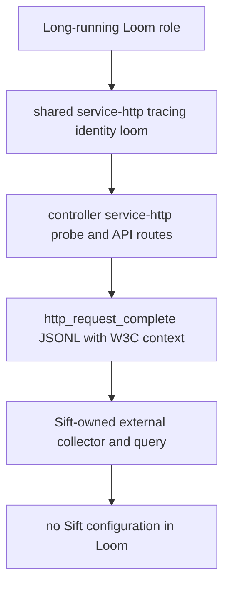

## Logic
<!-- type: logic lang: mermaid -->



Loom remains a Sift-agnostic producer. The process boundary owns structured axiom.service.log.v1 records, W3C request correlation, Prometheus-compatible probe metrics, and optional non-fatal OTLP export. Sift owns collection, routing, credentials, ingestion, retention, and query.

### Service-role tracing initialization

Add one Loom-local adapter around service_http::HttpConfig, ServiceIdentity, and init_tracing_with_identity. It reads LOOM_LOG_FORMAT (pretty or json, default pretty), LOOM_LOG_LEVEL (default info), and optional LOOM_OTLP_ENDPOINT. The adapter identifies every long-running Loom process as service.name=loom and returns configuration errors before the role begins serving. Controller, worker, run-task, job-controller, schema-layer, and the operator run path invoke the adapter; offline spec, render, llm, upgrade, and issue commands remain byte-clean.

### HTTP completion evidence

The controller keeps its existing service_http standard probe router and trace layer. The shared trace layer emits one INFO http_request_complete record inside the W3C-correlated request span after a response. A valid traceparent keeps trace_id, parent_span_id, trace_flags, and a distinct local span_id. Missing or malformed input creates a valid local root without panic. Loom adds no domain event solely for telemetry.

### Deployment configuration

The static base StatefulSet and the operator-rendered StatefulSet set LOOM_LOG_FORMAT=json for service workloads, while LOOM_LOG_LEVEL remains configurable. This makes production stdout collector-ready without introducing Sift configuration into Loom.

### Failure behavior and boundaries

An invalid LOOM_LOG_FORMAT fails process startup with a remediation message. OTLP setup remains optional and non-fatal according to service-http behavior. No Loom Cargo dependency, environment variable, HTTP header, route, or manifest may name a Sift endpoint, token, or collector. The Sift-owned VAT journey consumes captured stdout out of process and asserts nonzero accepted/query evidence.

## Changes
<!-- type: changes lang: yaml -->

```yaml
changes:
  - path: libs/service-http/src/transport.rs
    action: modify
    section: logic
    impl_mode: hand-written
    anchor: pub fn trace_layer
    description: Emit one W3C-correlated http_request_complete JSONL event through the shared response hook so all shared HTTP services have the same generic request evidence.
  - path: libs/service-http/Cargo.toml
    action: modify
    section: unit-test
    impl_mode: hand-written
    description: Add the existing formatter test dependency needed to decode the shared completion event contract.
  - path: libs/service-http/tests/request_completion_event.rs
    action: create
    section: unit-test
    impl_mode: hand-written
    description: Exercise the shared router and JSON formatter for valid, absent, and malformed W3C request context.
  - path: apps/loom/src/main.rs
    action: modify
    section: logic
    impl_mode: hand-written
    anchor: fn main
    description: Initialize shared service tracing only for long-running Loom roles from LOOM_LOG_FORMAT, LOOM_LOG_LEVEL, and optional LOOM_OTLP_ENDPOINT.
  - path: apps/loom/src/operator/render.rs
    action: modify
    section: logic
    impl_mode: hand-written
    anchor: fn extra_env
    description: Set collector-ready LOOM_LOG_FORMAT=json in the operator-rendered service workload environment.
  - path: apps/loom/k8s/base/statefulset.yaml
    action: modify
    section: logic
    impl_mode: hand-written
    description: Set LOOM_LOG_FORMAT=json in the checked-in controller workload base.
  - path: apps/loom/tests/structured_stdout_traceparent.rs
    action: create
    section: unit-test
    impl_mode: hand-written
    description: Spawn the real controller, exercise valid invalid and absent traceparent requests, and assert schema identity W3C correlation and no direct Sift linkage.
```

## Unit Test

```mermaid
---
id: loom-sift-agnostic-telemetry-verification
requirements:
  collector_boundary:
    id: R3
    text: "Loom adds neither a Sift dependency nor Sift endpoint, token, header, route, or collector configuration; collection remains external."
    kind: negative
    risk: medium
    verify: apps/loom/tests/structured_stdout_traceparent.rs::loom_remains_sift_agnostic
  existing_controller_surface:
    id: R5
    text: "The existing shared standard endpoint surface remains available after tracing initialization is moved to the process boundary."
    kind: regression
    risk: medium
    verify: apps/loom/src/controller.rs::tests::standard_endpoints_served
  real_controller_jsonl:
    id: R2
    text: "A real Loom controller under LOOM_LOG_FORMAT=json emits a nonzero service.name=loom JSONL completion record for valid, missing, and malformed traceparent requests."
    kind: functional
    risk: high
    verify: apps/loom/tests/structured_stdout_traceparent.rs::real_loom_controller_correlates_structured_stdout
  shared_completion:
    id: R1
    text: "The shared HTTP trace layer emits exactly one axiom.service.log.v1 http_request_complete event with method, URI, response status, latency, and inherited W3C context."
    kind: functional
    risk: high
    verify: libs/service-http/tests/request_completion_event.rs::completion_event_is_schema_valid_and_w3c_correlated
  workload_configuration:
    id: R4
    text: "Both checked-in and operator-rendered controller workloads request JSON service logging without changing replica or workflow semantics."
    kind: regression
    risk: medium
    verify: apps/loom/tests/structured_stdout_traceparent.rs::loom_workloads_request_json_logging
---
flowchart TD
    r1[R1 shared completion] --> libs_service_http_tests_request_completion_event_rs_completion_event_is_schema_valid_and_w3c_correlated[libs/service-http/tests/request_completion_event.rs::completion_event_is_schema_valid_and_w3c_correlated]
    r2[R2 real controller jsonl] --> apps_loom_tests_structured_stdout_traceparent_rs_real_loom_controller_correlates_structured_stdout[apps/loom/tests/structured_stdout_traceparent.rs::real_loom_controller_correlates_structured_stdout]
    r3[R3 collector boundary] --> apps_loom_tests_structured_stdout_traceparent_rs_loom_remains_sift_agnostic[apps/loom/tests/structured_stdout_traceparent.rs::loom_remains_sift_agnostic]
    r4[R4 workload configuration] --> apps_loom_tests_structured_stdout_traceparent_rs_loom_workloads_request_json_logging[apps/loom/tests/structured_stdout_traceparent.rs::loom_workloads_request_json_logging]
    r5[R5 existing controller surface] --> apps_loom_src_controller_rs_tests_standard_endpoints_served[apps/loom/src/controller.rs::tests::standard_endpoints_served]
```

<!-- type: unit-test lang: mermaid -->


