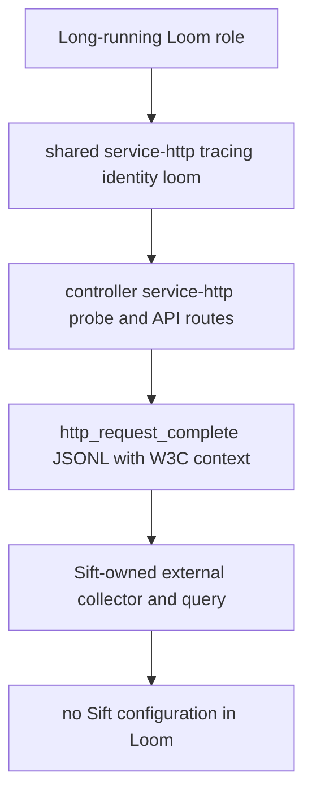

## Logic
<!-- type: logic lang: mermaid -->

Loom remains a Sift-agnostic producer. The process boundary owns structured axiom.service.log.v1 records, W3C request correlation, Prometheus-compatible probe metrics, and optional non-fatal OTLP export. Sift owns collection, routing, credentials, ingestion, retention, and query.

### Service-role tracing initialization

Add one Loom-local adapter around service_http::HttpConfig, ServiceIdentity, and init_tracing_with_identity. It reads LOOM_LOG_FORMAT (pretty or json, default pretty), LOOM_LOG_LEVEL (default info), and optional LOOM_OTLP_ENDPOINT. The adapter identifies every long-running Loom process as service.name=loom and returns configuration errors before the role begins serving. Controller, worker, run-task, job-controller, schema-layer, and the operator run path invoke the adapter; offline spec, render, llm, upgrade, and issue commands remain byte-clean.

### HTTP completion evidence

The controller keeps its existing service_http standard probe router and trace layer. The shared trace layer emits one INFO http_request_complete record inside the W3C-correlated request span after a response. A valid traceparent keeps trace_id, parent_span_id, trace_flags, and a distinct local span_id. Missing or malformed input creates a valid local root without panic. Loom adds no domain event solely for telemetry.

### Deployment configuration

The static base StatefulSet and the operator-rendered StatefulSet set LOOM_LOG_FORMAT=json for service workloads, while LOOM_LOG_LEVEL remains configurable. This makes production stdout collector-ready without introducing Sift configuration into Loom.

### Failure behavior and boundaries

An invalid LOOM_LOG_FORMAT fails process startup with a remediation message. OTLP setup remains optional and non-fatal according to service-http behavior. No Loom Cargo dependency, environment variable, HTTP header, route, or manifest may name a Sift endpoint, token, or collector. The Sift-owned VAT journey consumes captured stdout out of process and asserts nonzero accepted/query evidence.
