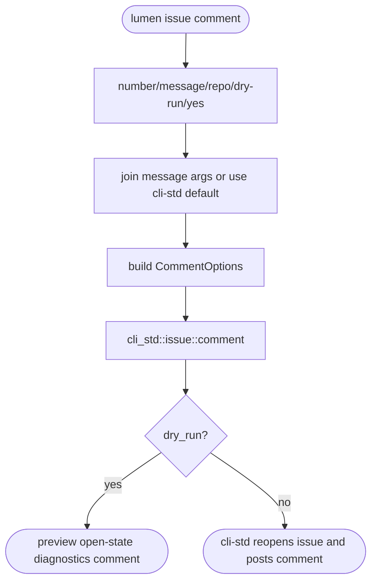
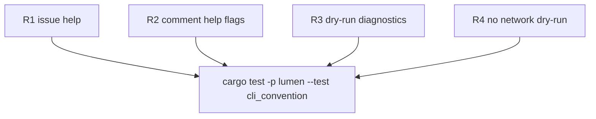

# TD: Lumen CLI issue comment follow-up

## Logic
<!-- type: logic lang: mermaid -->


## Unit Test
<!-- type: unit-test lang: mermaid -->


## Changes
<!-- type: changes lang: yaml -->

```yaml
changes:
  - path: apps/lumen/src/bin/lumen.rs
    action: modify
    section: logic
    impl_mode: hand-written
    description: "Extend IssueCommand with Comment, add IssueCommentArgs, and dispatch to cli_std::issue::comment using Lumen TOOL metadata."
  - path: apps/lumen/tests/cli_convention.rs
    action: modify
    section: unit-test
    impl_mode: hand-written
    description: "Cover issue comment help flags and dry-run output so the follow-up path remains offline-testable."
```
