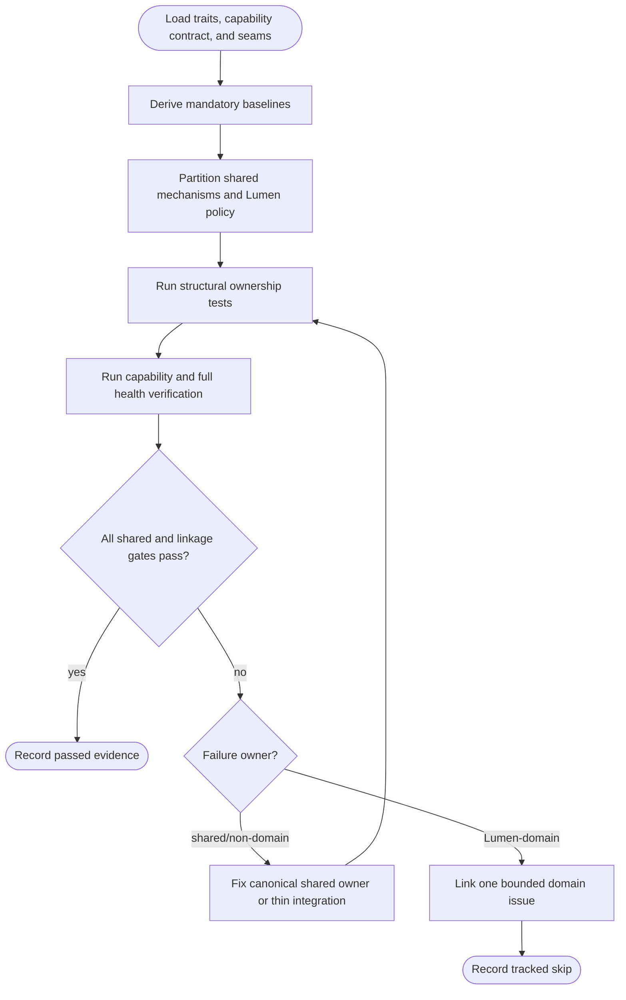

## Logic
<!-- type: logic lang: mermaid -->


## Changes
<!-- type: changes lang: yaml -->

```yaml
changes:
  - path: apps/lumen/tests/capability_shared_ownership.rs
    action: create
    section: unit-test
    impl_mode: hand-written
    description: "Add a deterministic structural regression gate that derives Lumen's required service baselines from aw.toml, requires the capability contract to name shared stateful composition, verifies cli-std/service-http/service-auth/service-k8s/raft-runtime/peer-tls delegation at the actual integration seams, and rejects app-local copies of tracing, admission, auth registry, Kubernetes render, or Raft host mechanisms. Search policy, Lumen CRD policy, and thin adapters remain app-owned. generator gap: missing-generator:test:capability-shared-ownership (#2324)."
```

## Unit Test

```mermaid
---
id: lumen-capability-shared-ownership-verification
requirements:
  full_machine_verification:
    id: R4
    text: "Capability verification and full AW health verification run with current tests, traceability, codegen, cold-build, and evidence checks before the child records passed or tracked_skip."
    kind: integration
    risk: high
    verify: aw capability check --project lumen --verify --write-evidence && aw health --project lumen full --verify-traceability --verify-cb --verify-cold --verify-tests
  platform_mechanisms_delegate_to_shared_owners:
    id: R2
    text: "CLI, HTTP, auth, observability, Kubernetes rendering, Raft hosting, and peer identity are delegated to their canonical shared libraries at Lumen's real integration seams."
    kind: regression
    risk: high
    verify: capability_shared_ownership::platform_mechanisms_delegate_to_shared_owners
  shared_failures_are_not_skippable:
    id: R3
    text: "The ownership inventory classifies shared mechanisms separately from Lumen domain policy so a shared failure cannot be represented as an app-domain tracked skip."
    kind: regression
    risk: high
    verify: capability_shared_ownership::shared_and_domain_ownership_are_total_and_disjoint
  trait_profile_requires_shared_baselines:
    id: R1
    text: "Lumen's configured service, long-running, CLI-facing, network-exposed, stateful-storage, and agent-facing traits resolve to a current capability contract and executable verification sequence."
    kind: functional
    risk: high
    verify: capability_shared_ownership::trait_profile_requires_shared_service_baselines
---
flowchart TD
    r1[R1 trait profile requires shared baselines] --> capability_shared_ownership_trait_profile_requires_shared_service_baselines[capability_shared_ownership::trait_profile_requires_shared_service_baselines]
    r2[R2 platform mechanisms delegate to shared owners] --> capability_shared_ownership_platform_mechanisms_delegate_to_shared_owners[capability_shared_ownership::platform_mechanisms_delegate_to_shared_owners]
    r3[R3 shared failures are not skippable] --> capability_shared_ownership_shared_and_domain_ownership_are_total_and_disjoint[capability_shared_ownership::shared_and_domain_ownership_are_total_and_disjoint]
    r4[R4 full machine verification] --> aw_capability_check_project_lumen_verify_write_evidence_aw_health_project_lumen_full_verify_traceability_verify_cb_verify_cold_verify_tests[aw capability check --project lumen --verify --write-evidence && aw health --project lumen full --verify-traceability --verify-cb --verify-cold --verify-tests]
```

<!-- type: unit-test lang: mermaid -->


