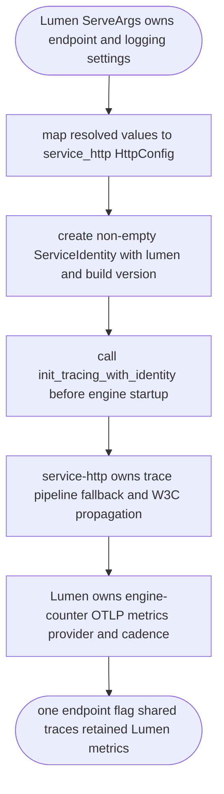
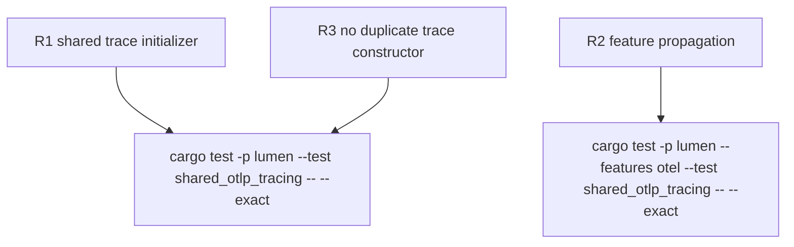

## Logic
<!-- type: logic lang: mermaid -->


## Changes
<!-- type: changes lang: yaml -->

```yaml
changes:
  - path: apps/lumen/Cargo.toml
    action: modify
    section: logic
    impl_mode: hand-written
    description: Keep the metrics OpenTelemetry dependencies while making the service-http OTLP tracing feature available and removing the trace-only direct layer dependency.
  - path: apps/lumen/src/bin/lumen.rs
    action: modify
    section: logic
    impl_mode: hand-written
    description: Delegate Lumen trace initialization to service-http with stable Lumen identity while retaining Lumen-owned metrics export.
  - path: apps/lumen/tests/shared_otlp_tracing.rs
    action: create
    section: unit-test
    impl_mode: hand-written
    description: Verify the Lumen binary wiring uses the shared OTLP trace initializer without owning a duplicate tracer constructor.
  - path: apps/lumen/README.md
    action: modify
    section: contract
    impl_mode: hand-written
    description: Record the shared service-http tracing adopter under the Lumen observability work root.
  - path: apps/lumen/tech-design/semantic/source/apps-lumen-src-bin-lumen-rs.md
    action: modify
    section: source
    impl_mode: hand-written
    description: Update the semantic source unit to distinguish shared tracing from Lumen-owned metrics export.
```

## Unit Test
<!-- type: unit-test lang: mermaid -->


