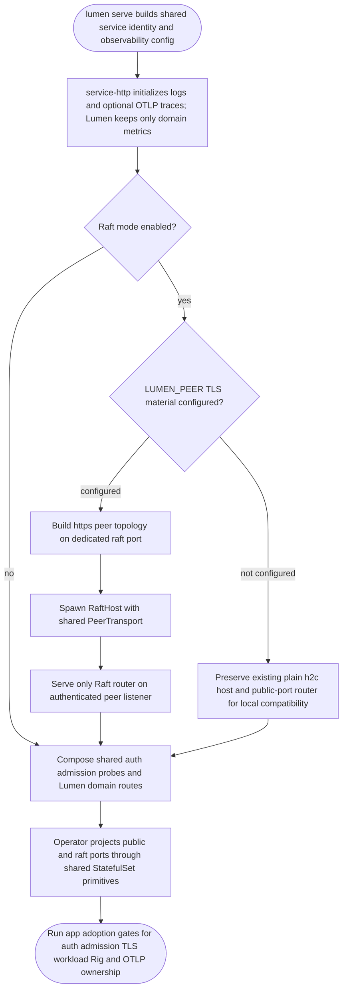

## Logic
<!-- type: logic lang: mermaid -->



## Changes
<!-- type: changes lang: yaml -->

```yaml
changes:
  - path: apps/lumen/Cargo.toml
    action: modify
    section: logic
    impl_mode: hand-written
    description: "Delegate OTLP trace ownership to service-http while retaining Lumen's domain metrics exporter. generator gap: missing-generator:lumen-manifest-feature-adoption (#1646)."
  - path: apps/lumen/src/bin/lumen.rs
    action: modify
    section: logic
    impl_mode: hand-written
    description: "Use shared observability initialization and wire configured peer mTLS into RaftHost plus a dedicated authenticated listener. generator gap: missing-generator:lumen-serve-foundation-adoption (#1646)."
  - path: apps/lumen/tech-design/semantic/source/apps-lumen-src-bin-lumen-rs.md
    action: modify
    section: logic
    impl_mode: hand-written
    description: "Keep the canonical Lumen binary source unit aligned with shared observability and peer transport adoption. generator gap: missing-generator:semantic-source-sync (#1646)."
  - path: apps/lumen/src/operator/render.rs
    action: modify
    section: logic
    impl_mode: hand-written
    description: "Project the dedicated Raft port in the Lumen StatefulSet and headless Service while preserving the public client port. generator gap: missing-generator:lumen-peer-port-projection (#1646)."
  - path: apps/lumen/tech-design/semantic/source/apps-lumen-src-operator-render-rs.md
    action: modify
    section: logic
    impl_mode: hand-written
    description: "Keep the operator render source unit aligned with peer-port projection. generator gap: missing-generator:semantic-source-sync (#1646)."
  - path: apps/lumen/tests/operator_render.rs
    action: modify
    section: unit-test
    impl_mode: hand-written
    description: "Assert the public and Raft ports are projected without changing resource, topology, or domain policy. generator gap: missing-generator:lumen-operator-adoption-test (#1646)."
  - path: apps/lumen/tests/shared_stateful_foundations.rs
    action: create
    section: unit-test
    impl_mode: hand-written
    description: "Lock Lumen's ownership boundary: shared OTLP tracing and shared reloadable peer transport, with no local duplicate tracer. generator gap: missing-generator:lumen-foundation-ownership-test (#1646)."
  - path: apps/lumen/README.md
    action: modify
    section: logic
    impl_mode: hand-written
    description: "Publish the dependency-ordered #1640-#1645 adoption evidence and clarify the credential reload boundary. generator gap: missing-generator:lumen-capability-adoption-doc (#1646)."
```

## Unit Test

```mermaid
---
id: lumen-shared-stateful-foundations-verification
requirements:
  admission:
    id: R6
    text: "Lumen's route classification continues to use shared bounded admission while the default router remains disabled."
    kind: regression
    risk: medium
    verify: cargo test -p lumen --test admission_e2e
  credential_lifecycle:
    id: R5
    text: "Lumen's verifier continues to use service-auth atomic credential reload and RBAC behavior."
    kind: regression
    risk: high
    verify: cargo test -p lumen --lib auth
  feature_compile:
    id: R9
    text: "The combined observability, Raft, and operator feature graph compiles across every Lumen target."
    kind: regression
    risk: high
    verify: cargo check -p lumen --all-targets --features otel,raft-wal,operator
  peer_mtls_runtime:
    id: R2
    text: "Configured LUMEN_PEER mTLS material selects https topology, spawn_with_peer_transport, and a dedicated authenticated Raft listener that is not merged into the public router."
    kind: functional
    risk: high
    verify: cargo test -p lumen --test shared_stateful_foundations
  peer_tls_adapter:
    id: R7
    text: "Lumen's environment adapter constructs the shared reloadable peer transport and preserves existing TLS configuration validation."
    kind: regression
    risk: high
    verify: cargo test -p lumen --lib tls
  plain_h2c_compatibility:
    id: R3
    text: "When peer TLS material is absent, Lumen retains the established public-port h2c Raft compatibility path for local and existing deployments."
    kind: regression
    risk: high
    verify: cargo test -p lumen --test shared_stateful_foundations
  rig_adapter:
    id: R8
    text: "Lumen search continuity runs through the shared Rig stateful-service lifecycle."
    kind: regression
    risk: medium
    verify: cargo test -p lumen --test rig_stateful_adapter
  shared_otlp_owner:
    id: R1
    text: "Lumen delegates structured logging and optional OTLP trace initialization to service-http and retains only its domain metrics exporter, with no local tracer pipeline or tracing-opentelemetry dependency."
    kind: regression
    risk: high
    verify: cargo test -p lumen --test shared_stateful_foundations
  workload_ports:
    id: R4
    text: "The operator projects both the public 7373 port and dedicated Raft 7374 port through the StatefulSet and headless Service without changing Lumen resource, shard, or CRD policy."
    kind: functional
    risk: high
    verify: cargo test -p lumen --features operator --test operator_render
---
flowchart TD
    r1[R1 shared otlp owner] --> cargo_test_p_lumen_test_shared_stateful_foundations[cargo test -p lumen --test shared_stateful_foundations]
    r2[R2 peer mtls runtime] --> cargo_test_p_lumen_test_shared_stateful_foundations
    r3[R3 plain h2c compatibility] --> cargo_test_p_lumen_test_shared_stateful_foundations
    r4[R4 workload ports] --> cargo_test_p_lumen_features_operator_test_operator_render[cargo test -p lumen --features operator --test operator_render]
    r5[R5 credential lifecycle] --> cargo_test_p_lumen_lib_auth[cargo test -p lumen --lib auth]
    r6[R6 admission] --> cargo_test_p_lumen_test_admission_e2e[cargo test -p lumen --test admission_e2e]
    r7[R7 peer tls adapter] --> cargo_test_p_lumen_lib_tls[cargo test -p lumen --lib tls]
    r8[R8 rig adapter] --> cargo_test_p_lumen_test_rig_stateful_adapter[cargo test -p lumen --test rig_stateful_adapter]
    r9[R9 feature compile] --> cargo_check_p_lumen_all_targets_features_otel_raft_wal_operator[cargo check -p lumen --all-targets --features otel,raft-wal,operator]
```

<!-- type: unit-test lang: mermaid -->


