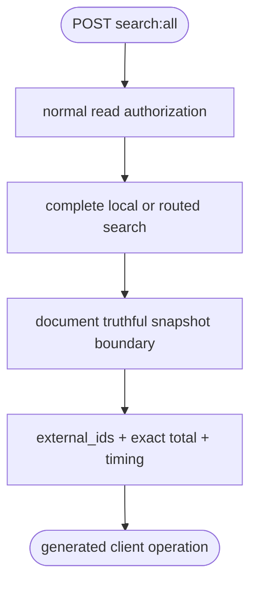
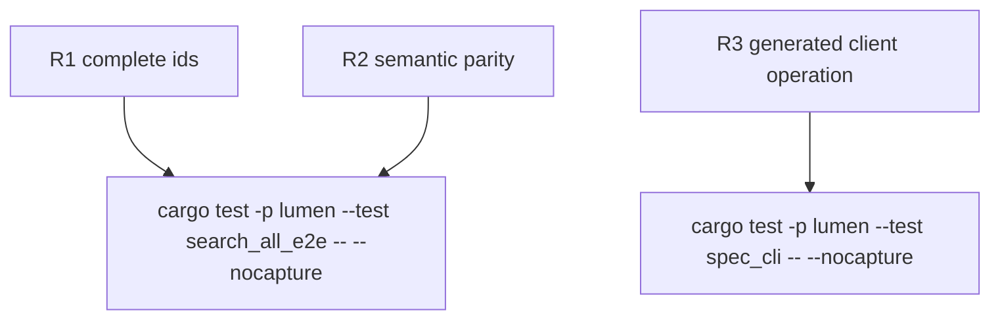

## Logic
<!-- type: logic lang: mermaid -->


## Changes
<!-- type: changes lang: yaml -->

```yaml
changes:
  - path: apps/lumen/src/types.rs
    action: modify
    section: logic
    impl_mode: hand-written
    description: "Add dedicated search-all request/response wire types with explicit consistency documentation."
  - path: apps/lumen/src/api.rs
    action: modify
    section: logic
    impl_mode: hand-written
    description: "Register POST search:all, reuse authorization/routing, request an exact complete result and project external IDs."
  - path: apps/lumen/src/spec.rs
    action: modify
    section: logic
    impl_mode: hand-written
    description: "Advertise the explicit-cost complete-ID operation and consistency boundary."
  - path: apps/lumen/tests/search_all_e2e.rs
    action: create
    section: unit-test
    impl_mode: hand-written
    description: "Prove completeness beyond the default page, sort/filter semantics and generated OpenAPI operation."
  - path: apps/lumen/tests/spec_cli.rs
    action: modify
    section: unit-test
    impl_mode: hand-written
    description: "Lock offline search-all and canonical OpenAPI metadata."
```
## Unit Test
<!-- type: unit-test lang: mermaid -->


