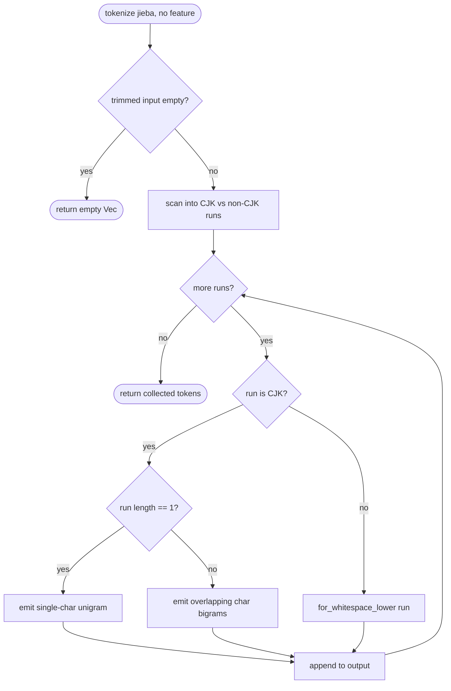

## Logic
<!-- type: logic lang: mermaid -->



Contract (approved, final): the `#[cfg(not(feature = "jieba"))] fn jieba` fallback signature (`fn jieba(text: &str) -> Vec<String>`) and the outer `tokenize` dispatch are unchanged; only the fallback body's internal algorithm changes. Guarantees held stable for callers:

- CJK-run classification is a Unicode char-range test (Han `U+4E00..=U+9FFF` plus the common CJK extension/compat blocks; Hiragana `U+3040..=U+309F`; Katakana `U+30A0..=U+30FF`; Hangul syllables `U+AC00..=U+D7A3`) — no external segmenter dependency, matching the jieba-off constraint.
- A run is a maximal contiguous span of chars that are all CJK or all non-CJK; run boundaries never split a char.
- Bigram emission is overlapping (window 1, stride 1) over the run's char sequence: an N-char CJK run yields N-1 bigrams (「北京大學」, N=4, yields 3 bigrams: 北京/京大/大學), matching Lucene `CJKBigramFilter` / Elasticsearch `cjk_bigram` semantics referenced in the WI problem statement.
- A length-1 CJK run (a lone CJK character) emits that character as a single-char unigram token instead of being dropped, keeping it searchable (AC3).
- Non-CJK runs (including surrounding whitespace/punctuation) are handed to the existing `for_whitespace_lower` emitter unchanged, so mixed text such as `lumen 搜尋引擎` keeps its `lumen` token exactly as today (R2) while the CJK run `搜尋引擎` is bigrammed.
- Output preserves scan order (non-CJK and CJK tokens interleaved as they appear in the source), consistent with the existing `Vec<String>` contract in `tokenize`'s doc comment (duplicate tokens preserved, order matters for term-frequency callers).
- No new `Analyzer` variant, no schema/API change: this logic lives entirely inside the existing `#[cfg(not(feature = "jieba"))] fn jieba` fallback body; the `#[cfg(feature = "jieba")]` path, `WhitespaceLower`, and `Ngram` are untouched (R3).
- Documents indexed under the OLD whole-string fallback need reindex before new-query CJK-bigram tokens will match them; this is a documented degraded-mode caveat, not new migration machinery (module doc comment update).
## Changes
<!-- type: changes lang: yaml -->

```yaml
changes:
  - path: apps/lumen/src/tokenize.rs
    action: modify
    section: logic
    impl_mode: hand-written
    anchor: jieba
    description: "Rewrite the `#[cfg(not(feature = \"jieba\"))] fn jieba` fallback: split input into CJK runs (Han/Hiragana/Katakana/Hangul char-range) vs non-CJK runs; CJK runs emit overlapping char bigrams (unigram for length-1 runs); non-CJK runs route through the existing `for_whitespace_lower` emitter. Update the module doc comment (top of file) to describe the CJK-bigram fallback and note that documents indexed under the old whole-string fallback need reindex for new-query tokens to match."
  - path: apps/lumen/src/tokenize.rs
    action: modify
    section: unit-test
    impl_mode: hand-written
    anchor: jieba_fallback_when_no_feature
    description: "Update `jieba_fallback_when_no_feature` to assert the bigram output for 北京大學 (北京/京大/大學) instead of the old whole-string token; add a mixed-text case (`lumen 搜尋引擎` keeps the `lumen` token plus CJK bigrams of the Chinese run) and a single-CJK-char case (one char emits one unigram, not empty). All new/updated cases must pass under the default (no `jieba`) feature set."
  - path: apps/lumen/tech-design/semantic/source/apps-lumen-src-tokenize-rs.md
    action: modify
    section: logic
    impl_mode: hand-written
    description: "Synchronize the SPEC-MANAGED source capture for tokenize.rs (Overview symbol table + Source rust-source-unit code block) with the rewritten no-feature `jieba` fallback and updated module doc comment, so the mirror stays byte-identical to the real file per the mirror-sync gate (AC6)."
  - path: apps/lumen/tests/jieba_bigram_fallback_e2e.rs
    action: create
    section: e2e-test
    impl_mode: hand-written
    description: "New end-to-end test (default feature set, jieba OFF): create a collection with a `text` field declared `analyzer: jieba`, index a document whose value is 北京大學, run a `match` query for 北京 over the HTTP API, and assert the document is returned (AC5, fails before this change since the old fallback only matches the exact whole string)."
```
## Unit Test

```mermaid
---
id: jieba-no-feature-cjk-bigram-fallback-verification
requirements:
  cjk_bigram_split:
    id: R1
    text: "With `jieba` OFF, tokenize(\"北京大學\", Analyzer::Jieba) returns overlapping character bigrams [\"北京\", \"京大\", \"大學\"] instead of the old whole-string token (AC1)."
    kind: functional
    risk: high
    verify: cargo test -p lumen --lib tokenize::tests::jieba_fallback_when_no_feature
  mixed_text_split:
    id: R2
    text: "With `jieba` OFF, \"lumen 搜尋引擎\" yields the `lumen` token (via the unchanged for_whitespace_lower path) plus CJK bigrams of the Chinese run, and never emits a whole-string token (AC2)."
    kind: functional
    risk: high
    verify: cargo test -p lumen --lib tokenize::tests::jieba_fallback_mixed_text
  other_analyzers_unaffected:
    id: R4
    text: "WhitespaceLower, Ngram, and the jieba-on (`#[cfg(feature = \"jieba\")]`) path stay byte-identical in behavior; only the `#[cfg(not(feature = \"jieba\"))]` fallback changes (AC4)."
    kind: regression
    risk: medium
    verify: cargo test -p lumen --lib tokenize
  single_char_and_empty_edge_cases:
    id: R3
    text: "A single CJK character input yields that character as one unigram token (not empty); empty/whitespace-only input yields no tokens (AC3)."
    kind: regression
    risk: medium
    verify: cargo test -p lumen --lib tokenize::tests::jieba_fallback_single_cjk_char
---
flowchart TD
    r1[R1 cjk bigram split] --> cargo_test_p_lumen_lib_tokenize_tests_jieba_fallback_when_no_feature[cargo test -p lumen --lib tokenize::tests::jieba_fallback_when_no_feature]
    r2[R2 mixed text split] --> cargo_test_p_lumen_lib_tokenize_tests_jieba_fallback_mixed_text[cargo test -p lumen --lib tokenize::tests::jieba_fallback_mixed_text]
    r3[R3 single char and empty edge cases] --> cargo_test_p_lumen_lib_tokenize_tests_jieba_fallback_single_cjk_char[cargo test -p lumen --lib tokenize::tests::jieba_fallback_single_cjk_char]
    r4[R4 other analyzers unaffected] --> cargo_test_p_lumen_lib_tokenize[cargo test -p lumen --lib tokenize]
```

<!-- type: unit-test lang: mermaid -->


