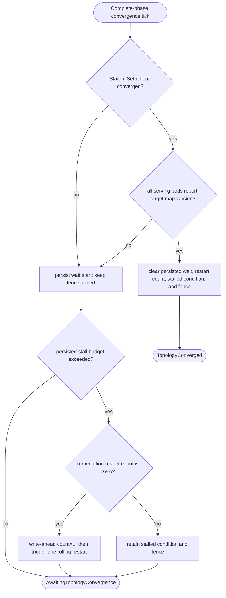
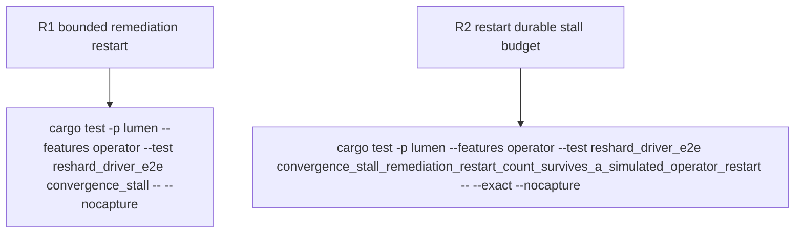

## Logic
<!-- type: logic lang: mermaid -->


## Changes
<!-- type: changes lang: yaml -->

```yaml
changes:
  - path: apps/lumen/src/operator/crd.rs
    action: modify
    section: logic
    impl_mode: hand-written
    description: "Persist convergenceWaitStartedAt and convergenceRemediationRestartCount in the CR workflow/status projection so the stall budget and remediation claim survive operator restarts."
  - path: apps/lumen/tech-design/semantic/source/apps-lumen-src-operator-crd-rs.md
    action: modify
    section: source
    impl_mode: hand-written
    description: "Keep the CRD source mirror aligned with the persisted convergence fields."
  - path: apps/lumen/src/operator/reshard_driver.rs
    action: modify
    section: logic
    impl_mode: hand-written
    description: "Use the persisted wait start, write-ahead claim one bounded remediation restart on a rollout-complete version mismatch, and retain the fence/stalled condition until convergence."
  - path: apps/lumen/tech-design/semantic/source/apps-lumen-src-operator-reshard-driver-rs.md
    action: modify
    section: source
    impl_mode: hand-written
    description: "Keep the reshard-driver source mirror aligned with bounded self-heal behavior."
  - path: apps/lumen/tests/reshard_driver_e2e.rs
    action: modify
    section: unit-test
    impl_mode: hand-written
    description: "Verify exactly-one remediation, write-ahead durability, operator-restart persistence, fence retention, and eventual convergence."
```

## Unit Test
<!-- type: unit-test lang: mermaid -->


