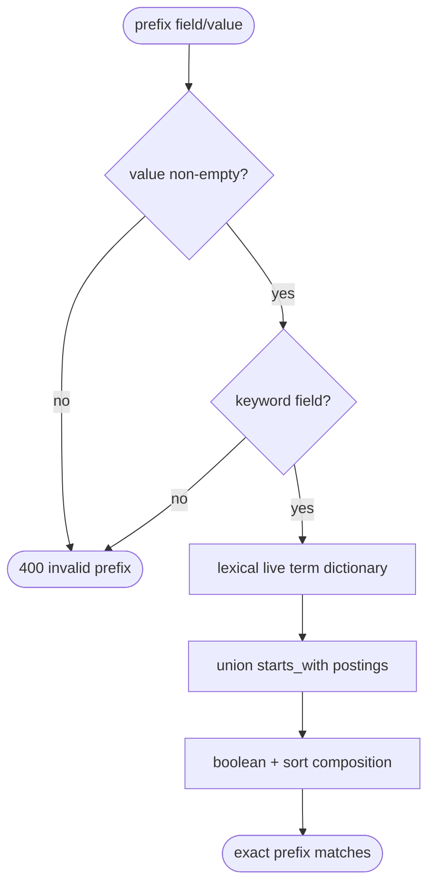
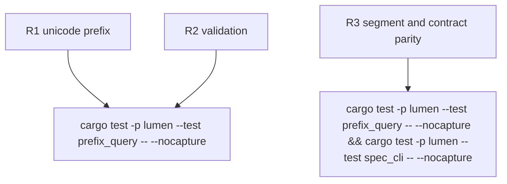

## Logic
<!-- type: logic lang: mermaid -->



## Changes
<!-- type: changes lang: yaml -->

```yaml
changes:
  - path: apps/lumen/src/types.rs
    action: modify
    section: logic
    impl_mode: hand-written
    description: "Add PrefixQuery, QueryNode::Prefix and the keyword prefix capability bit."
  - path: apps/lumen/src/storage.rs
    action: modify
    section: logic
    impl_mode: hand-written
    description: "Validate prefix inputs, union lexical keyword postings, and integrate boolean/sort predicate paths."
  - path: apps/lumen/src/dx.rs
    action: modify
    section: logic
    impl_mode: hand-written
    description: "Project prefix support from FieldType capabilities into the generated field catalogue."
  - path: apps/lumen/src/spec.rs
    action: modify
    section: logic
    impl_mode: hand-written
    description: "Add the canonical hierarchical keyword prefix query shape."
  - path: apps/lumen/tests/prefix_query.rs
    action: create
    section: unit-test
    impl_mode: hand-written
    description: "Cover Taiwanese UTF-8 paths, boolean/sort composition, invalid field types, empty values, segment tail and delete parity."
  - path: apps/lumen/tests/spec_cli.rs
    action: modify
    section: unit-test
    impl_mode: hand-written
    description: "Lock runtime-derived field catalogue and canonical OpenAPI prefix metadata."
```

## Unit Test
<!-- type: unit-test lang: mermaid -->


