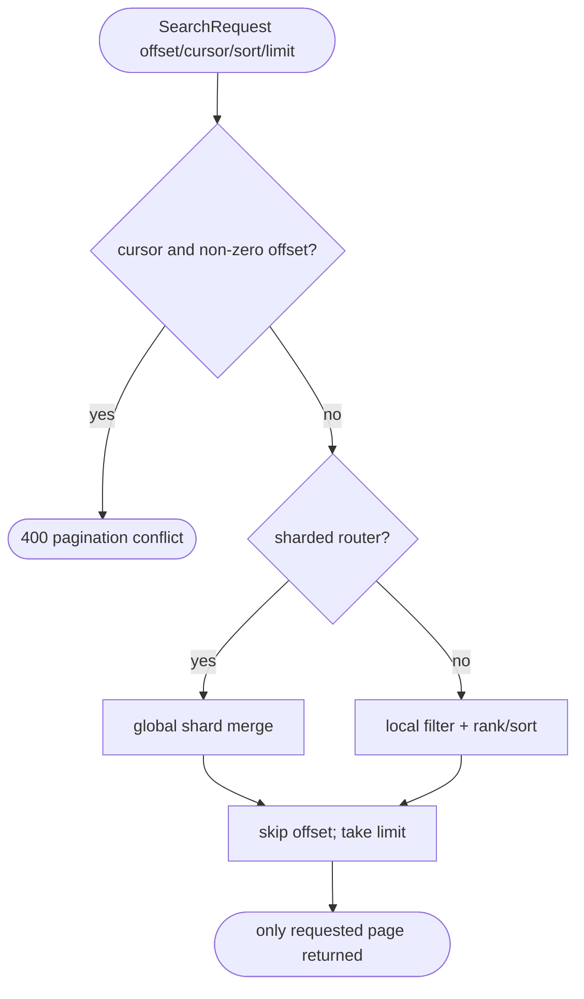
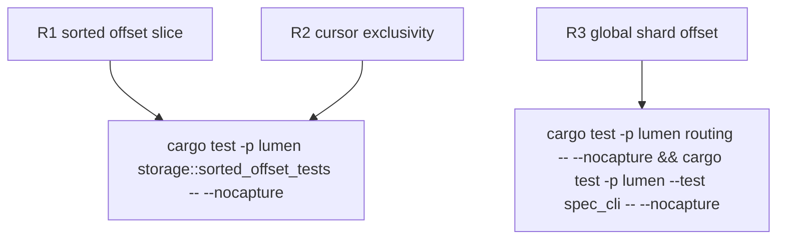

## Logic
<!-- type: logic lang: mermaid -->



## Changes
<!-- type: changes lang: yaml -->

```yaml
changes:
  - path: apps/lumen/src/types.rs
    action: modify
    section: logic
    impl_mode: hand-written
    description: "Add the default-zero offset request field and document cursor exclusivity."
  - path: apps/lumen/src/storage.rs
    action: modify
    section: logic
    impl_mode: hand-written
    description: "Apply native offset after filtering and sort/ranking; reject cursor plus offset and cover number/keyword/composite pages."
  - path: apps/lumen/src/routing.rs
    action: modify
    section: logic
    impl_mode: hand-written
    description: "Apply offset after the global in-process shard merge."
  - path: apps/lumen/src/routing_remote.rs
    action: modify
    section: logic
    impl_mode: hand-written
    description: "Fetch sufficient shard candidates and preserve global offset semantics across pods."
  - path: apps/lumen/src/spec.rs
    action: modify
    section: logic
    impl_mode: hand-written
    description: "Publish the native random-page contract in offline query shapes."
  - path: apps/lumen/tests/spec_cli.rs
    action: modify
    section: unit-test
    impl_mode: hand-written
    description: "Lock OpenAPI and offline-spec offset metadata."
```

## Unit Test
<!-- type: unit-test lang: mermaid -->


