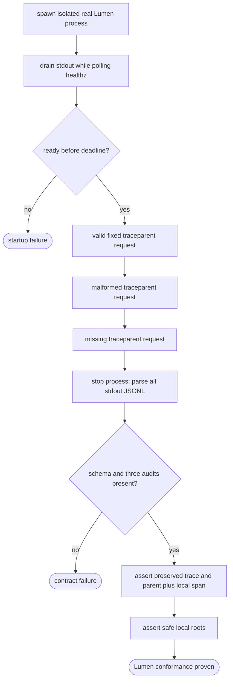

## Logic
<!-- type: logic lang: mermaid -->



The process command passes `--log-format json`, `--wal embedded`, and `--log-level info`; it configures no OTLP endpoint and no Sift address. Readiness traffic may produce events, but every stdout line must independently parse and identify `service.name=lumen`. The three requests use distinct collection ids so each successful request emits exactly one `collection_create_or_extend` audit event from the real handler. The fixed valid header is `00-0af7651916cd43dd8448eb211c80319c-00f067aa0ba902b7-01`. Invalid and missing cases must still return success, generate nonzero lowercase ids, and carry no propagated parent.
## Changes
<!-- type: changes lang: yaml -->

```yaml
changes:
  - path: apps/lumen/tests/structured_stdout_traceparent.rs
    action: create
    section: unit-test
    impl_mode: hand-written
    description: Run the real Lumen binary, make valid, invalid, and missing traceparent HTTP writes, capture stdout concurrently, and assert the shared JSONL and correlation contracts.
```

The product source already has the required adopter seams: `serve` maps `--log-format json` into shared `service-http` initialization, `api::router` applies the shared trace layer outside all routes, and the collection handler emits a domain audit event. The bounded change adds executable proof instead of duplicating those shared implementations.
## Unit Test

```mermaid
---
id: lumen-structured-stdout-traceparent-verification
requirements:
  fixed_parent:
    id: R3
    text: "The valid version-00 traceparent keeps the fixed trace and parent ids and creates a distinct lowercase nonzero Lumen span id."
    kind: functional
    risk: high
    verify: cargo test -p lumen --test structured_stdout_traceparent real_lumen_process_correlates_structured_stdout -- --exact
  jsonl_only:
    id: R1
    text: "Every nonempty stdout line from the isolated real Lumen process parses as axiom.service.log.v1 with service.name lumen."
    kind: contract
    risk: high
    verify: cargo test -p lumen --test structured_stdout_traceparent real_lumen_process_correlates_structured_stdout -- --exact
  safe_fallback:
    id: R4
    text: "Malformed and absent traceparent requests succeed and their audit events contain safe locally generated lowercase nonzero trace and span ids without a propagated parent."
    kind: regression
    risk: high
    verify: cargo test -p lumen --test structured_stdout_traceparent real_lumen_process_correlates_structured_stdout -- --exact
  shared_outer_span:
    id: R2
    text: "The existing public collection route emits its audit event within the existing outer shared HTTP request span."
    kind: integration
    risk: high
    verify: cargo test -p lumen --test structured_stdout_traceparent real_lumen_process_correlates_structured_stdout -- --exact
  standalone_contract:
    id: R5
    text: "The process runs with embedded WAL, no OTLP endpoint, and no Sift configuration; its captured records need no transformation for file collection."
    kind: integration
    risk: medium
    verify: cargo test -p lumen --test structured_stdout_traceparent real_lumen_process_correlates_structured_stdout -- --exact
---
flowchart TD
    r1[R1 jsonl only] --> cargo_test_p_lumen_test_structured_stdout_traceparent_real_lumen_process_correlates_structured_stdout_exact[cargo test -p lumen --test structured_stdout_traceparent real_lumen_process_correlates_structured_stdout -- --exact]
    r2[R2 shared outer span] --> cargo_test_p_lumen_test_structured_stdout_traceparent_real_lumen_process_correlates_structured_stdout_exact
    r3[R3 fixed parent] --> cargo_test_p_lumen_test_structured_stdout_traceparent_real_lumen_process_correlates_structured_stdout_exact
    r4[R4 safe fallback] --> cargo_test_p_lumen_test_structured_stdout_traceparent_real_lumen_process_correlates_structured_stdout_exact
    r5[R5 standalone contract] --> cargo_test_p_lumen_test_structured_stdout_traceparent_real_lumen_process_correlates_structured_stdout_exact
```

<!-- type: unit-test lang: mermaid -->


