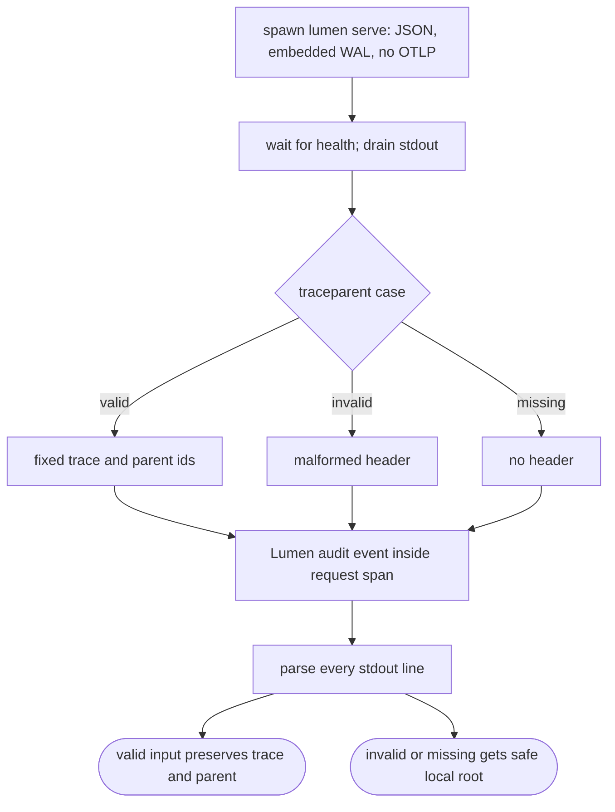

## Logic
<!-- type: logic lang: mermaid -->



Lumen remains independent of Sift. The existing outer router owns the shared `service_http::trace_layer()`, and the existing `collection_create_or_extend` audit event provides a real domain event inside that request span. The conformance process explicitly selects collector mode, removes `LUMEN_OTLP_ENDPOINT` and `RUST_LOG`, sends three independent collection requests, and treats any non-JSON stdout line as failure.

## Changes
<!-- type: changes lang: yaml -->

```yaml
changes:
  - path: apps/lumen/tests/structured_stdout_traceparent.rs
    action: create
    section: e2e-test
    impl_mode: hand-written
    description: Spawn the real Lumen binary without OTLP, drive valid, invalid, and missing traceparent requests, drain stdout, and assert versioned JSONL correlation.
```

No Lumen-local formatter, collector client, or request middleware is added. The adopter relies on the existing `service_http::init_tracing_with_identity` mapping, outer `service_http::trace_layer()`, and audit event; this WI is a process-level conformance proof for shared WIs #1868 and #1870.

## Unit Test

```mermaid
---
id: lumen-structured-stdout-traceparent-verification
requirements:
  independence:
    id: R5
    text: "The conformance process has no OTLP endpoint or Sift dependency and produces stdout consumable as independent JSONL records."
    kind: integration
    risk: medium
    verify: cargo test -p lumen --test structured_stdout_traceparent real_lumen_process_correlates_structured_stdout -- --exact
  invalid_missing:
    id: R4
    text: "Malformed and missing traceparent requests both succeed and emit valid locally rooted correlation."
    kind: regression
    risk: high
    verify: cargo test -p lumen --test structured_stdout_traceparent real_lumen_process_correlates_structured_stdout -- --exact
  outer_trace_layer:
    id: R2
    text: "The public collection route audit event runs inside the shared request span rather than a Lumen-local propagation implementation."
    kind: contract
    risk: high
    verify: cargo test -p lumen --test structured_stdout_traceparent real_lumen_process_correlates_structured_stdout -- --exact
  structured_mode:
    id: R1
    text: "A real Lumen process uses the shared JSON formatter and every captured operational stdout line conforms to axiom.service.log.v1."
    kind: functional
    risk: high
    verify: cargo test -p lumen --test structured_stdout_traceparent real_lumen_process_correlates_structured_stdout -- --exact
  valid_parent:
    id: R3
    text: "A fixed valid traceparent preserves its trace and parent span ids while Lumen creates a distinct nonzero local span id."
    kind: functional
    risk: high
    verify: cargo test -p lumen --test structured_stdout_traceparent real_lumen_process_correlates_structured_stdout -- --exact
---
flowchart TD
    r1[R1 structured mode] --> cargo_test_p_lumen_test_structured_stdout_traceparent_real_lumen_process_correlates_structured_stdout_exact[cargo test -p lumen --test structured_stdout_traceparent real_lumen_process_correlates_structured_stdout -- --exact]
    r2[R2 outer trace layer] --> cargo_test_p_lumen_test_structured_stdout_traceparent_real_lumen_process_correlates_structured_stdout_exact
    r3[R3 valid parent] --> cargo_test_p_lumen_test_structured_stdout_traceparent_real_lumen_process_correlates_structured_stdout_exact
    r4[R4 invalid missing] --> cargo_test_p_lumen_test_structured_stdout_traceparent_real_lumen_process_correlates_structured_stdout_exact
    r5[R5 independence] --> cargo_test_p_lumen_test_structured_stdout_traceparent_real_lumen_process_correlates_structured_stdout_exact
```

<!-- type: unit-test lang: mermaid -->


