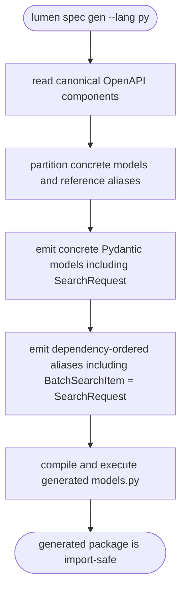
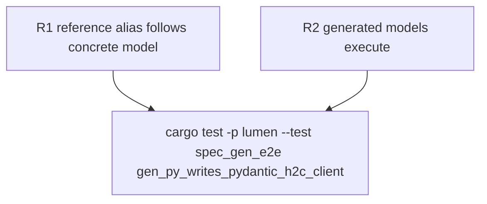

## Logic
<!-- type: logic lang: mermaid -->


## Changes
<!-- type: changes lang: yaml -->

```yaml
changes:
  - path: libs/openapi-codegen/src/emit/py/models_emit.rs
    action: modify
    section: logic
    impl_mode: hand-written
    description: "Partition concrete Pydantic models from reference aliases and dependency-order aliases after their referenced declarations."
  - path: apps/lumen/tests/spec_gen_e2e.rs
    action: modify
    section: unit-test
    impl_mode: hand-written
    description: "Extend the real lumen spec gen --lang py e2e test to assert SearchRequest is declared before BatchSearchItem = SearchRequest and execute the emitted models.py with python3, locking import-time safety for reference aliases."
```
## Unit Test
<!-- type: unit-test lang: mermaid -->


