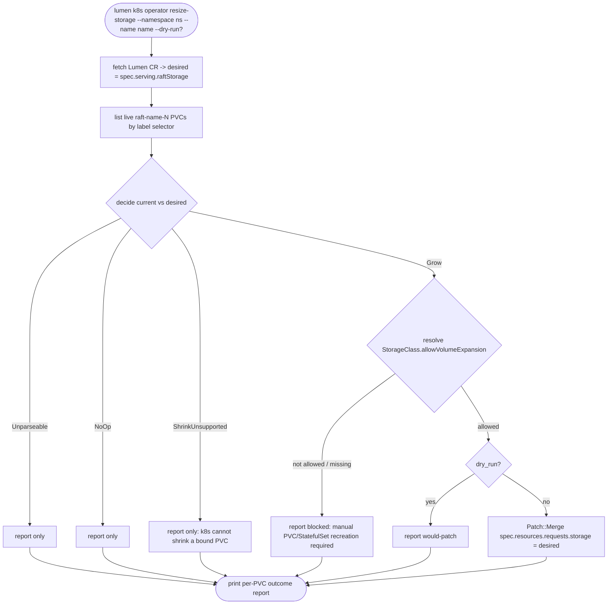

## Logic
<!-- type: logic lang: mermaid -->


## Unit Test
<!-- type: unit-test lang: mermaid -->

```mermaid
---
id: raft-storage-resize-cli-and-docs-tests
requirements:
  llm_storage_documents_resize_gap:
    id: R1
    text: "lumen llm storage documents that editing spec.serving.raftStorage on a live CR does not resize existing PVCs (StatefulSet volumeClaimTemplates immutability), the manual kubectl patch pvc procedure, the allowVolumeExpansion: true StorageClass precondition, that shrink is unsupported, and the lumen k8s operator resize-storage helper."
    kind: doc
    risk: low
    verify: test
  parse_and_decide_classify_storage_changes:
    id: R2
    text: "parse_storage_bytes/decide correctly classify grow (20Gi -> 30Gi), no-op (20Gi -> 20Gi), shrink-unsupported (20Gi -> 10Gi), and unparseable quantity strings, with no live-cluster dependency."
    kind: behavior
    risk: medium
    verify: test
  cli_help_documents_resize_storage_flags:
    id: R3
    text: "lumen k8s operator resize-storage --help documents --namespace, --name, and --dry-run, and the verb is reachable only when built with --features operator, consistent with the existing k8s operator run feature gate and fallback error message."
    kind: behavior
    risk: low
    verify: inspection
  default_build_excludes_kube_client:
    id: R4
    text: "cargo build -p lumen with no features still compiles with no kube-rs/k8s-openapi client linked; resize-storage is reachable only via the operator feature, matching run_operator/crd_yaml."
    kind: behavior
    risk: low
    verify: inspection
elements:
  resize_pure_unit_tests:
    kind: test
    path: apps/lumen/src/operator/resize.rs
  spec_cli_unit_tests:
    kind: test
    path: apps/lumen/tests/spec_cli.rs
relations:
  - { from: spec_cli_unit_tests, verifies: llm_storage_documents_resize_gap }
  - { from: resize_pure_unit_tests, verifies: parse_and_decide_classify_storage_changes }
  - { from: resize_pure_unit_tests, verifies: cli_help_documents_resize_storage_flags }
  - { from: resize_pure_unit_tests, verifies: default_build_excludes_kube_client }
---
requirementDiagram
    requirement R1 {
      id: R1
      text: "llm storage documents resize gap + procedure"
      risk: low
      verifymethod: test
    }
    requirement R2 {
      id: R2
      text: "parse_storage_bytes/decide classify grow/no-op/shrink/unparseable"
      risk: medium
      verifymethod: test
    }
    requirement R3 {
      id: R3
      text: "resize-storage --help documents flags, feature-gated"
      risk: low
      verifymethod: inspection
    }
    requirement R4 {
      id: R4
      text: "default build excludes kube client"
      risk: low
      verifymethod: inspection
    }
    element resize_pure_unit_tests {
      type: test
    }
    element spec_cli_unit_tests {
      type: test
    }
    spec_cli_unit_tests - satisfies -> R1
    resize_pure_unit_tests - satisfies -> R2
    resize_pure_unit_tests - satisfies -> R3
    resize_pure_unit_tests - satisfies -> R4
```
## Changes
<!-- type: changes lang: yaml -->

```yaml
changes:
  - path: apps/lumen/src/operator/resize.rs
    action: create
    section: logic
    impl_mode: hand-written
    description: "New module: parse_storage_bytes(&str) -> Result<u64> (Kubernetes quantity suffixes Ki/Mi/Gi/Ti and bare bytes), a ResizeAction enum {Grow, NoOp, ShrinkUnsupported, Unparseable} plus decide(current: &str, desired: &str) -> ResizeAction (pure, unit-tested), a PvcResizeOutcome struct (pvc name, action, patched: bool, detail: String), and an impure async resize_instance(client: kube::Client, namespace: &str, name: &str, dry_run: bool) -> Result<Vec<PvcResizeOutcome>> that: fetches the named Lumen CR for spec.serving.raftStorage, lists PVCs labeled app.kubernetes.io/instance=<name> filtered to names starting raft-<name>-, runs decide() per PVC, and for Grow results looks up the bound PersistentVolumeClaim.spec.storage_class_name's StorageClass.spec.allow_volume_expansion — patching spec.resources.requests.storage via Patch::Merge only when allowed and !dry_run, otherwise recording a blocked/would-patch/no-op/shrink-skipped outcome without mutating the PVC."
  - path: apps/lumen/tech-design/semantic/source/projects-lumen-src-operator-resize-rs.md
    action: create
    section: source
    impl_mode: hand-written
    description: "New SPEC-MANAGED rust-source-unit tech-design doc for resize.rs, mirroring the format of the other projects-lumen-src-operator-*-rs.md docs."
  - path: apps/lumen/src/operator/mod.rs
    action: modify
    section: logic
    impl_mode: hand-written
    description: "Add `pub mod resize;` alongside the existing `pub mod crd; pub mod lease; pub mod reconcile; pub mod render;` lines."
  - path: apps/lumen/tech-design/semantic/source/projects-lumen-src-operator-mod-rs.md
    action: modify
    section: source
    impl_mode: hand-written
    description: "Sync the SPEC-MANAGED Source block byte-for-byte with the edited operator/mod.rs."
  - path: apps/lumen/src/bin/lumen.rs
    action: modify
    section: logic
    impl_mode: hand-written
    description: "Add K8sOperatorCmd::ResizeStorage(K8sOperatorResizeStorageArgs { namespace: String, name: String, dry_run: bool }) beside Run/Render; wire it in the k8s() dispatcher's K8sCmd::Operator match arm calling a new resize_storage(args) function; add a #[cfg(feature = \"operator\")] real impl (kube::Client::try_default().await, lumen::operator::resize::resize_instance, print a per-PVC outcome table) paired with a #[cfg(not(feature = \"operator\"))] fallback bailing with the same 'rebuild with --features operator' message pattern already used by run_operator/crd_yaml; update the k8s() doc comment to note resize-storage as a second live-cluster verb alongside operator run."
  - path: apps/lumen/tech-design/semantic/source/projects-lumen-src-bin-lumen-rs.md
    action: modify
    section: source
    impl_mode: hand-written
    description: "Sync the SPEC-MANAGED Source block byte-for-byte with the edited bin/lumen.rs."
  - path: apps/lumen/src/spec.rs
    action: modify
    section: logic
    impl_mode: hand-written
    description: "Extend llm_storage_md() with a new 'Resizing raftStorage' section: (a) why a plain spec.serving.raftStorage CR edit does not resize existing PVCs (StatefulSet volumeClaimTemplates immutability, applies at every replicasPerShard value post-#812), (b) the manual `kubectl patch pvc raft-<name>-<n> --type merge -p '{\"spec\":{\"resources\":{\"requests\":{\"storage\":\"<new size>\"}}}}'` procedure per pod, requiring allowVolumeExpansion: true on the bound StorageClass, (c) that PVC shrink is unsupported by Kubernetes and requires pod/PVC recreation instead, and (d) the new `lumen k8s operator resize-storage --namespace <ns> --name <name> [--dry-run]` helper as the automated form of the same procedure."
  - path: apps/lumen/tech-design/semantic/source/projects-lumen-src-spec-rs.md
    action: modify
    section: source
    impl_mode: hand-written
    description: "Sync the SPEC-MANAGED Source block byte-for-byte with the edited spec.rs."
  - path: apps/lumen/tests/operator_render.rs
    action: modify
    section: unit-test
    impl_mode: hand-written
    description: "No render() shape changes needed for this issue, but confirm (via an added lightweight assertion or comment) that the raft PVC volumeClaimTemplate this WI's resize tooling targets is still rendered unconditionally per #812, keeping this fixture file and the new resize tooling in sync."
  - path: apps/lumen/tests/spec_cli.rs
    action: modify
    section: unit-test
    impl_mode: hand-written
    description: "Extend the llm storage doc test to assert the new Resizing raftStorage content (volumeClaimTemplates immutability, kubectl patch pvc procedure, allowVolumeExpansion requirement, shrink unsupported, and the lumen k8s operator resize-storage helper reference)."
  - path: apps/lumen/tech-design/semantic/lumen-tests.md
    action: modify
    section: source
    impl_mode: hand-written
    description: "Sync the SPEC-MANAGED Source block byte-for-byte with the edited operator_render.rs and spec_cli.rs."
```
