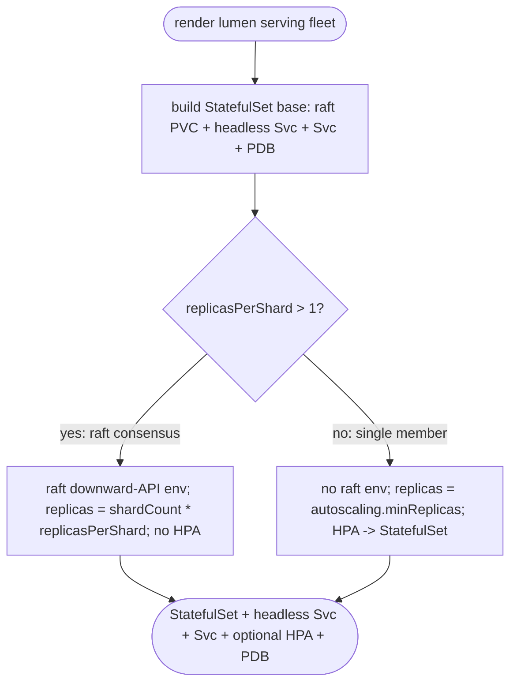

## Logic
<!-- type: logic lang: mermaid -->


## Unit Test

```mermaid
---
id: render-serving-statefulset-unconditional-pvc-tests
requirements:
  always_statefulset_with_pvc:
    id: R1
    text: "render() renders the serving fleet as a StatefulSet with the volumeClaimTemplates-backed raft PVC mounted at /var/lib/lumen for every replicasPerShard value."
    kind: behavior
    risk: medium
    verify: test
  solo_no_raft_env_keeps_hpa:
    id: R2
    text: "At replicasPerShard <= 1 the StatefulSet has no raft downward-API env and an HPA (scaleTargetRef kind StatefulSet) still targets it with unchanged min/max/target-CPU behavior."
    kind: behavior
    risk: medium
    verify: test
  raft_ha_unchanged:
    id: R3
    text: "At replicasPerShard > 1 behavior is unchanged from today: fixed replica count shard_count * replicasPerShard, raft downward-API env present, no HPA."
    kind: behavior
    risk: medium
    verify: test
  headless_service_unconditional:
    id: R4
    text: "The serving headless Service required for the StatefulSet serviceName is rendered unconditionally, not only when raft is active."
    kind: behavior
    risk: low
    verify: test
  reconcile_targets_statefulset:
    id: R5
    text: "reconcile.rs ManagedService::readiness_targets reports kind StatefulSet (never Deployment) for the serving fleet in both replica-count regimes."
    kind: behavior
    risk: medium
    verify: test
  crd_docs_not_raft_only:
    id: R6
    text: "CRD doc comments for replicas_per_shard and raft_storage no longer describe the PVC as raft-only / replicasPerShard>1-only."
    kind: doc
    risk: low
    verify: inspection
  llm_storage_topic:
    id: R7
    text: "lumen llm exposes a storage/ops topic documenting that replicasPerShard:1 deployments still get a StatefulSet + PVC-backed WAL."
    kind: behavior
    risk: low
    verify: test
elements:
  operator_render_unit_tests:
    kind: test
    path: apps/lumen/tests/operator_render.rs
  spec_cli_unit_tests:
    kind: test
    path: apps/lumen/tests/spec_cli.rs
relations:
  - { from: operator_render_unit_tests, verifies: always_statefulset_with_pvc }
  - { from: operator_render_unit_tests, verifies: solo_no_raft_env_keeps_hpa }
  - { from: operator_render_unit_tests, verifies: raft_ha_unchanged }
  - { from: operator_render_unit_tests, verifies: headless_service_unconditional }
  - { from: operator_render_unit_tests, verifies: reconcile_targets_statefulset }
  - { from: spec_cli_unit_tests, verifies: llm_storage_topic }
---
requirementDiagram
    requirement R1 {
      id: R1
      text: "always StatefulSet + PVC"
      risk: medium
      verifymethod: test
    }
    requirement R2 {
      id: R2
      text: "solo: no raft env, HPA kept"
      risk: medium
      verifymethod: test
    }
    requirement R3 {
      id: R3
      text: "raft-HA unchanged"
      risk: medium
      verifymethod: test
    }
    requirement R4 {
      id: R4
      text: "headless service unconditional"
      risk: low
      verifymethod: test
    }
    requirement R5 {
      id: R5
      text: "reconcile targets StatefulSet"
      risk: medium
      verifymethod: test
    }
    requirement R6 {
      id: R6
      text: "CRD docs updated"
      risk: low
      verifymethod: inspection
    }
    requirement R7 {
      id: R7
      text: "llm storage topic"
      risk: low
      verifymethod: test
    }
    element operator_render_unit_tests {
      type: "rs/#[test]"
    }
    element spec_cli_unit_tests {
      type: "rs/#[test]"
    }
    operator_render_unit_tests - verifies -> R1
    operator_render_unit_tests - verifies -> R2
    operator_render_unit_tests - verifies -> R3
    operator_render_unit_tests - verifies -> R4
    operator_render_unit_tests - verifies -> R5
    spec_cli_unit_tests - verifies -> R7
```

<!-- type: unit-test lang: mermaid -->


## Changes
<!-- type: changes lang: yaml -->

```yaml
changes:
  - path: apps/lumen/src/operator/render.rs
    action: modify
    section: logic
    impl_mode: hand-written
    description: "render() unconditionally pushes serving_statefulset + serving_headless_service + serving_service + serving_pdb; serving_hpa is pushed only when replicas_per_shard <= 1 and its scaleTargetRef.kind becomes StatefulSet; serving_statefulset gates the raft downward-API env extension and the shard_count*replicas_per_shard replica override on replicas_per_shard > 1, leaving PVC/volumeMount/headless-service-dependent fields unconditional; serving_deployment's Deployment-only build path is removed."
  - path: apps/lumen/tech-design/semantic/source/projects-lumen-src-operator-render-rs.md
    action: modify
    section: source
    impl_mode: hand-written
    description: "Sync the SPEC-MANAGED Source block byte-for-byte with the edited render.rs."
  - path: apps/lumen/src/operator/reconcile.rs
    action: modify
    section: logic
    impl_mode: hand-written
    description: "ManagedService::readiness_targets returns kind \"StatefulSet\" unconditionally for the serving fleet (drop the replicas_per_shard branch); status_patch's desired-replica formula is unchanged."
  - path: apps/lumen/tech-design/semantic/source/projects-lumen-src-operator-reconcile-rs.md
    action: modify
    section: source
    impl_mode: hand-written
    description: "Sync the SPEC-MANAGED Source block byte-for-byte with the edited reconcile.rs."
  - path: apps/lumen/src/operator/crd.rs
    action: modify
    section: logic
    impl_mode: hand-written
    description: "Update module doc, replicas_per_shard doc, and raft_storage doc comments so the PVC is no longer described as raft-only / replicasPerShard>1-only; no schema field changes."
  - path: apps/lumen/tech-design/semantic/source/projects-lumen-src-operator-crd-rs.md
    action: modify
    section: source
    impl_mode: hand-written
    description: "Sync the SPEC-MANAGED Source block byte-for-byte with the edited crd.rs doc comments."
  - path: apps/lumen/tests/operator_render.rs
    action: modify
    section: unit-test
    impl_mode: hand-written
    description: "Update fixtures/assertions so replicasPerShard:1 (dev_spec/prod_spec) expect a StatefulSet with a raft PVC, no raft env, and an HPA targeting kind StatefulSet; replicasPerShard>1 assertions are unchanged."
  - path: apps/lumen/tech-design/semantic/lumen-tests.md
    action: modify
    section: source
    impl_mode: hand-written
    description: "Sync the SPEC-MANAGED Source block byte-for-byte with the edited operator_render.rs."
  - path: apps/lumen/src/spec.rs
    action: modify
    section: logic
    impl_mode: hand-written
    description: "Add an llm_storage_md() (and JSON equivalent) documenting that replicasPerShard:1 still renders a StatefulSet with a durable raft PVC, following the llm_auth_md() pattern."
  - path: apps/lumen/tech-design/semantic/source/projects-lumen-src-spec-rs.md
    action: modify
    section: source
    impl_mode: hand-written
    description: "Sync the SPEC-MANAGED Source block byte-for-byte with the edited spec.rs."
  - path: apps/lumen/src/bin/lumen.rs
    action: modify
    section: logic
    impl_mode: hand-written
    description: "Add a Storage variant to LlmTopic and wire it to lumen::spec::llm_storage_md()/json, following the existing Auth variant wiring."
  - path: apps/lumen/tech-design/semantic/source/projects-lumen-src-bin-lumen-rs.md
    action: modify
    section: source
    impl_mode: hand-written
    description: "Sync the SPEC-MANAGED Source block byte-for-byte with the edited bin/lumen.rs."
```
