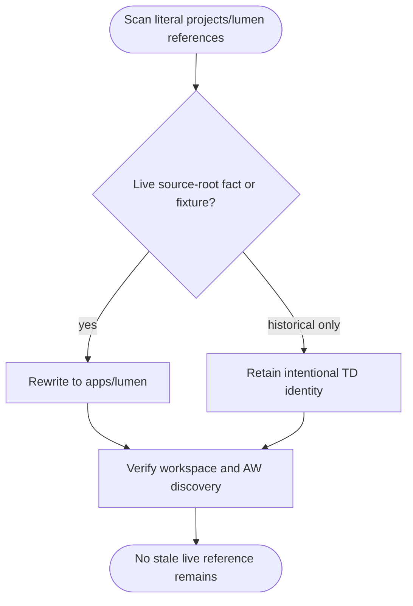

## Logic
<!-- type: logic lang: mermaid -->



## Changes
<!-- type: changes lang: yaml -->

```yaml
changes:
  - path: projects/mamba/src/runtime/stdlib/mmap_mod.rs
    action: modify
    section: logic
    impl_mode: hand-written
    description: "Correct the workspace dependency note to name the canonical apps/lumen source root."
  - path: apps/agentic-workflow/src/cli/capability.rs
    action: modify
    section: unit-test
    impl_mode: hand-written
    description: "Make the Lumen capability-profile discovery fixture exercise apps/lumen rather than the retired projects/lumen root."
```
