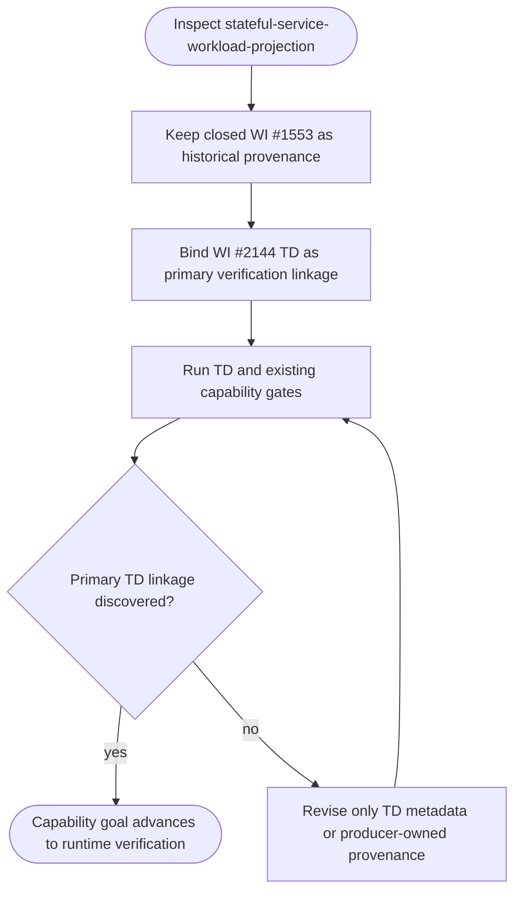

## Logic
<!-- type: logic lang: mermaid -->


## Changes
<!-- type: changes lang: yaml -->

```yaml
changes:
  - path: apps/lumen/README.md
    action: modify
    section: logic
    impl_mode: hand-written
    description: "Make WI #2144 the active bounded verification-link root for stateful-service-workload-projection while retaining closed WI #1553 as historical projection provenance; do not change the capability promise or runtime evidence. generator gap: missing-generator:capability-provenance-link (#2144)."
  - path: apps/lumen/tests/capability_stateful_workload_linkage.rs
    action: create
    section: unit-test
    impl_mode: hand-written
    description: "Add a deterministic structural regression test that requires the TD primary capability reference, active #2144 linkage, retained #1553 provenance, and the existing stateful capability gate. generator gap: missing-generator:test:capability-td-linkage (#2144)."
```
## Unit Test

```mermaid
---
id: lumen-stateful-service-workload-primary-verification
requirements:
  active_and_historical_wi_provenance:
    id: R2
    text: "The capability contract identifies #2144 as the active verification-link work while retaining closed #1553 as historical projection provenance."
    kind: regression
    risk: medium
    verify: capability_stateful_workload_linkage::active_and_historical_provenance_are_distinct
  capability_goal_advances:
    id: R4
    text: "The Lumen capability goal advances past link_claim_verification once the TD lifecycle is complete."
    kind: functional
    risk: high
    verify: aw goal capability --project lumen --non-interactive
  existing_stateful_gate_remains_authoritative:
    id: R3
    text: "The existing Lumen stateful capability gate remains present and no new runtime behavior is claimed."
    kind: regression
    risk: medium
    verify: aw capability check --project lumen --skip-issue-inventory
  primary_td_linkage:
    id: R1
    text: "The TD declares stateful-service-workload-projection as a primary capability verification linkage."
    kind: functional
    risk: high
    verify: capability_stateful_workload_linkage::primary_td_linkage_is_bound
---
flowchart TD
    r1[R1 primary td linkage] --> capability_stateful_workload_linkage_primary_td_linkage_is_bound[capability_stateful_workload_linkage::primary_td_linkage_is_bound]
    r2[R2 active and historical wi provenance] --> capability_stateful_workload_linkage_active_and_historical_provenance_are_distinct[capability_stateful_workload_linkage::active_and_historical_provenance_are_distinct]
    r3[R3 existing stateful gate remains authoritative] --> aw_capability_check_project_lumen_skip_issue_inventory[aw capability check --project lumen --skip-issue-inventory]
    r4[R4 capability goal advances] --> aw_goal_capability_project_lumen_non_interactive[aw goal capability --project lumen --non-interactive]
```

<!-- type: unit-test lang: mermaid -->


