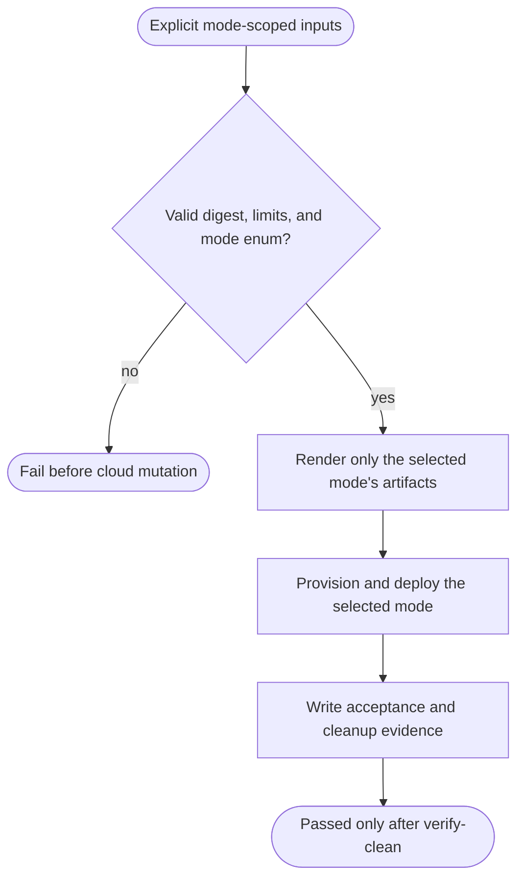
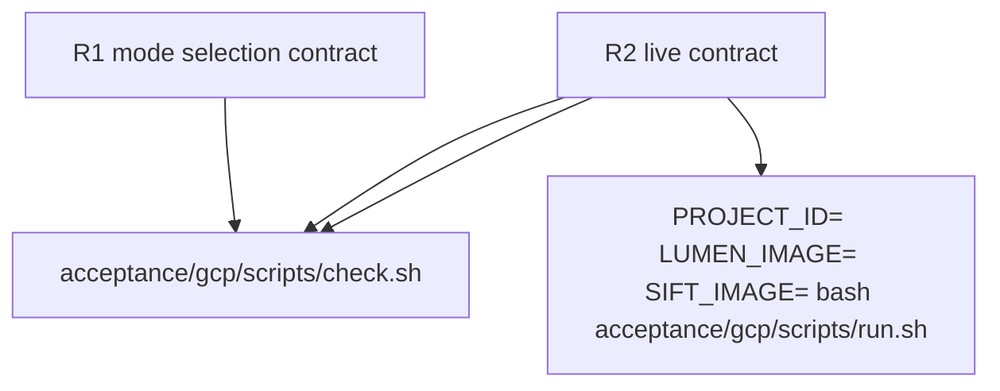

## Logic
<!-- type: logic lang: mermaid -->


## Changes
<!-- type: changes lang: yaml -->

```yaml
changes:
  - path: acceptance/gcp/scripts/run.sh
    action: modify
    section: logic
    impl_mode: hand-written
    anchor: top-level run harness configuration and phase dispatch
  - path: acceptance/gcp/scripts/render-manifests.sh
    action: modify
    section: logic
    impl_mode: hand-written
    anchor: rendered service layer selection
  - path: acceptance/gcp/evidence/schema.json
    action: modify
    section: logic
    impl_mode: hand-written
    anchor: terminal acceptance evidence schema
  - path: acceptance/gcp/tests/acceptance_mode_selection.sh
    action: create
    section: unit-test
    impl_mode: hand-written
    anchor: shell regression for acceptance-mode phase selection
  - path: acceptance/gcp/scripts/check.sh
    action: modify
    section: unit-test
    impl_mode: hand-written
    anchor: static acceptance gate entrypoint
```
## Unit Test
<!-- type: unit-test lang: mermaid -->


