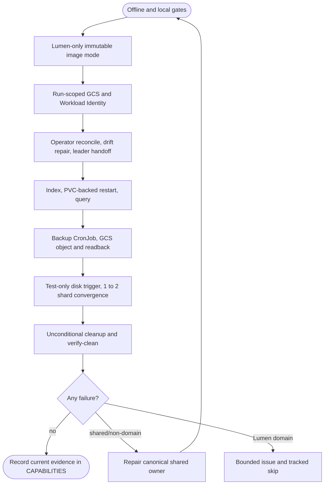

## Logic
<!-- type: logic lang: mermaid -->



## Changes
<!-- type: changes lang: yaml -->

```yaml
changes:
  - path: benchmarks/gcp-operator-acceptance/scripts/run.sh
    action: modify
    section: logic
    impl_mode: hand-written
    anchor: top-level run harness configuration and phase dispatch
  - path: benchmarks/gcp-operator-acceptance/scripts/check.sh
    action: modify
    section: unit-test
    impl_mode: hand-written
    anchor: offline harness validation sequence
  - path: benchmarks/gcp-operator-acceptance/tests/lumen_only_mode.sh
    action: create
    section: unit-test
    impl_mode: hand-written
    anchor: shell regression for Lumen-only phase selection
  - path: benchmarks/gcp-operator-acceptance/README.md
    action: modify
    section: logic
    impl_mode: hand-written
    anchor: acceptance boundary and exact lifecycle
  - path: apps/lumen/CAPABILITIES.md
    action: modify
    section: logic
    impl_mode: hand-written
    anchor: cross-service delivery verification work-root evidence
```

## Unit Test

```mermaid
---
id: lumen-gke-deployment-scaling-cleanup-verification
requirements:
  capability_evidence:
    id: R4
    text: "A successful current Lumen run is recorded with command, commit, evidence path, and exclusions in the Lumen capability contract."
    kind: regression
    risk: medium
    verify: aw capability check --project lumen --skip-issue-inventory
  lumen_gke_acceptance:
    id: R2
    text: "The live low-cost GKE journey proves Lumen reconcile, restart persistence, GCS upload/readback, disk-driven 1-to-2 split, and cleanup with non-zero work."
    kind: functional
    risk: high
    verify: LUMEN_ONLY=1 benchmarks/gcp-operator-acceptance/scripts/run.sh
  lumen_only_static_contract:
    id: R1
    text: "The reusable harness can select a Lumen-only phase without requiring or deploying Sift."
    kind: regression
    risk: medium
    verify: benchmarks/gcp-operator-acceptance/tests/lumen_only_mode.sh
  offline_harness_gate:
    id: R1
    text: "Shell syntax and Terraform static validation remain reproducible without contacting GCP."
    kind: regression
    risk: medium
    verify: benchmarks/gcp-operator-acceptance/scripts/check.sh
---
flowchart TD
    r1[R1 lumen only static contract] --> benchmarks_gcp_operator_acceptance_tests_lumen_only_mode_sh[benchmarks/gcp-operator-acceptance/tests/lumen_only_mode.sh]
    r1[R1 offline harness gate] --> benchmarks_gcp_operator_acceptance_scripts_check_sh[benchmarks/gcp-operator-acceptance/scripts/check.sh]
    r2[R2 lumen gke acceptance] --> lumen_only_1_benchmarks_gcp_operator_acceptance_scripts_run_sh[LUMEN_ONLY=1 benchmarks/gcp-operator-acceptance/scripts/run.sh]
    r4[R4 capability evidence] --> aw_capability_check_project_lumen_skip_issue_inventory[aw capability check --project lumen --skip-issue-inventory]
```

<!-- type: unit-test lang: mermaid -->


