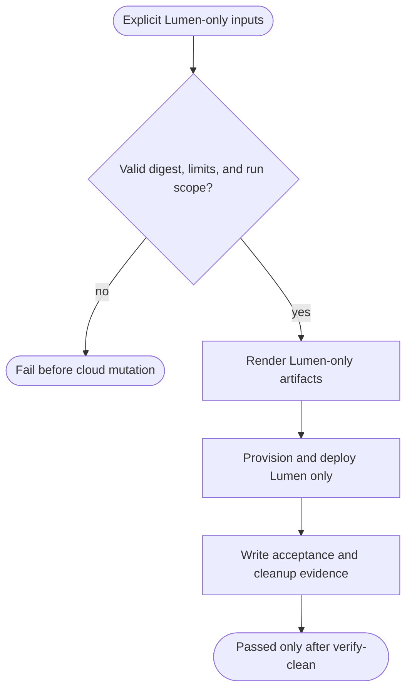
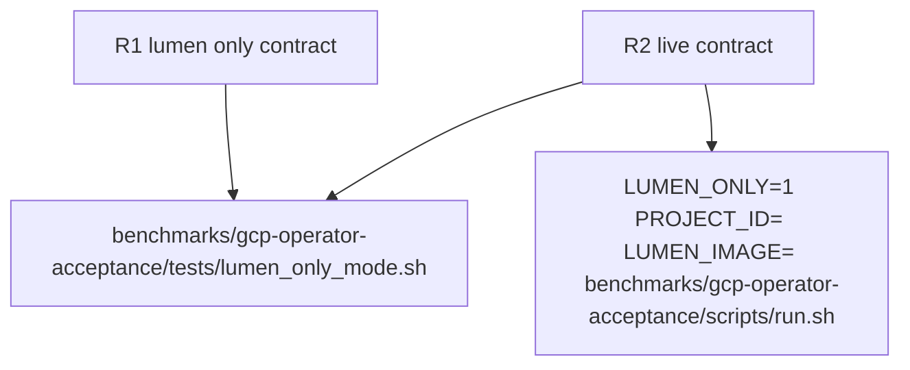

## Logic
<!-- type: logic lang: mermaid -->


## Changes
<!-- type: changes lang: yaml -->

```yaml
changes:
  - path: benchmarks/gcp-operator-acceptance/scripts/run.sh
    action: modify
    section: logic
    impl_mode: hand-written
    anchor: top-level run harness configuration and phase dispatch
  - path: benchmarks/gcp-operator-acceptance/scripts/render-manifests.sh
    action: modify
    section: logic
    impl_mode: hand-written
    anchor: rendered service layer selection
  - path: benchmarks/gcp-operator-acceptance/evidence/schema.json
    action: modify
    section: logic
    impl_mode: hand-written
    anchor: terminal acceptance evidence schema
  - path: benchmarks/gcp-operator-acceptance/tests/lumen_only_mode.sh
    action: create
    section: unit-test
    impl_mode: hand-written
    anchor: shell regression for Lumen-only phase selection
```
## Unit Test
<!-- type: unit-test lang: mermaid -->


