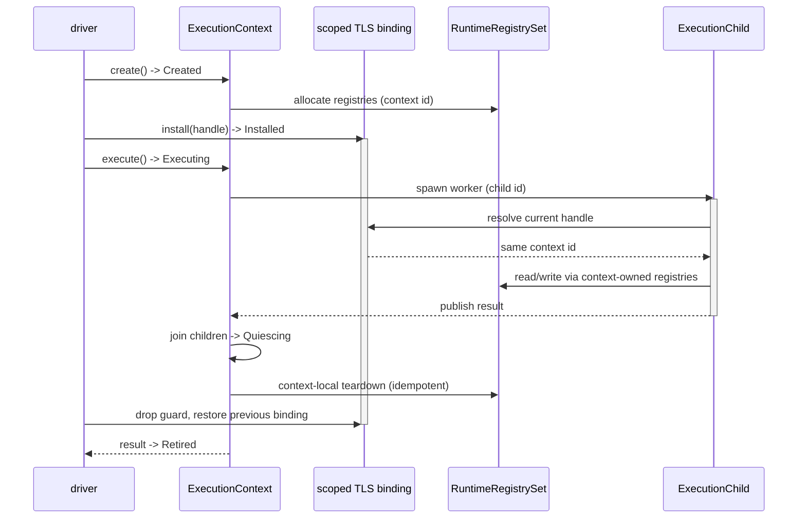
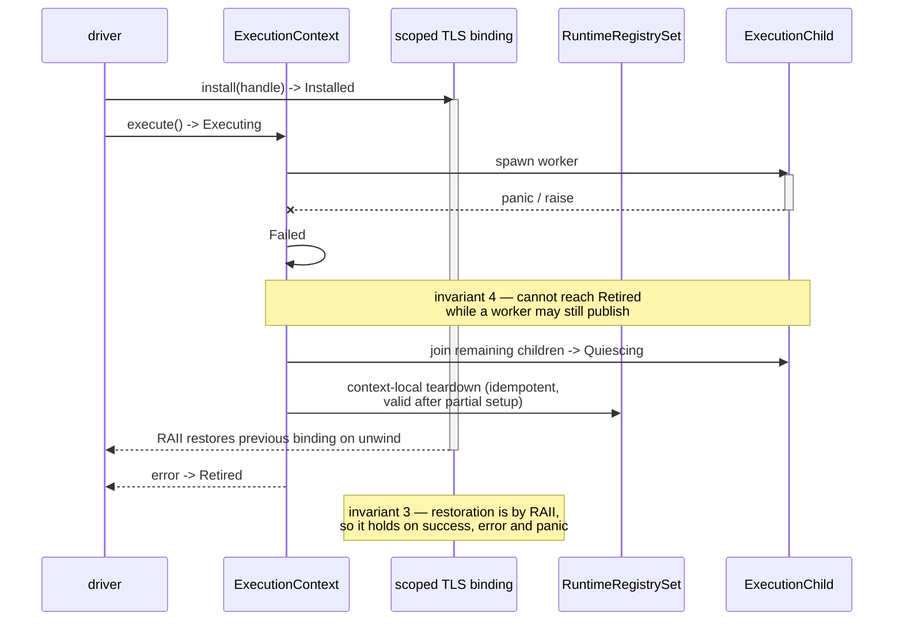

# execution context — stage 1 ownership inventory

Stage 1 deliverable for [`execution-context.md`](execution-context.md) (#2968,
under epic #2530). Controller-owned; no `src/**` change.

Per-symbol table: [`ownership-inventory-rows.md`](ownership-inventory-rows.md).

## Reproduction anchor

| field | value |
|---|---|
| HEAD | `03e8c5216126fa1fd2fed4447a207cb53ee62414` **plus a dirty working tree** |
| platform | `aarch64-apple-darwin` |
| oracle | CPython 3.12.11 (`~/.pyenv/versions/3.12.11/bin/python3.12`) |
| declarations | 375 |
| **set digest** | `sha256 d7bd291d53649cee63f6f38d93d38c1478d5ff8a741bb366232a3c1f3b439998` |
| position digest | `sha256 b2cb9d85dfb08d74f3404d032ef161e66bdd0381d877eafe293b68e9a97e2d0d` |

The **set digest** is over the sorted `path:symbol` list and is the anchor to
compare against: all 375 pairs are unique, so it identifies the set exactly
while being independent of line movement. A later pass that does not reproduce
it is scanning a different set, and its conclusions do not compose with this
one.

The **position digest** additionally covers `:line`. It is reproducible only
against the same working tree, because this scan ran with uncommitted work in
the tree. That work adds and removes **zero** declarations — verified by
diffing for `thread_local!` and `static` declaration lines, which yields no
hits — so the set is unaffected. But it shifts line numbers in five files, 52
of the 375 rows (`class/mod.rs` 44, `exception.rs` 4, `inspect_mod.rs` 3,
`traceback_mod.rs` 1). Expect the position digest to change once that work
lands; the set digest should not.

The scanner expands transitively from the roots named in `execution-context.md`
§"Current state inventory roots"; it does not stop at that starter list.
`src/driver/**` and `src/conformance/**` yield **zero** real declarations —
every `static` hit there is a `'static` lifetime or prose.

## Storage census

| storage | n |
|---|---|
| `thread_local!` | 270 |
| `static` + atomic | 46 |
| `static` + `LazyLock` | 24 |
| `static` + `OnceLock` | 22 |
| `static` plain | 6 |
| `static` + `Mutex` | 5 |
| `static` + `RwLock` | 2 |

102 files: `runtime` 371, `codegen` 4.

## Ownership classification

Against the five classes in `execution-context.md` §"Ownership classification".

| class | n | destination |
|---|---|---|
| context-owned | 239 | `ExecutionContext` field / sub-aggregate |
| process-immutable | 45 | process-global cache, outside the aggregate |
| process-service | 37 | explicit service handle, outside the aggregate |
| child-owned | 19 | `ExecutionChild`, joined at quiescence |
| compatibility-binding | 9 | scoped TLS stack holding `ContextHandle` only |
| *discarded* | 26 | n/a |

No symbol is unclassified — the contract states an unknown classification is a
blocker, not a default to TLS.

**Discards are justified, not dropped.** All 26 are test-only observability:
`*_TEST_HOOK*`, `TEST_LOCK`, `TRACE_TEST_LOCK`, `ASYNC_STATE_TEST_LOCK`,
`CURRENT_TEST_NAME`, and the counter blocks at `class/mod.rs:23259+` and
`weakref_mod.rs:1979+`.

**`child-owned` vs `context-owned`** is drawn on inherit-vs-fresh: does a
spawned context share the parent's instance, or start with an empty one?

**`compatibility-binding`** is narrower than "per-thread". It is reserved for
state CPython *specifies* as per-thread **and** that user code can observe: the
`sys.exc_info` chain, `threading.local`, `current_thread`.

## Finding 1 — the cross-thread boundary is the handle representation

TLS storage is **necessary but not sufficient** to predict a cross-thread
defect. Reasoning from storage class alone gives the wrong answer: the core
registries `CLASS_REGISTRY`, `GLOBAL_NAMESPACE`, and `MODULES` are all
`thread_local!`, yet the behaviours that depend on them cross threads correctly,
because classes, module functions, and simple globals are statically lowered.

Probed against the release binary, CPython 3.12.11 as oracle:

| probe | mamba | |
|---|---|---|
| global `int` rebound by child | `99` | matches |
| class defined + instantiated in child | `42` | matches |
| instance built in parent, method called in child | `42` | matches |
| module-level `def` called in child | `42` | matches |
| `dict`/`list`/`set` read in child | `(1, [1, 2], [1, 2])` | matches |
| `import json` inside child | `{"k": 1}` | matches |
| `re.compile` pattern used in child | `42` | matches |
| `lambda` / closure called in child | `TypeError: 'int' object is not callable` | **breaks** |
| generator `next()` in child | `TypeError: 'int' object is not an iterator` | **breaks** |
| `hashlib` hash `.hexdigest()` in child | `TypeError: 'NoneType' object is not callable` | **breaks** |
| `array.array` iterated in child | `TypeError: 'int' object is not iterable` | **breaks** |
| `random.Random` drawn in child | `TypeError: 'NoneType' object is not callable` | **breaks** |
| `open()` file `.write()` in child | `AttributeError: 'int' object has no attribute 'write'` | **breaks** |

> An object whose runtime representation is a `u64` index into a **thread-local
> table** is invalid outside the thread that created it.

The failure signature is uniform and self-diagnosing: the handle integer
surfaces as a Python `int`, so the interpreter reports `'int' object is not
callable / not iterable / not an iterator / has no attribute …`, or
`'NoneType' …` when the missed lookup yields `None`.

Severity note: the `hashlib`, `random`, and `open()` cases **exit 0**. These are
silent wrong answers reachable from ordinary Python, not crashes.

### Population with this shape

**80 handle-keyed TLS registries across 33 files**, plus **33 handle id
generators**. One repeated pattern — `XS: RefCell<HashMap<u64, State>>` +
`NEXT_X_ID: Cell<u64>` (+ `X_IDS` / `X_REFCOUNTS` in 11 modules) — not 80
independent designs:

| file | n | symbols |
|---|---|---|
| `closure.rs` | 14 | `FUNC_*` ×13, `MODULE_SYM_INFO` |
| `module.rs` | 6 | `*_FUNC_ADDRS`, `MODULE_VALUE_PTRS`, `NATIVE_TYPE_NAMES` |
| `json_mod.rs` | 5 | `DECODERS`, `ENCODERS`, `*_IDS`, `JSON_REFCOUNTS` |
| `array_mod.rs`, `random_mod.rs` | 4 each | store + ids + refcounts (+ typecodes / saved states) |
| `decimal_mod`, `fractions_mod`, `hashlib_mod`, `hmac_mod`, `ipaddress_mod`, `uuid_mod`, `sqlite3_mod` | 3 each | store + ids + refcounts |
| singletons | 1–2 each | `GENERATORS`, `ITERATORS`, `FILES`, `FD_TABLE`, `MMAPS`, `CALLABLE_REGISTRY`, `FUNC_ATTRS`, `SURROGATE_STRINGS`, `weakref` ×2, `types_mod` ×2, dbm/zipfile/lzma/graphlib/code/cprofile stores |

Because it is one shape, migration is mechanical — one owner type threaded
through ~33 modules — rather than 375 individual decisions.

## Finding 2 — most context-owned state has no reset path

`cleanup_all_runtime_state()` (`src/runtime/mod.rs:52`) is the only global reset
path. Following its call graph transitively to depth 3 (28 function bodies)
reaches **84 of 349** live symbols.

| class | no reset path |
|---|---|
| context-owned | **169** |
| process-immutable | 42 |
| process-service | 34 |
| child-owned | 14 |
| compatibility-binding | 6 |

Cleanup covers the core — closure, class, module, iterator, generator,
exception, file_io, GC — and essentially **no stdlib module state**: the largest
uncovered groups are `threading_mod` (11), `random_mod` (8), `decimal_mod`,
`logging_mod`, `uuid_mod` (7 each), `array_mod`, `json_mod` (6 each).

This does not currently produce a user-visible bug, because each `mamba run` is
a fresh process. It is nonetheless a stage-1 blocker for two reasons: it
violates invariant 6 (*cleanup is idempotent and local*) the moment a second
context exists in one process, and it means the in-process test harness cannot
assume a clean slate between programs. Every migrated registry must acquire a
context-local teardown as part of its slice — there is no existing reset to
inherit.

## Sequence — normal execution

The child resolves the **same** context id, which is what makes a handle
allocated by the parent valid in the worker — the defect in Finding 1 stated
positively.

## Sequence — failure and cleanup

Teardown runs on the failure path through the **same** idempotent entry point as
the success path; a partially initialised context is a valid input to it
(invariant 6).

## Proposed first source slice

Stage 2 (#2839) is the aggregate root, handle, scoped binding, and teardown —
no registry migration. The first *registry* slice, for stage 4, should be
**`src/runtime/closure.rs`'s handle registries** (14 of the 80).

- **Smallest slice with a live, user-visible failing behaviour** — `lambda` in a
  child thread, with generators immediately behind it. The slice has its own
  acceptance oracle rather than being refactor-on-faith.
- **Highest fan-in.** Closures underpin decorators, `functools.partial`,
  callbacks, and every `concurrent.futures` / `threading.Thread(target=…)`
  payload that is not a bare module-level `def`. The stage-8 bridges cannot land
  on a closure table that dies at the thread boundary.
- **Proves the owner type against the hardest consumer first.** If the
  handle-ownership design survives `closure.rs`, the remaining 32 files are the
  same edit.

`GLOBAL_NAMESPACE` / `GLOBAL_ID_NAMESPACE` is explicitly **not** proposed first.
That is what the pre-probe hypothesis would have chosen, but simple global
rebinding already works across threads, so the slice would have shipped with no
behavioural evidence that it fixed anything.

## Out of scope

- `random.Random(seed)` diverging from CPython's Mersenne Twister stream
  single-threaded is a separate defect (#3084), not a threading issue.
- `re.compile` passing is consistent with `RE_CACHE` being keyed by pattern
  string rather than by handle. No action.
