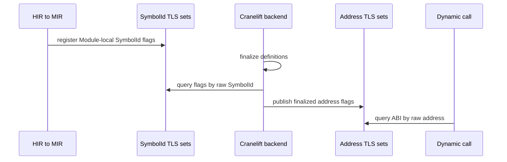
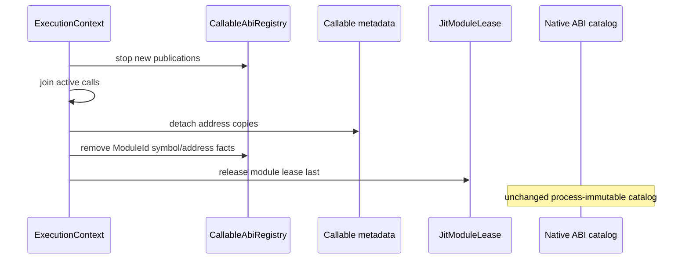

# Callable ABI registry state topology

Issue: #2981
Parent inventory: #2968
Source revision: `39fc55332f`

This Stage 1 slice classifies the variadic, kwargs, and boxed-return facts used
to choose a callable ABI. Current TLS sets mix compilation-local SymbolIds,
JIT-module-lifetime addresses, and process-lifetime native or test dispatchers.

## Bounded contexts

```text
Process
└── NativeCallableAbiCatalog
    └── native/test static address -> AbiFlags

ExecutionContext
└── JitSession[ModuleId]
    └── CallableAbiRegistry
        ├── by_symbol[SymbolId] -> AbiFlags
        └── by_address[CodeAddress] -> AbiFlags + JitModuleLease
```

`AbiFlags` contains independent `variadic`, `kwargs`, and `boxed_return`
facts. Querying a callable address overlays the immutable process catalog with
the current context/module registry.

## Frozen inventory

The six admitted identities have sorted newline SHA-256
`294f5edbf7fe8a42930ce4a91ffd7d040cd4ec5d4b0e164a0c28715f891aba2e`.

| Current symbol | Current key | Target owner |
|---|---|---|
| `VARIADIC_SYMBOL_IDS` | raw `u32` SymbolId | `CallableAbiRegistry.by_symbol[ModuleId]` |
| `KWARGS_SYMBOL_IDS` | raw `u32` SymbolId | `CallableAbiRegistry.by_symbol[ModuleId]` |
| `BOXED_RETURN_SYMBOL_IDS` | raw `u32` SymbolId | `CallableAbiRegistry.by_symbol[ModuleId]` |
| `VARIADIC_FUNC_ADDRS` | raw `u64` address | native catalog or module `by_address` |
| `KWARGS_FUNC_ADDRS` | raw `u64` address | native catalog or module `by_address` |
| `BOXED_RETURN_FUNC_ADDRS` | raw `u64` address | native/test catalog or module `by_address` |

The local callable-dispatch denominator is nine TLS rows. The three discarded
rows—`NATIVE_FUNC_ADDRS`, `NATIVE_TYPE_NAMES`, and
`NATIVE_TYPE_NAME_COLLISIONS`—form the next native-catalog slice.

## Current publication pipeline



Lowering publishes the three SymbolId facts. After finalization, JIT code
queries those facts for each body and publishes the resulting address into the
matching address sets. Dynamic call, class, builtins, and asyncio paths query
address membership to reshape arguments or preserve an already-boxed return.

Raw SymbolIds restart in separate compilation sessions. Raw addresses contain
neither module identity nor an executable-memory lease.

## Mixed address lifetimes

The current register functions are also called directly with Rust function
addresses:

- the raw selector finds 153 variadic register-call rows across 72 files;
- kwargs has 8 rows;
- boxed-return has 14 rows.

These totals include central definitions, JIT publication, production native
dispatchers, and test-only static dispatchers. In particular, the sampled
boxed-return non-JIT rows are test helpers; this inventory does not promote
them into a production capability. It proves that the storage type itself does
not distinguish native/test static code from JIT-module code.

Therefore none of the three address sets may move wholesale:

- a process singleton would retain stale JIT addresses beyond their modules;
- a context-only set would duplicate process-native facts and make cleanup of
  one context responsible for re-registering static runtime behavior.

## Target query contract

Address lookup is:

```text
lookup(address, current_context) =
    current_context.jit_sessions.find_live(address)
    OR process.native_callable_abi_catalog.contains(address)
```

The context lookup must return a typed record containing `ModuleId`,
`CodeAddress`, `AbiFlags`, and a live module-lease relation. The process
catalog is constructed before publication and immutable afterward. Test-only
static registrations belong in a test catalog with process/test lifetime, not
in a production context registry.

Symbol lookup is valid only inside one `JitSession[ModuleId]`; the typed key is
`(ModuleId, SymbolId)`. Translation to an address occurs after successful
finalization under the same session.

## Cleanup and retirement

Current broad module cleanup clears all six sets together. This simultaneously
erases process-native registrations and JIT facts on the current OS thread,
while it cannot clear another thread's stale JIT addresses.

Target retirement:



## Invariants

1. Every JIT SymbolId fact is qualified by `ModuleId`.
2. Every JIT address fact names the module lease that keeps it callable.
3. Address publication occurs only after successful finalization.
4. Module retirement removes address facts before releasing the lease.
5. Process-native catalog entries never point into a JIT module.
6. Test-only static registrations cannot leak into production catalog
   construction.
7. Query overlay uses only the current context; another context's JIT address
   is invisible.
8. Cleanup of one context never erases the process-native catalog.
9. Address reuse cannot inherit flags from a retired JIT module.
10. One address has one reviewed `AbiFlags` record per lifetime domain;
    conflicting registration fails closed rather than silently unioning facts.

## Current risks

- Identical raw SymbolIds from different modules collide in ambient TLS.
- JIT address sets outlive no explicit lease and can retain stale addresses.
- A recycled executable address can inherit old variadic/kwargs/boxed flags.
- Broad cleanup erases native facts and JIT facts without lifetime
  distinction.
- TLS publication performed on one thread is invisible to execution on another
  unless both happen to share the same thread.
- A native/JIT address collision is indistinguishable from intentional shared
  ABI membership.

## Dependency and source order

1. Finish the native catalog slice and remaining #2968 owners.
2. Introduce #2839 context shell after #2968 closes.
3. Add typed `ModuleId`, `JitSession`, and module-lease ownership.
4. Move SymbolId facts into the compiling session.
5. Split native catalog construction from JIT address publication.
6. Replace query functions with the process-plus-current-context overlay.
7. Remove broad six-set cleanup after all consumers use typed registries.

Forbidden fixes include copying all six sets into one context singleton,
keeping raw unqualified SymbolIds, retaining JIT addresses in a process
catalog, rebuilding native catalogs for every call, releasing a module lease
before deleting its address facts, or considering a raw address to be lifetime
ownership.

## Verification surface

- Inventory: 6 admitted plus 3 discarded.
- Digest:
  `294f5edbf7fe8a42930ce4a91ffd7d040cd4ec5d4b0e164a0c28715f891aba2e`.
- Two modules with identical raw SymbolIds and different flags.
- Two contexts with disjoint JIT address registries.
- Native catalog remains stable while one context retires.
- Address-reuse negative control after module-lease release.
- Conflicting native/JIT address registration fails closed.
- Dynamic-call tests for all combinations of variadic, kwargs, and boxed
  return.
- Snapshot rule: #2981 permits no AGY repository writes and no controller
  `apps/mamba/src/**` changes.
