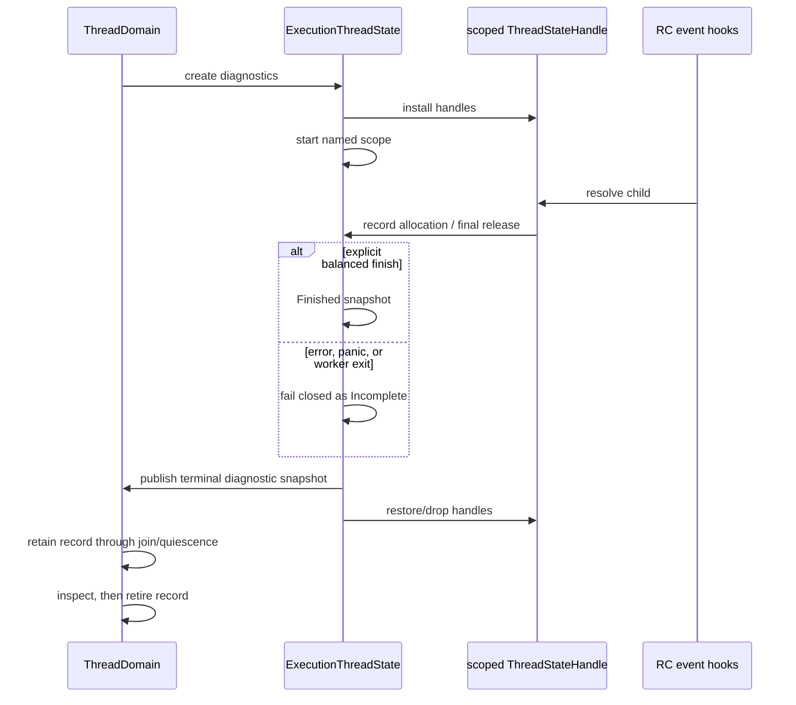

# Child leak-balance diagnostic topology

Issue: #3007
Parent inventory: #2968
Origin contract: #2830
Source revision: `1d6eed298d`

This Stage 1 slice classifies the debug-only TLS recorder used by source-local
allocation/final-deallocation balance tests. The originating contract
deliberately measures one OS thread so unrelated parallel Rust tests cannot
pollute a named workload. The target makes that diagnostic state an explicit
execution-child value without expanding it into a false context-wide leak
oracle. No `src/**` change occurs in this slice.

## Bounded context

```text
ExecutionContext
└── ThreadDomain
    ├── ThreadRecord[LogicalThreadId]
    │   └── terminal LeakBalanceSnapshot
    └── ExecutionThreadState[LogicalThreadId]
        └── ExecutionThreadDiagnostics
            └── leak_balance: Option<LeakBalanceState>

OS-thread compatibility binding
└── ContextHandle + ThreadStateHandle
```

`ExecutionThreadState` is the semantic owner. The diagnostic scope observes
only events attributed to that child. TLS resolves handles and owns no counter,
status, name, or snapshot.

This is distinct from a future context-owned cross-worker leak probe. A
context-wide proof must track stable object identity and transfer/final-release
edges; adding atomics to these child counters would not supply that evidence.

## Aggregate and values

| Type | Kind | Identity / value |
|---|---|---|
| `ExecutionThreadState` | child entity | context id + logical thread id |
| `ExecutionThreadDiagnostics` | child-owned value aggregate | optional debug diagnostics |
| `LeakBalanceState` | child-owned state machine | name, status, allocation/deallocation counts |
| `LeakBalanceScopeGuard` | non-Send RAII value | one active scope on its owner child |
| `LeakBalanceSnapshot` | immutable value | named counts + terminal/current status |
| `ThreadStateHandle` | scoped compatibility value | resolves current child state |

The exact target field is:

```rust
pub struct ExecutionThreadState {
    // logical identity, frame/hook/local state
    #[cfg(debug_assertions)]
    diagnostics: ExecutionThreadDiagnostics,
}

#[cfg(debug_assertions)]
pub struct ExecutionThreadDiagnostics {
    leak_balance: Option<LeakBalanceState>,
}
```

The active mutable state stays on the child. At worker termination, the child
publishes a terminal/fail-closed snapshot into its `ThreadRecord`; the domain
retains that record through join/quiescence.

## Frozen inventory

The one production debug-diagnostic identity has sorted newline-terminated
SHA-256
`952280ea9a6f802f7245c5c03c87e5db91fdcca51e71c171d44363f099a22c5f`.
There are zero test-only state identities. The reset helper is `cfg(test)`, but
it mutates the same debug-production state.

| Current symbol | Storage | Role | Target disposition |
|---|---|---|---|
| `LEAK_BALANCE_STATE` | debug-only TLS `RefCell<LeakBalanceState>` | named same-thread RC event ledger | move to `ExecutionThreadState::diagnostics` |

The accepted selector contains 39 distinct physical lines:

| Family | Occurrences |
|---|---:|
| `LEAK_BALANCE_STATE` | 8 |
| `record_allocation_event` | 2 |
| `record_deallocation_event` | 3 |
| `start_leak_balance_scope` | 8 |
| `finish_leak_balance_scope` | 2 |
| `get_leak_balance_snapshot` | 8 |
| `assert_leak_balanced` | 5 |
| `reset_leak_balance_scope_for_testing` | 3 |
| **Total** | **39** |

Seventeen normal boxed-object constructor call sites route through the debug
`into_raw_tracked` helper. The two final-free branches in `mb_release` record
one deallocation immediately before dropping the box. Event helpers increment
only when the current state is `Active`.

## Debug versus test boundary

`LeakBalanceState`, its TLS declaration, event hooks, snapshots, guard, and
scope operations compile in every debug build. Current activators are unit
tests inside `rc.rs`; that reachability fact does not make the declaration
test-only.

Only `reset_leak_balance_scope_for_testing` is additionally gated by
`cfg(test)`. It is an explicit recovery tool for falsification tests, not an
independent state identity or a production cleanup path.

## Current state machine

| Operation | State | Result | Mutation |
|---|---|---|---|
| start | `Inactive` / `Finished` | guard | set name, zero counts, `Active` |
| start | `Active` | error | none; active evidence preserved |
| start | `Incomplete` | error | none; incomplete evidence preserved |
| record alloc/free | `Active` | unit | increment matching counter |
| record alloc/free | other | unit | none |
| get | `Active` / `Finished` | snapshot | none |
| get | `Inactive` / `Incomplete` | error | none |
| assert | balanced `Active` / `Finished` | snapshot | none; does not finish |
| assert | missing/incomplete/unbalanced | panic | none |
| direct finish helper | balanced `Active` | snapshot | set `Finished` |
| direct finish helper | imbalanced `Active` | error | remains `Active` |
| direct finish helper | other | error | none |
| guard-owned finish | balanced `Active` | snapshot | helper finishes; mark guard finished |
| guard-owned finish | imbalanced `Active` | error | helper leaves active; guard drop sets `Incomplete` |
| unfinished guard drop | `Active` | unit | set `Incomplete` |
| guard drop | other / finished guard | unit | none |
| test reset | any | unit | set `Inactive`, zero counts, retain stale name |

`LeakBalanceScopeGuard` carries `PhantomData<*const ()>` and is non-Send/non-
Sync. Safe code therefore creates, finishes, and drops it on its owner thread.

Balanced explicit finish is the only normal transition to `Finished`.
Inactive, incomplete, and absent evidence cannot be reported as balanced.

## Current lifecycle and limitation

| Boundary | Current result |
|---|---|
| unrelated parallel Rust test | independent TLS; cannot change this scope |
| allocation and final release on owner thread | both events reach one ledger |
| allocation on A, final release on B | events split across two TLS ledgers |
| runtime cleanup | state is unchanged |
| unfinished normal guard unwind | guard drop marks `Incomplete` |
| OS-thread exit | TLS destructor drops state and can erase unfinished evidence |
| process exit | remaining TLS is retired |
| release build | state, hooks, and diagnostic branches are absent |

The split-event case is not cross-thread leak evidence. Depending on which
threads have active scopes, it produces unmatched positive/negative counts or
ignores one side. It cannot prove object balance across a context.

## Target child lifecycle



Moving state out of TLS changes retirement deliberately. Worker exit must
publish or fail closed unfinished evidence before the child record advances to
`Finished`/`Failed`. TLS destruction drops only handles. Runtime cleanup cannot
reset active/incomplete evidence, and join/quiescence inspects the terminal
snapshot before explicit record retirement.

## Target invariants

1. Event counters change if and only if the child scope is `Active`.
2. At most one scope is active per execution child.
3. Nested start never erases active or incomplete evidence.
4. Balanced guard-owned finish is the only normal `Finished` transition.
5. Direct imbalanced helper return remains distinct from later RAII drop.
6. Error, panic, unfinished drop, and worker exit fail closed.
7. Parallel children cannot mutate each other's state.
8. The probe makes no cross-child or context-wide balance claim.
9. TLS stores only `ContextHandle + ThreadStateHandle`.
10. Runtime cleanup never silently resets child diagnostic evidence.
11. Worker exit publishes evidence before TLS handles retire.
12. `ThreadDomain` retains terminal evidence through join/quiescence.
13. Test reset remains test-only and cannot become product cleanup.
14. Release builds contain no state, hook, handle lookup, or counter cost.

## Source implementation slice

This migration follows #2839's context shell and the source slice that
introduces `ExecutionThreadState`, `ThreadDomain`, and scoped
`ThreadStateHandle`. Until then the current same-thread TLS witness remains a
known, bounded diagnostic compatibility mechanism.

Exact planned paths:

- `apps/mamba/src/runtime/execution_context.rs`
  - supply the scoped context/thread-state binding prerequisite.
- `apps/mamba/src/runtime/execution_thread_state.rs`
  - define the child diagnostics/state machine and terminal publication.
- `apps/mamba/src/runtime/mod.rs`
  - wire the child-state module and crate-visible diagnostic seam.
- `apps/mamba/src/runtime/rc.rs`
  - resolve the child handle in debug event hooks;
  - migrate existing lifecycle tests and delete data-bearing TLS.

Forbidden changes:

- calling the debug-production identity test-only;
- moving counters to `ExecutionContext` and claiming cross-worker coverage;
- replacing TLS data with another process/TLS counter map;
- storing diagnostic data rather than handles in the compatibility binding;
- allowing nested start or cleanup to erase evidence;
- treating imbalanced direct helper return as the RAII drop transition;
- retiring child evidence at OS-thread exit before domain inspection;
- resetting stale name as an undocumented behavior change;
- adding release-build hooks or lookups;
- reporting any planned cross-thread test as executed by a measure-only audit.

## Verification gates

- Exact-set gate: one identity and all 39 rows reconcile until migration.
- Constructor/final-free gate: 17 constructor calls and both final-free
  branches reach exactly one matching event hook.
- State-machine gate: every cell above, including no-mutation errors, runs.
- Same-child gate: clean scalar, nested owner/child, and deliberate leak
  falsification retain their existing outcomes.
- Parallel-isolation gate: two active child scopes do not cross-pollute.
- Cross-thread negative gate: allocate on A/release on B cannot be presented as
  a balanced same-child proof.
- Guard gate: safe code cannot send the scope guard to another worker.
- Worker-exit gate: unfinished evidence survives OS-thread exit in the child
  record until join/quiescence inspection.
- Cleanup gate: runtime cleanup cannot reset active/incomplete evidence.
- Negative source gate: no data-bearing leak-balance TLS remains.
- Release gate: state and hooks are absent from release artifacts.
- A separate future pointer-identity oracle owns Tier 1 cross-worker leak
  evidence.
- AGY's measure-only run executed none of these planned gates.

## Dependency and dispatcher result

- #3007 is a Stage 1 classification slice under #2968.
- #2968 must close before #2839 and later child-state source work can start.
- AGY's first report contradicted its 39-row appendix with a second 37-line
  denominator and omitted state/error cells and invariants.
- The next revision completed the current matrix but copied current TLS
  evidence loss into target ownership and conflated helper return with guard
  drop.
- Later revisions corrected target lifecycle; the final self-contained report
  restored all accepted lifecycle and cleanup evidence.
- Snapshot/protected-artifact verification passed throughout. This required
  three revisions and is not a one-pass ramp sample.
