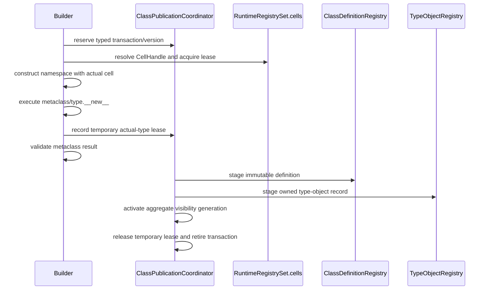

# Classcell definition transaction topology

Issue: #3016
Parent inventory: #2968
Source revision: `dc499d62fa7e1522e62f4b5db3ee119415658eaa`

This Stage 1 DDD slice classifies the three TLS collections used to stage
CPython's implicit `__classcell__` contract. They describe one provisional
class-definition transaction, but are currently mutated and transferred as
three independent maps.

The target creates no second published class owner. A
`ClassDefinitionTransaction` is protocol state owned by the accepted
`ClassPublicationCoordinator`. Published definitions remain owned by
`ClassDefinitionRegistry`, type objects by `TypeObjectRegistry`, and closure
cell contents by `RuntimeRegistrySet.cells`.

No `apps/mamba/src/**` change occurs in this slice.

## Bounded context

```text
ExecutionContext
├── ClassDomain
│   ├── ClassPublicationCoordinator
│   │   └── active[ClassTransactionId] -> ClassDefinitionTransaction
│   ├── ClassDefinitionRegistry
│   │   └── published definitions
│   ├── ClassIdentityCatalog
│   │   └── ClassRuntimeKey
│   └── TypeObjectRegistry
│       └── owned published type objects
├── RuntimeRegistrySet
│   └── cells[CellHandle] -> owned cell contents
└── ExecutionThreadState[*]
    └── active symbol bindings -> CellHandle

OS-thread compatibility binding
└── ContextHandle
```

Ownership is deliberately split:

- `ClassPublicationCoordinator` owns only transaction protocol and aggregate
  visibility state;
- `ClassDefinitionRegistry` is the sole definition owner;
- `TypeObjectRegistry` is the sole type-object owner;
- `RuntimeRegistrySet.cells` is the sole closure-cell-content owner;
- a transaction holds typed leases and temporary claims, not duplicate
  published records or cell contents.

## Domain values

| Type | Kind | Meaning |
|---|---|---|
| `ClassTransactionId` | typed identity | context, definition, and generation |
| `ClassRuntimeKey` | typed identity | one execution-unique class identity |
| `ClassDefinitionVersion` | owner version | one immutable definition publication |
| `CellHandle` | context-bound handle | closure-domain cell identity |
| `CellLease` | operation lease | keeps the bound cell valid |
| `TemporaryTypeLease` | owned temporary claim | actual type created by `type.__new__` |
| `ClasscellState` | state machine | one-shot provisional lifecycle |
| `AggregateVisibilityGeneration` | coordinator value | complete class publication generation |

Display names, formatted runtime-key strings, symbol integers, marker strings,
cell handles, type-object values, and metaclass results are different identity
or value domains. No migration may reinterpret one as another.

## Frozen inventory

The admitted production identities are:

- `apps/mamba/src/runtime/class/mod.rs::CLASSCELL_REQUIRED`
- `apps/mamba/src/runtime/class/mod.rs::CLASSCELL_SYMBOL_IDS`
- `apps/mamba/src/runtime/class/mod.rs::CLASSCELL_VALUES`

There are zero test-only identities. The SHA-256 over the sorted,
newline-terminated identity set is:

`0dab2b3b44e9ad115bbe407b34d5aeaf5f5e3ec76f0cb87155bd0c49c4c31e25`

The exact selector across `runtime/class/mod.rs` and
`runtime/class/cells.rs` emits 22 physical rows and 22 occurrences. All 22 are
production. The `class/mod.rs` test boundary is `#[cfg(test)]` at frozen line
22077; `cells.rs` has no test module.

### Exact occurrence ledger

| Path:line | Identity | Operation | Enclosing owner |
|---|---|---|---|
| `class/cells.rs:9` | `CLASSCELL_REQUIRED` | requirement write | `mb_class_mark_classcell_required` |
| `class/cells.rs:18` | `CLASSCELL_REQUIRED` | requirement write | `mb_class_bind_classcell` |
| `class/cells.rs:21` | `CLASSCELL_SYMBOL_IDS` | symbol write | `mb_class_bind_classcell` |
| `class/cells.rs:27` | `CLASSCELL_REQUIRED` | requirement read | `classcell_required_for` |
| `class/cells.rs:65` | `CLASSCELL_VALUES` | retained value write | `record_classcell_value_for_type_new` |
| `class/cells.rs:73` | `CLASSCELL_SYMBOL_IDS` | symbol read/cell fill | `record_classcell_value_for_type_new` |
| `class/cells.rs:84` | `CLASSCELL_REQUIRED` | per-definition remove | `clear_classcell_state` |
| `class/cells.rs:87` | `CLASSCELL_SYMBOL_IDS` | per-definition remove | `clear_classcell_state` |
| `class/cells.rs:90` | `CLASSCELL_VALUES` | per-definition remove | `clear_classcell_state` |
| `class/cells.rs:111` | `CLASSCELL_VALUES` | validation read | `validate_classcell_after_metaclass_new` |
| `class/mod.rs:163` | `CLASSCELL_REQUIRED` | declaration | TLS block |
| `class/mod.rs:166` | `CLASSCELL_SYMBOL_IDS` | declaration | TLS block |
| `class/mod.rs:170` | `CLASSCELL_VALUES` | declaration | TLS block |
| `class/mod.rs:21990` | `CLASSCELL_VALUES` | snapshot | `snapshot_thread_class_state` |
| `class/mod.rs:22005` | `CLASSCELL_REQUIRED` | snapshot | `snapshot_thread_class_state` |
| `class/mod.rs:22006` | `CLASSCELL_SYMBOL_IDS` | snapshot | `snapshot_thread_class_state` |
| `class/mod.rs:22025` | `CLASSCELL_REQUIRED` | replace | `replace_thread_class_state` |
| `class/mod.rs:22026` | `CLASSCELL_SYMBOL_IDS` | replace | `replace_thread_class_state` |
| `class/mod.rs:22027` | `CLASSCELL_VALUES` | replace | `replace_thread_class_state` |
| `class/mod.rs:22058` | `CLASSCELL_REQUIRED` | cleanup | `cleanup_all_classes` |
| `class/mod.rs:22059` | `CLASSCELL_SYMBOL_IDS` | cleanup | `cleanup_all_classes` |
| `class/mod.rs:22060` | `CLASSCELL_VALUES` | cleanup | `cleanup_all_classes` |

Category reconciliation:

| Category | Count |
|---|---:|
| declarations | 3 |
| requirement writes | 2 |
| symbol write | 1 |
| requirement read | 1 |
| retained value write | 1 |
| symbol read/cell fill | 1 |
| per-definition removals | 3 |
| validation read | 1 |
| snapshot | 3 |
| replace | 3 |
| cleanup | 3 |
| **total** | **22** |

## Current key mechanics

The three maps are not keyed by the Python display name. Lowering calls
`mb_class_runtime_key(declaration_key)` before class registration.
`mb_class_runtime_key` obtains an execution-unique process serial, constructs
an `identity@serial` runtime key, and updates the declaration alias. The
returned runtime-key string is passed to class registration and
`mb_class_bind_classcell`.

Ordinary repeated execution of the same display-named class therefore
allocates a fresh key and does not overwrite the prior execution's classcell
entry. The residual defect is different: the key remains an untyped string
without execution-context or transaction-generation authority.

`mb_class_mark_classcell_required` is exported through
`runtime/symbols.rs`. The inspected normal lowering path emits
`mb_class_bind_classcell`, which also marks the definition required. No direct
production Rust call to the mark-only helper exists in the admitted surface.

## Current compiler-to-runtime flow

1. `lower/ast_to_hir.rs` detects implicit `__class__` and zero-argument
   `super()` use and sets `HirClass.class_cell_required`.
2. `lower/hir_to_mir.rs` obtains the execution-unique runtime key and emits
   `mb_class_bind_classcell(runtime_key, symbol_id)`.
3. `runtime/symbols.rs` exposes the extern helper.
4. `mb_class_bind_classcell` inserts the key into `CLASSCELL_REQUIRED`, then
   inserts the raw symbol id into `CLASSCELL_SYMBOL_IDS`.
5. `build_class_namespace_dict` sees the requirement and inserts
   `"__classcell__"` with the formatted marker string
   `"__mamba_classcell__:<runtime-key>"`.
6. `type.__new__` extracts that namespace value and calls
   `record_classcell_value_for_type_new`.
7. The marker path parses the runtime key, confirms it remains required,
   retains the actual created type, inserts it into `CLASSCELL_VALUES`, reads
   the symbol id, and fills the closure cell.
8. `validate_classcell_after_metaclass_new` compares the actual type recorded
   by `type.__new__` with the metaclass `__new__` result.
9. Success and defined failure paths call `clear_classcell_state`.
10. Validation and clear occur before metaclass `__init__`.

When the namespace value is not a live formatted marker, a real closure cell
follows `mb_cell_compare_value` and `mb_cell_set` without touching the three
classcell maps. A non-cell raises `TypeError`.

## Current state transitions

| Phase | Required set | Symbol map | Value map | Namespace/cell |
|---|---|---|---|---|
| idle | absent | absent | absent | none |
| bind | present | raw symbol id | absent | none |
| namespace | present | raw symbol id | absent | formatted marker |
| `type.__new__` | present | read | retained actual type | closure cell filled |
| validation | read | not read | borrowed bit copy | compare metaclass result |
| clear | remove | remove | remove/release | staging terminal |
| snapshot | clone | clone | clone/retain | payload copied |
| replace | overwrite | overwrite | raw overwrite | payload transferred |
| cleanup | ignored-result clear | ignored-result clear | take/release if borrow succeeds | reset |

There is no shared transaction object or transition discriminator.
Requirement and symbol publication are sequential. Actual-type publication and
closure-cell fill are also separate operations. Compatible repeats,
conflicting repeats, rollback, and terminal-state rejection are not represented
as domain transitions.

## Current ownership ledger

1. First insertion retains `class_value` before publishing it in
   `CLASSCELL_VALUES`.
2. Same-key replacement releases the previous stored value.
3. Validation copies `MbValue` bits and creates no new claim.
4. Per-definition clear removes and releases the stored value.
5. Snapshot clones the value map and adds one retain for every copied value.
6. Replace overwrites the prior TLS map as raw bits without releasing its
   registry claims. The separately retained returned snapshot does not balance
   those lost claims.
7. `ThreadClassState` has no `Drop` implementation; dropping an uninstalled
   snapshot leaks its added claims.
8. Cleanup takes the value map and releases values only if its conditional TLS
   borrow succeeds.
9. TLS/thread exit drops raw `MbValue` bits without explicit Python-claim
   retirement.

The `CLASSCELL_VALUES` borrow ends before
`mb_capture_cell_set_id`. The target must preserve this guard-free cell-fill
boundary. It must additionally guarantee guard-free Python allocation, error
construction, callback, and release/deallocation paths.

## Current worker transport

The production transport chain is:

```text
mb_threading_thread_start
  -> snapshot_thread_class_state
  -> run_thread_target
  -> replace_thread_class_state
  -> target execution
  -> replace_thread_class_state(previous)
```

This copies provisional classcell maps between OS-thread TLS instances. It is
not shared `ExecutionContext` ownership. The builtin
`user_type_object_identity_survives_cross_thread_transfer` path is a test of
whole-`ThreadClassState` transfer, not a second production caller and not a
classcell-specific assertion.

## Current hazards

1. Runtime-key strings lack typed context and transaction-generation identity.
2. Three maps expose partial state across failure, panic, or reentry.
3. A namespace-visible marker string can be replayed while its runtime key
   remains required.
4. Retain, value-map publication, and closure-cell fill are not one rollback
   unit.
5. Sequential per-definition clear can leave sibling state after failure.
6. Snapshot/replace copies ambient staging state instead of sharing a context
   owner.
7. Snapshot adds claims that `ThreadClassState` cannot retire on drop.
8. Replace leaks the overwritten TLS registry claims.
9. Cleanup silently skips individual maps when `try_borrow_mut` fails.
10. TLS exit is neither rollback nor class-definition/context retirement.

## Existing behavior-test owners

| Test | Path | Proven seam |
|---|---|---|
| `test_lower_method_class_cell_preserves_class_symbol_name` | `lower/ast_to_hir.rs` | HIR requirement detection |
| `test_class_registration_stores_class_object_global` | `lower/hir_to_mir.rs` | MIR bind and symbol id |
| `repeated_local_class_execution_keeps_its_class_cell_identity` | `driver/mod.rs` | fresh repeated-execution identity |
| `class_cell_survives_descriptors_methods_and_class_decorators` | `driver/mod.rs` | wrapper/decorator preservation |
| `deferred_methods_keep_their_class_cell_identity` | `driver/mod.rs` | async/generator preservation |
| `zero_arg_super_without_a_first_parameter_raises_runtime_error` | `driver/mod.rs` | invalid zero-arg super |
| `default_type_fills_classcell_before_init_subclass` | `driver/mod.rs` | fill before PEP 487 hook |
| `nondelegating_metaclass_does_not_prefill_classcell` | `driver/mod.rs` | missing `type.__new__` failure |
| `metaclass_may_remove_classcell_after_type_new` | `driver/mod.rs` | removal after consumption |
| `type_new_rejects_a_non_cell_classcell` | `driver/mod.rs` | non-cell rejection |
| `runtime_base_slots_include_inherited_fields_before_instance_init` | `driver/mod.rs` | registration with runtime base |
| `classcell_validation_compares_the_actual_type_object` | `runtime/class/mod.rs` | actual/result mismatch |
| `user_type_object_identity_survives_cross_thread_transfer` | `runtime/builtins/mod.rs` | whole-state TLS transfer |

## Target transaction

```rust
struct ClassDefinitionTransaction {
    id: ClassTransactionId,
    runtime_key: ClassRuntimeKey,
    definition_version: ClassDefinitionVersion,
    classcell: ClasscellState,
}

enum ClasscellState {
    NotRequired,
    RequiredUnbound,
    CellBound {
        cell: CellLease,
    },
    TypeNewFilled {
        cell: CellLease,
        actual_type: TemporaryTypeLease,
    },
    Validated {
        cell: CellLease,
        actual_type: TemporaryTypeLease,
    },
    Committed,
    Aborted,
}
```

`RolledBack` is the completed cleanup outcome of the `Aborted` terminal path;
it may be represented as a separate terminal variant if implementation needs
to distinguish rollback-in-progress from rollback-complete.

`NotRequired` and `RequiredUnbound` are distinct. A compatible repeat of an
already completed transition may be explicitly idempotent only when its typed
identity, generation, cell, and type lease all match. Any mismatch or illegal
state jump fails closed without changing the prior state.

## Target cell binding

Lowering resolves the class closure symbol through the current
`ExecutionThreadState` into a context-bound `CellHandle`. The transaction
acquires a `CellLease`, and namespace construction places the actual cell
value/handle in `__classcell__`. A formatted Python string is no longer
authority.

`type.__new__` validates and fills the real cell. It records a temporary lease
for the actual created type in the transaction. Custom metaclasses may forward
or remove the real cell according to the Python contract; a non-cell value
still fails with `TypeError`.

The cell registry continues to own cell contents. The transaction owns only
the lease and binding protocol.

## Target publication

Publication is transactional at the observable aggregate boundary, not one
machine-level atomic instruction across registries and Python objects.



Pre-commit failure removes all staged records and releases every provisional
claim after guards drop. At commit, the coordinator activates already-staged
records in their sole registries. The transaction does not become a published
owner or transfer a cell it does not own.

## Guard and lease protocol

1. Resolve the transaction and clone its transaction lease under a narrow
   coordinator guard.
2. Resolve/clone the cell lease under the closure-domain guard.
3. Drop aggregate guards.
4. Allocate namespace values, execute metaclass/Python work, fill the cell, and
   construct errors.
5. Re-enter the coordinator only to validate the typed transition and stage
   the next immutable transaction state.
6. Release old temporary claims outside all guards.
7. Retain the operation/transaction lease until the real operation finishes.

No raw map lookup or copied `MbValue` is an operation lease.

## Target retirement

Context retirement:

1. rejects new calls and class transactions;
2. quiesces execution children and active calls;
3. waits for active class-publication/transaction leases;
4. aborts every remaining provisional transaction;
5. detaches staged definition and type-object records;
6. releases temporary type claims outside coordinator guards;
7. retires published definitions and type objects through their sole owners;
8. retires closure/cell storage only after live closures and cell leases drain;
9. marks the context retired.

TLS retains only the active `ContextHandle`. Classcell payload disappears from
`ThreadClassState` snapshot/replace.

## Target invariants

1. `ClassDefinitionTransaction` is the sole provisional classcell-state owner.
2. `ClassDefinitionRegistry` remains the sole published-definition owner.
3. `TypeObjectRegistry` remains the sole published-type-object owner.
4. `RuntimeRegistrySet.cells` remains the sole cell-content owner.
5. The coordinator owns protocol state, not duplicate published records.
6. Transaction identity includes context, definition, and generation.
7. Display names and formatted runtime-key strings are not transaction authority.
8. Symbol integers and cell handles remain distinct typed domains.
9. `NotRequired` and `RequiredUnbound` remain distinct.
10. The seven state variants form an explicit one-shot lifecycle.
11. Compatible repeats are idempotent only on exact typed identity/value match.
12. Conflicting or out-of-order transitions fail closed.
13. A live transaction lease is required for every transition.
14. A context-bound cell lease is required before namespace publication.
15. Namespace `__classcell__` transports an actual cell, not a marker string.
16. User/metaclass-provided real cells remain supported.
17. Non-cell `__classcell__` input fails explicitly.
18. Default type creation fills the cell before `__init_subclass__`.
19. Validation compares the actual created type with metaclass `__new__` result.
20. Validation completes before metaclass `__init__`.
21. Temporary type claims are explicit and balanced.
22. Rollback removes all staged records before releasing claims.
23. Release/deallocation occurs outside aggregate guards.
24. Python allocation, callbacks, and error construction occur outside guards.
25. Publication exposes one complete aggregate visibility generation.
26. Cross-store publication is not described as machine-level atomic.
27. Same-context children use the shared coordinator instead of copied TLS maps.
28. Independent contexts isolate same-named transactions.
29. Reentrant/concurrent definitions receive distinct transaction identities.
30. Active leases remain valid across republish and retirement attempts.
31. No provisional classcell payload remains in thread snapshots.
32. Context retirement rejects new transactions before quiescence.
33. Retirement waits for children, calls, publications, and transaction leases.
34. Cell storage retires only after closure and cell leases drain.
35. Retirement failure is explicit and isolated to the owning context.

## Source implementation slice

Prerequisites:

1. finish and close Stage 1 parent #2968;
2. land Stage 2 context shell #2839;
3. migrate closure/cell ownership to the accepted context boundary;
4. establish the class publication coordinator and accepted class registries;
5. implement this classcell transaction as part of the coordinated class
   publication source slice.

Exact planned paths:

- `apps/mamba/src/runtime/execution_context.rs`
- `apps/mamba/src/runtime/class/cells.rs`
- `apps/mamba/src/runtime/class/mod.rs`
- `apps/mamba/src/runtime/builtins/type_objects.rs`
- `apps/mamba/src/runtime/closure.rs`
- `apps/mamba/src/lower/hir_to_mir.rs`
- `apps/mamba/src/runtime/mod.rs`

Forbidden changes:

- creating a second published class-definition or type-object owner;
- treating display names or runtime-key strings as transaction authority;
- retaining formatted marker strings as authority;
- reinterpreting raw symbol ids as context-free cell handles;
- copying provisional state through `ThreadClassState`;
- storing raw `MbValue` ownership without explicit claim types;
- holding aggregate guards across Python work or release/deallocation;
- preserving partial multi-map cleanup or silent conflict overwrite;
- calling cross-store publication machine-level atomic;
- merging metaclass stack, callable registry, kwargs, slots, or method-cache
  migration into this slice;
- treating process/TLS exit as rollback or retirement.

## Focused implementation tests

1. `test_classcell_same_context_transaction_visibility`
2. `test_classcell_independent_context_same_name_isolation`
3. `test_classcell_concurrent_reentrant_definition_isolation`
4. `test_classcell_repeated_local_execution_identity`
5. `test_classcell_default_type_fill_before_init_subclass`
6. `test_classcell_nondelegating_metaclass_unset_failure`
7. `test_classcell_actual_type_result_validation`
8. `test_classcell_real_cell_without_marker_authority`
9. `test_classcell_transition_idempotence_and_conflict`
10. `test_classcell_failure_injection_complete_rollback`
11. `test_classcell_exact_retain_release_balance`
12. `test_classcell_absent_from_thread_snapshot`
13. `test_classcell_guard_free_python_work_and_release`
14. `test_classcell_active_lease_survives_retirement_race`

Failure injection covers requirement reservation, cell binding,
`type.__new__` fill, closure-cell mutation, definition/type staging, and
pre-commit activation. Every failure must leave no visible partial generation
and no provisional ownership residue.

These tests are planned and were not executed by the Stage 1 measurement.
