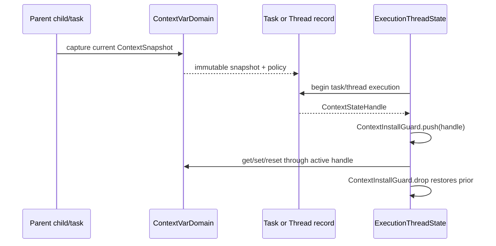

# Context variable domain state topology

Issue: #2995
Parent inventory: #2968
Source revision: `324c3336cd`

This Stage 1 slice classifies the current ContextVar map, Token.MISSING
sentinel, empty Context flyweight, and ContextVar ID allocator declared by
`runtime/stdlib/contextvars_mod.rs`. It defines logical context propagation,
ownership, and retirement without changing `src/**`.

## Bounded contexts

```text
Process
└── ProcessHandleAllocator
    └── ContextVarId

ExecutionContext
├── ContextVarDomain
│   ├── token_missing_singleton
│   ├── empty_context_data
│   └── context_states[ContextStateId]
├── AsyncDomain
│   └── Task
│       └── ContextSnapshot
└── ThreadDomain
    └── ThreadRecord
        └── ContextStartPolicy

ExecutionThreadState
└── contextvars
    └── current_context_stack
        └── ContextStateHandle
```

`ContextVarDomain` belongs to one `ExecutionContext`. It owns Python-visible
module singletons and logical context states. `ExecutionThreadState` owns only
the stack of context handles currently installed while it executes.

An async task captures a logical `ContextSnapshot` according to task-creation
semantics. A thread record carries an explicit start-context policy. Neither
semantic is inferred from whichever OS worker happens to execute the code.

## Aggregate and entities

| Type | Kind | Identity / value |
|---|---|---|
| `ContextVarDomain` | aggregate root | `ContextId` |
| `ContextState` | entity/value state | `ContextId + ContextStateId` |
| `ContextSnapshot` | immutable value | persistent bindings + source generation |
| `ContextVarId` | typed value | process-unique handle |
| `ContextBinding` | owned value | `ContextVarRef + OwnedMbValue` |
| `ContextInstallGuard` | child stack guard | prior + installed `ContextStateHandle` |
| `TokenRecord` | Python-object state | var id + old binding + originating context state/generation + used flag |
| `TokenMissingSingleton` | module singleton | one Python identity per execution context |
| `EmptyContextData` | context flyweight | context-owned immutable mapping object |
| `ContextStartPolicy` | value | explicit empty/copy/inherit policy |

`ContextState` owns every binding it publishes. A raw `ContextVarId` does not
authorize lookup in another execution context. `TokenRecord` identifies the
logical context in which `set` occurred so reset cannot apply a token in a
different context merely because the variable ID matches.

## Frozen inventory

The four production identities have sorted newline SHA-256
`44463e88ae402bb33ab4dfe45aad295eca11af49c995ad466d675b923abfdd5d`.
There are no test-only static declarations.

| Current symbol | Current storage | Current role | Target owner |
|---|---|---|---|
| `CURRENT` | TLS `RefCell<FxHashMap<u64, (MbValue, MbValue)>>` | current ContextVar bindings | `ExecutionThreadState.contextvars.current_context_stack` |
| `MISSING` | TLS `RefCell<Option<MbValue>>` | Token.MISSING identity | `ExecutionContext.ContextVarDomain.token_missing_singleton` |
| `EMPTY_DATA` | TLS `RefCell<Option<MbValue>>` | empty Context `_data` flyweight | `ExecutionContext.ContextVarDomain.empty_context_data` |
| `NEXT_VAR_ID` | process `AtomicU64` | ContextVar integer allocation | process `ProcessHandleAllocator` |

The accepted direct-reference evidence contains 22 physical rows and 22
identity occurrences:

| Identity | Occurrences |
|---|---:|
| `CURRENT` | 8 |
| `EMPTY_DATA` | 3 |
| `MISSING` | 9 |
| `NEXT_VAR_ID` | 2 |
| **Total** | **22** |

## Current behavior and defects

### OS worker TLS is mistaken for logical context

`CURRENT` is one map per OS thread. ContextVar lookup and mutation therefore
follow worker affinity rather than the logical async task or child execution
state.

The real `ObjData::Instance` `threading.Thread` path spawns an OS worker but
does not call `replace_current_context`. The worker starts with empty TLS
implicitly and receives no parent ContextVar snapshot.

The `ObjData::Dict` compatibility path behaves differently: it does not spawn.
It synchronously replaces the caller OS thread's `CURRENT` with an empty map,
runs the target, restores the caller map, and drops the target's resulting map.
The local name `context_snapshot` refers to the caller's saved map; it is not
evidence of parent-to-child propagation.

Async-task propagation is likewise not represented as task-owned state.
Resuming one logical task on another OS worker changes which `CURRENT` map it
observes.

### Token.MISSING is not the singleton its comment claims

`MISSING` is declared inside the same `thread_local!` block as `CURRENT`.
Each OS worker can lazily allocate a different `Token.MISSING` Instance, even
though comments and the public type surface describe one identity.

Identity comparison may therefore vary by worker. The target singleton belongs
to the execution context's ContextVar module domain and is published once. A
worker accesses it through its context handle rather than creating a TLS copy.

### Empty Context data is one immortal allocation per worker

`EMPTY_DATA` lazily allocates a dict, writes `IMMORTAL_REFCOUNT`, untracks it
from GC, and stores only copied pointer bits in TLS. Every worker can create
another permanently allocated dict.

The target flyweight is one context-owned immutable mapping with an explicit
strong owner. It is retired with the context. It does not rely on process
immortality or an untracked raw pointer to survive.

If the `_data` implementation field remains Python-observable, all empty
Context instances within one execution context share the same stable identity.
Different execution contexts never share a heap-object pointer.

### ContextVar IDs are process-wide but untyped

`NEXT_VAR_ID.fetch_add(1, Relaxed)` supplies monotonically increasing raw
integers and is not reset. This is suitable process allocation behavior but
does not carry handle kind or context membership.

The target allocator issues typed `ContextVarId`s for process-wide collision
avoidance. Lookup still validates the active `ContextId`; allocation service
ownership is not ContextVar binding ownership.

## Current value-ownership ledger

`MbValue` is a copied bit representation whose Rust `Drop` is a no-op. Runtime
container destruction releases fields through `release_if_ptr`, but dropping a
plain Rust `FxHashMap<u64, (MbValue, MbValue)>` does not.

### Set and token creation

`mb_contextvar_set` retains the new `var` and `value` for `CURRENT`, then
replaces any old pair.

- the old value's map-owned reference is transferred into
  `Token.old_value`;
- the old variable pointer is discarded without release;
- the Token separately retains `var` for its own `"var"` field.

The old-value transfer can be sound only when represented explicitly. The old
variable leak is concrete.

### Reset

When `Token.old_value` is MISSING, reset removes the current pair and ignores
the returned tuple. Both map-owned references are dropped as raw bits without
release.

When an old value exists, reset retains `var` and `old` for a new map entry.
The replaced current pair is again dropped without releasing its map-owned
references. The Token continues to own its field references until normal
Instance destruction.

### Thread exit and whole-map swaps

TLS destruction drops the Rust map but does not release any remaining
bindings. The synchronous Dict-thread compatibility path transfers the caller
map out and later restores it, but drops the target's `_worker_context` map
without releasing writes made during the target call.

`replace_current_context` itself performs a whole-map transfer. The caller must
either reinstall the returned map or retire every binding through an
owner-aware container.

### Context.run snapshot installation

`context_snapshot_map` copies pointer bits borrowed from `ctx._data` into a
temporary Rust map without retaining them. `Context.run` installs that map as
`CURRENT`. Ordinary Mamba side-channel exceptions return normally and reach
the manual restore. A caught Rust panic/unwind can bypass restore and leave the
borrowed map installed.

Bindings created during the run are retained into `CURRENT`. Replacement of a
borrowed binding does not require releasing the borrowed bits, but the current
code has no type distinction between borrowed and owned entries, so the same
map cannot apply a correct generic retirement rule.

After the call, `make_context` creates a new dict and `mb_dict_setitem` retains
each key/value for that dict. It then wraps the dict in a temporary `rebuilt`
Context Instance.

`inst_set_field(ctx, "_data", v)` is only a Rust map insertion:

- it does not retain the new `v`;
- it ignores and does not release the old `_data`;
- `ctx._data` therefore has no independent retained ownership of the new dict.

The temporary `rebuilt` Instance is never released. Its leaked initial
reference accidentally keeps the new dict alive, while the old `_data` also
leaks. This is not a balanced transfer.

## Target binding ownership

The target does not store borrowed and owned pointer bits in the same raw map:

```text
ContextState {
    id: ContextStateId,
    generation: ContextGeneration,
    bindings: PersistentMap<ContextVarId, ContextBinding>,
}

ContextBinding {
    variable: OwnedContextVarRef,
    value: OwnedMbValue,
}
```

Publishing a binding retains or transfers one reference for each field.
Replacement retains/transfers the new pair before publication and releases the
old pair after readers can no longer observe it. Removal and state retirement
release both fields exactly once.

Snapshots use persistent structural sharing or explicitly retained immutable
bindings. Borrowed maps may exist only behind a lexical guard that cannot
escape, be installed as general mutable state, or be converted into a Token
owner without a retain.

## Context installation and propagation



Task creation captures the active logical context according to the async task
contract. Every poll/resume installs that task's handle and restores the prior
child state even if the task migrates to another OS worker.

Thread creation records an explicit `ContextStartPolicy`. If the selected
language/runtime policy is empty context, that is recorded as `Empty`; if it is
copy/inherit, the exact parent snapshot is captured before spawn. The worker
does not derive semantics from empty TLS initialization.

## Context.run contract

`Context.run` validates that the same `ContextState` is not concurrently
entered where the Python contract forbids it, then installs it through
`ContextInstallGuard`.

On return:

1. side-channel exceptions still pass through guard restoration;
2. caught Rust unwind invokes guard `Drop`;
3. writes are committed to the target Context state under one generation;
4. the caller's exact prior handle is restored;
5. new and replaced `_data` projections follow normal retain/release rules.

Process abort ends the process and has no later-call restoration requirement.

The projection update never constructs a leaked temporary owner to keep
borrowed field bits alive.

## Token contract

A Token records:

```text
TokenRecord {
    variable_id: ContextVarId,
    origin_context_state_id: ContextStateId,
    origin_generation: ContextGeneration,
    old_binding: Missing | OwnedMbValue,
    used: bool,
}
```

Reset validates variable identity, originating logical context, and one-time
use. A Token created by one task/context cannot reset a same-ID variable in a
different context. Applying reset transfers or clones the old binding through
the owner-aware state API and retires the replaced binding.

`Token.MISSING` is the context module singleton used for the Python surface;
the internal enum does not require raw sentinel comparison for correctness.

## Retirement matrix

| Identity | Current normal lifecycle | Current OS-thread exit | Target context retirement |
|---|---|---|---|
| `CURRENT` | raw map insert/replace/remove/swap with incomplete releases | TLS map drops retained bits without release | pop guards; release every owned binding exactly once |
| `MISSING` | per-worker lazy Instance | TLS pointer drops without release | release one context module singleton |
| `EMPTY_DATA` | per-worker immortal untracked dict | allocation remains forever | release one context flyweight after all Context projections |
| `NEXT_VAR_ID` | monotonic process allocation | unchanged | process allocator remains monotonic; no reset |

The current module has no context-wide or process-wide cleanup entry point.
Target `ExecutionContext::quiesce` rejects new context operations, unwinds child
context stacks, retires task/thread snapshots, releases Context states and
module singletons, and proves no worker can publish after domain retirement.

## Migration order

1. Introduce typed `ContextVarId`, `ContextState`, binding owners, and
   context-owned module singletons.
2. Implement retain/release-correct binding replace/remove/retire operations.
3. Replace TLS maps with `ContextStateHandle` installation on
   `ExecutionThreadState`.
4. Add task snapshot capture/install/restore and explicit thread start-context
   policy.
5. Replace manual Context.run swaps with `ContextInstallGuard`.
6. Repair Token context identity and `_data` projection ownership.
7. Remove per-worker `MISSING`/`EMPTY_DATA` caches and add context quiescence.

## Verification obligations

Later implementation tickets must prove:

- task ContextVar values survive OS-worker migration without bleeding into
  other tasks;
- two contexts with the same raw-shaped IDs cannot access each other's
  bindings or Tokens;
- thread start applies the explicit empty/copy/inherit policy;
- nested Context.run restores the exact prior state on normal return,
  side-channel exception, and caught Rust unwind;
- Token reset rejects the wrong variable, context, generation, and reuse;
- every binding replacement/removal/thread exit/context retirement balances
  variable and value retain/release counts;
- `Token.MISSING` has one stable identity per execution context;
- empty Context projections do not create per-worker immortal allocations;
- process ContextVar IDs remain collision-free and are never reset;
- #2839 remains blocked until the complete #2968 Stage 1 inventory closes.
