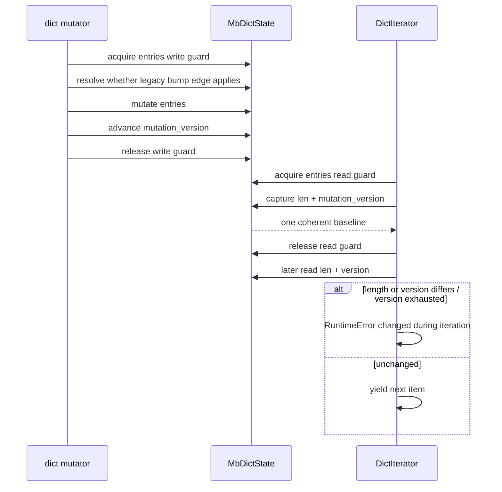

# Dictionary mutation version state topology

Issue: #3002
Parent inventory: #2968
Source revision: `91727dc23a`

This Stage 1 slice classifies the process-global dictionary-version side table
used by iterator invalidation. It replaces raw-address identity and one global
lock with object-owned evidence inside the context-owned object domain without
changing `src/**`.

## Bounded context

```text
ExecutionContext
└── ObjectDomain
    └── MbDictState[DictObjectIdentity]
        ├── entries: MbRwLock<MbDictMap>
        └── mutation_version: AtomicU64

ExecutionChild
└── DictIterator
    ├── source: RetainedDictHandle
    ├── expected_len
    └── expected_version
```

`ObjectDomain` is the target ownership class. Each `MbDictState` entity owns
its entries and mutation version for exactly the lifetime of one dictionary.
The context does not maintain a second version registry.

`DictIterator` owns a retained source handle and a baseline observation. It
does not own or reset the dictionary's version.

## Aggregate and values

| Type | Kind | Identity / value |
|---|---|---|
| `MbDictState` | object entity | typed dict object identity + generation |
| `DictMutationVersion` | value | live non-wrapping `u64` or exhausted |
| `DictIterationBaseline` | value | expected length + live version |
| `RetainedDictHandle` | owned RAII value | one balanced source retain/release |
| `DictMutationKind` | value | key-set change, value-only, or legacy forced bump |

The exact destination is:

```rust
pub struct MbDictState {
    entries: MbRwLock<MbDictMap>,
    mutation_version: AtomicU64,
}
```

`ObjData::Dict` holds `MbDictState`. Forwarding `read`, `write`, and
`try_write` methods preserve the current `ObjData::Dict(ref lock)` access
shape while the storage migration is staged.

## Frozen inventory

The one production identity has sorted newline-terminated SHA-256
`ec06f611169bdeed65543e3b03249d29b98727306573a8483b19bfca8752c521`.
There are zero test-only state identities.

| Current symbol | Current storage | Current role | Target disposition |
|---|---|---|---|
| `DICT_VERSIONS` | process `OnceLock<Mutex<FxHashMap<usize,u64>>>` | raw dict address to iterator-invalidating version | remove; version moves into `MbDictState` |

The accepted selector contains 31 physical rows:

| Family | Rows | Composition |
|---|---:|---|
| `DICT_VERSIONS` | 3 | comment, declaration, initializer use |
| `dict_versions` | 3 | definition and two calls |
| `dict_identity` | 3 | definition and two calls |
| `dict_version` | 10 | definition, 3 production consumers, 5 test calls, 1 assertion string |
| `bump_dict_version` | 12 | comment, definition, 10 production calls |
| **Total** | **31** | |

## Current storage and lifecycle

`dict_version` converts a valid dict pointer to `usize`, locks the process map,
and returns the stored version or zero. `bump_dict_version` locks the same map,
inserts zero for an absent address, and applies `wrapping_add(1)`.

No source path removes an entry. Dictionary retirement, context cleanup,
`cleanup_all_runtime_state`, and worker exit all leave the side table
unchanged.

Consequences:

- every dictionary mutation contends on one process mutex;
- the map grows with every mutated dictionary ever allocated;
- a new dictionary allocated at a retired address inherits the stale version;
- version wrap silently makes an old iterator baseline equal again;
- runtime resets retain old process state.

## Producer matrix

“Bump reached” is separate from “entries changed.” The first migration
preserves these ten current reachability edges exactly.

| Line | Enclosing operation | Guard live at bump | Current reachability |
|---:|---|---|---|
| 2254 | `mb_dict_setitem` | named `map` write guard | new key only; value replacement and lookup/error paths do not bump |
| 2318 | `mb_dict_delitem` | named `map` write guard | hit removed; miss/error do not bump |
| 2805 | `mb_dict_pop` | named `map` write guard | hit removed; miss/default/error do not bump |
| 2836 | `mb_dict_pop_no_default` | named `map` write guard | hit removed; miss raises without bump |
| 2889 | `mb_dict_setdefault` | named `map` write guard | vacant entry inserted; occupied entry does not bump |
| 2953 | `mb_dict_update`, fast dict path | both guards explicitly dropped | at least one new key; value-only/empty update does not bump |
| 3144 | `mb_dict_update`, general path | named `map` write guard | at least one new key; value-only/empty update does not bump |
| 3277 | `mb_dict_clear` | named `map` write guard | nonempty dict only |
| 3350 | `mb_dict_popitem` | named `map` write guard | nonempty dict only |
| 3623 | `mb_dict_ior` | named `map` write guard | unconditional after successful pair collection, including empty/value-only merge |

Nine paths acquire the process version mutex while a per-dict write guard is
live. The fast `mb_dict_update` path explicitly drops both object guards before
bumping, creating a publication gap: new keys are visible before their version
change.

## Consumer matrix

| Line | Consumer | Phase | Baseline / authority |
|---:|---|---|---|
| `iter.rs:245` | `dict_iter_changed` | each iterator step/drain | compares current length and version with stored values |
| `iter.rs:343` | `dict_keys_iter_kind` | construction | holds dict read guard while collecting len, global version, and keys; retains source afterward |
| `iter.rs:366` | `dict_view_iter_kind` | construction | reads length and version in separate operations, then retains source |

Both iterator kinds retain their source and release it on iterator retirement.
That protects object lifetime after construction, but it does not repair the
raw global identity or make the baseline atomic.

`dict_keys_iter_kind` cannot interleave with a normal write while its dict read
guard is live. `dict_view_iter_kind` drops the length read guard before loading
the global version, so a mutation can split its `(expected_len,
expected_version)` observation.

## Current version policy

The current counter is primarily a key-set/iteration version, not a complete
PEP 509 value-mutation version:

- ordinary setitem and update value replacements do not bump;
- new keys and removals bump;
- clearing an empty dict does not bump;
- `dict |= other` is the exception and bumps after every successful merge,
  including empty and value-only merges.

The source migration preserves this policy. It does not infer a new “every
value write bumps” rule from the name `mutation_version`. A later conformance
ticket may change policy only with its own CPython oracle and iterator gates.

## Target mutation and baseline contract



Required invariants:

1. Every dictionary starts at live version zero.
2. A producer publishes its version before releasing the write guard that made
   the corresponding entry change visible.
3. The fast update path no longer exposes new keys before the bump.
4. Iterator length and version baselines are captured under one read guard.
5. The iterator retains the source before releasing construction authority.
6. A mutation of dict B cannot touch dict A's version or block on a shared
   version lock.
7. Object retirement retires the version automatically; no cleanup registry
   or raw-address key remains.
8. All ten current bump reachability edges remain unchanged in the first
   migration.

## Version exhaustion

`mutation_version` never wraps. Its atomic state saturates at `u64::MAX`, which
represents `Exhausted`, not a reusable live baseline.

- An active iterator with a live baseline observes exhaustion as changed.
- New iterator construction on an exhausted dictionary fails closed.
- Mutations may continue under the dict lock, but no iterator can treat
  `MAX` as a stable version.

This avoids rolling back a completed dictionary mutation merely because a
diagnostic counter exhausted while preventing false “unchanged” results.

## Lock ordering and parallelism

The target version is atomic and never requires another object or process
lock. Mutation order is:

```text
one dict write guard -> entry change -> same dict atomic version -> unlock
```

Baseline order is:

```text
one dict read guard -> len + same dict atomic version -> unlock
```

There is no inverse global-lock-to-object-lock path and no cross-dict
coordination. Two threads mutating two dictionaries can progress concurrently.

## Smallest safe implementation slice

Exact implementation paths:

- `apps/mamba/src/runtime/rc.rs`
  - add `MbDictState`;
  - change `ObjData::Dict` payload and dictionary constructors;
  - forward lock operations and initialize live version zero.
- `apps/mamba/src/runtime/dict_ops.rs`
  - replace the side-table helpers with object-state reads/advances;
  - migrate all ten producer edges;
  - move fast-update publication inside its write critical section;
  - remove `DICT_VERSIONS`, raw identity, `OnceLock`, and version-map imports.
- `apps/mamba/src/runtime/iter.rs`
  - capture coherent length/version baselines from `MbDictState`;
  - fail closed on exhausted versions;
  - preserve retained-source retirement.
- focused Rust tests in the existing `dict_ops.rs` / `iter.rs` test modules;
  no broad fixture rewrite in this slice.

Forbidden changes:

- public dict/iterator C-ABI signature changes;
- a replacement process-global registry or lock;
- changed exception text;
- value-update version-policy changes;
- set/list version refactors;
- unrelated dictionary lookup, hashing, ordering, or ownership changes.

## Verification gates

- Exact-set gate: one identity and all 31 current selector rows reconcile until
  the side table is retired.
- Producer gate: all ten call sites map to their true enclosing functions,
  guards, and reachability.
- Policy gate: new key, value replacement, equal value, delete hit/miss,
  empty/nonempty clear, empty/value-only/key-adding update, setdefault
  occupied/vacant, pop hit/miss, and empty/value-only/key-adding `|=` are
  individually asserted.
- Same-dict gate: every frozen bump edge invalidates an active iterator; every
  frozen non-bump edge preserves current behavior.
- Different-dict gate: mutation of B neither changes A's version nor invalidates
  A's iterator.
- Publication-race gate: a barrier around fast update proves no iterator can
  capture new keys with the old version.
- Baseline gate: view length and version are captured from one read critical
  section.
- Retirement gate: repeated allocate/mutate/drop cycles leave no process map;
  a newly allocated dict starts at zero even when an address is reused.
- Parallelism gate: barrier-controlled mutations of independent dicts overlap
  without a shared version mutex.
- Lifetime gate: iterator ownership retains the source until iterator drop.
- Overflow gate: live-to-exhausted invalidates active iterators and rejects new
  iterator baselines without wrapping.

## Dependency and dispatcher result

- #3002 is a Stage 1 design slice under #2968; it changes no source.
- #2968 must close before Stage 2 #2839 can be dispatched.
- AGY produced the correct identity, 31-row appendix, ten producer rows, and
  three consumer rows in its first normalized report.
- The report omitted the required exact implementation-path and focused-test
  surfaces while marking that criterion PASS. The controller supplied those
  sections here, so #3002 is accepted but is not a one-pass ramp sample.
