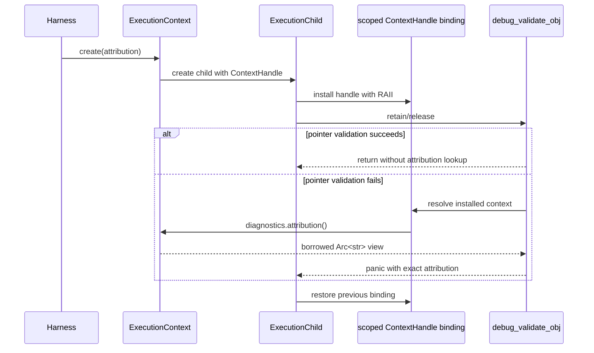

# Execution diagnostic attribution topology

Issue: #3006
Parent inventory: #2968
Source revision: `dec6db1917`

This Stage 1 slice classifies the debug-only process string used to attach an
outer test identity to UAF detector panics on a spawned JIT worker. The target
makes attribution immutable execution-context metadata so future contraction
of `JIT_LOCK` cannot mix concurrent executions. No `src/**` change occurs in
this slice.

## Bounded context

```text
ExecutionContext[ContextId]
└── ExecutionDiagnostics
    └── attribution: Option<Arc<str>>

ExecutionChild[ContextId, ChildId]
└── scoped ContextHandle
    └── resolves parent ExecutionDiagnostics

RuntimeDiagnostics
└── UafDetectorProcessService
    └── consumes attribution only while formatting a panic
```

The semantic owner is the `ExecutionContext`. Attribution differs between two
concurrent executions and spans preparation, compilation, child execution,
cleanup, and failure reporting. An `ExecutionChild` does not own a copied
string; its scoped context handle resolves the same immutable value.

`UafDetectorProcessService` owns the process-wide arming policy from #3005 but
does not own execution identity.

## Aggregate and values

| Type | Kind | Identity / value |
|---|---|---|
| `ExecutionContext` | aggregate root | one compiled-and-executed program |
| `ExecutionDiagnostics` | context-owned value aggregate | immutable diagnostic metadata |
| `DiagnosticAttribution` | optional immutable value | `Option<Arc<str>>` |
| `ExecutionChild` | child entity | context id + child id |
| `ContextHandle` | scoped compatibility value | resolves installed context |

The exact target field is:

```rust
#[cfg(debug_assertions)]
pub struct ExecutionDiagnostics {
    attribution: Option<std::sync::Arc<str>>,
}

pub struct ExecutionContext {
    // other Stage 2 state
    #[cfg(debug_assertions)]
    diagnostics: ExecutionDiagnostics,
}
```

The `cfg(debug_assertions)` placement preserves the current release-build
absence. If `ExecutionDiagnostics` later gains release-relevant fields, only
`attribution` remains conditional; the ownership and no-release-overhead
invariant do not change.

## Frozen inventory

The one production debug-diagnostic identity has sorted newline-terminated
SHA-256
`a95f0a94860e84524341ad3ec7aa2c04a803061d2ebbb34a943d83360d38031c`.
There are zero test-only state identities within this slice.

| Current symbol | Storage | Role | Target disposition |
|---|---|---|---|
| `CURRENT_TEST_NAME` | debug-only process `RwLock<String>` | worker-panic attribution breadcrumb | remove; move immutable value into `ExecutionContext::diagnostics` |

The accepted selector contains nine physical rows:

| Family | Occurrences |
|---|---:|
| `CURRENT_TEST_NAME` | 3 |
| `set_current_test_name` | 3 |
| `current_test_name_for_diagnostics` | 3 |
| **Total** | **9** |

The rows are the static declaration, setter declaration/write, diagnostic
reader declaration/read, two panic-formatting calls, one library-unit-test
setter, and one integration-harness setter.

## Current producer and consumer topology

### Integration harness producer

`jit_capture_with_exception` acquires the named `_jit_guard` before setting the
outer libtest thread name. That `JIT_LOCK` guard remains live through parsing,
worker spawn, compilation, execution, runtime cleanup, channel receive, worker
join, and function return.

The setter itself takes a blocking `RwLock::write`, clears the string, writes
the new name, and drops the write guard before returning. The write guard is
therefore not live on the worker. Correct attribution currently comes from
whole-execution `JIT_LOCK` serialization plus the process breadcrumb, not from
holding the attribution lock across execution.

### Direct unit-test producer

`test_uaf_detector_caught_panic_attribution` calls the setter directly. It is
compiled into the library unit-test executable; the CPython ported harness is
compiled into a separate integration-test executable. They occupy different
processes and do not race merely because both appear in the selector.

### Panic consumers

`current_test_name_for_diagnostics` runs only when `debug_validate_obj` is
already formatting one of two failures:

- a misaligned `MbObject` address;
- an invalid `ObjKind` discriminant.

Normal `mb_retain` and `mb_release` enter the detector policy check in debug
builds but do not read, clone, or lock the attribution string unless one of
those panic branches is reached.

## Current lock and failure behavior

| Event | Current result |
|---|---|
| empty initial string | `<unknown test>` |
| successful setter | replace process string |
| setter while another reader/writer exists | blocking `write()` waits |
| poisoned setter lock | setter ignores `Err`; poison remains |
| successful diagnostic read | clone nonempty string |
| empty diagnostic read | `<unknown test>` |
| contended diagnostic read | `try_read` returns `<test-name lock unavailable>` |
| poisoned diagnostic read | same unavailable fallback |
| runtime cleanup | does not clear the string |
| later harness execution | successful setter overwrites prior name |
| OS-thread exit | no effect; storage is process static |
| process exit | operating system retires the string and lock |

`<test-name lock unavailable>` is a legacy characterization, not target
behavior to preserve after removal of the process `RwLock`.

## Target propagation contract



Attribution is fixed while preparing the context and is not mutated after
installation. Child creation carries a `ContextHandle`; worker entry installs
that handle through the Stage 2 scoped binding. TLS contains only the handle,
never a diagnostic string.

When no context is installed, panic formatting uses an explicit
`<unknown execution>` fallback. It never consults stale process state.

## Invariants

1. Each execution context owns at most one immutable attribution value.
2. Two concurrent contexts cannot observe or overwrite each other's value.
3. Every child resolves its parent context's exact attribution.
4. Child creation copies/clones only the handle/`Arc`, not string contents.
5. Normal retain/release does not resolve or clone attribution.
6. Panic formatting performs the context lookup only after validation fails.
7. Missing or retired context produces an explicit stable fallback.
8. Nested context bindings restore the prior context on return, error, or panic.
9. Context retirement releases its attribution only after all children quiesce.
10. No mutable process or TLS string grants diagnostic identity.
11. Attribution correctness does not depend on whole-execution `JIT_LOCK`.
12. Release builds add no attribution storage or lookup cost.

## Source implementation slice

This migration cannot start before #2839 supplies the Stage 2 context shell,
`ContextHandle`, and scoped binding. It must complete before Stage 5 contracts
whole-execution `JIT_LOCK` serialization.

Exact planned changed paths:

- `apps/mamba/src/runtime/execution_context.rs`
  - define conditional `ExecutionDiagnostics`;
  - expose borrowed diagnostic lookup through a live context handle;
  - propagate/install the handle for `ExecutionChild`.
- `apps/mamba/src/runtime/mod.rs`
  - wire the execution-context module and required crate-visible exports.
- `apps/mamba/src/runtime/rc.rs`
  - delete `CURRENT_TEST_NAME`, its setter, and its process reader;
  - resolve context attribution only inside the two panic branches.
- `apps/mamba/tests/cpython_ported/harness.rs`
  - create the context with the outer test attribution;
  - install its handle on the JIT worker instead of setting a process string.
- `apps/mamba/tests/execution_context_diagnostics.rs`
  - own focused concurrent attribution and child-propagation integration tests.

Forbidden changes:

- another mutable process string or map;
- a TLS attribution string instead of the handle-only binding;
- one mutable copy per child;
- relying on `JIT_LOCK` as an attribution owner;
- resolving/cloning diagnostic text on successful retain/release;
- retaining stale attribution after context retirement;
- silently borrowing another context when the binding is missing;
- preserving the legacy lock-unavailable text by adding a replacement lock;
- adding release-build attribution overhead;
- changing UAF detector arming ownership from the #3005 process service.

## Verification gates

- Exact-set gate: the one identity and all nine rows reconcile until removal.
- Legacy contention/poison characterization: before removal, exercise a held
  writer and a poisoned lock and record the unavailable fallback; this is
  deletion evidence, not target behavior.
- Two-context gate: two barrier-interleaved contexts trigger diagnostic panics
  and each payload contains only its own attribution.
- Child propagation gate: a worker resolves its parent context attribution
  through the installed handle.
- Nested binding gate: inner context failure restores the outer attribution.
- Missing-context gate: an unbound panic reports `<unknown execution>`.
- Retirement gate: no child can report through a retired context; quiescence
  precedes attribution release.
- Fast-path gate: successful retain/release performs no diagnostic attribution
  lookup or string/`Arc` clone.
- Lock-contraction gate: attribution remains correct with two executions
  overlapping and no lock spanning compile+execute+cleanup.
- Negative source gate: `CURRENT_TEST_NAME`, its setter/reader, and any
  replacement process/TLS diagnostic string are absent.
- Release gate: attribution state and lookup code are absent from release
  artifacts.
- AGY's measure-only run did not execute any of these planned gates.

## Dependency and dispatcher result

- #3006 is a Stage 1 classification slice under #2968.
- #2968 must close before Stage 2 #2839 can be dispatched.
- AGY's first report reconciled the state and ownership but marked the delivery
  criterion PASS without listing planned changed paths or all required test
  seams.
- The resumed report printed the exact delivery surface and legacy-vs-target
  distinction; snapshot verification passed.
- Controller normalization additionally preserves debug-only/release omission.
  This issue is accepted after one revision and is not a one-pass ramp sample.
