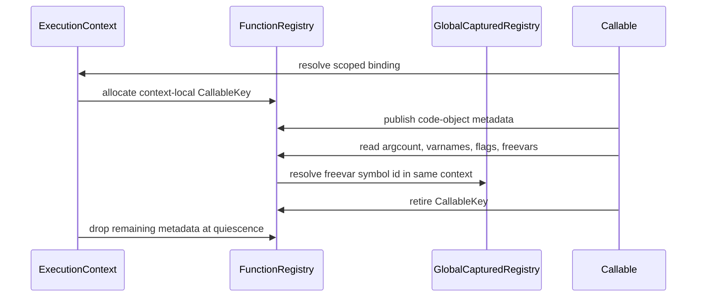

# Function code-object metadata state topology

Issue: #2973
Parent inventory: #2968
Source revision: `e64af84100ee8327e802c5a83c8d5e51c49f18b6`

This Stage 1 DDD slice classifies argument-count, variable-name, flag, and
free-variable metadata in `runtime/closure.rs`. It defines ownership and
lifetime rules without authorizing source migration before #2839.

## Aggregate boundary

`ExecutionContext` remains the aggregate root. These four registries form one
context-owned code-object metadata collection:

```text
ExecutionContext
└── RuntimeRegistrySet
    └── functions
        └── code_object_metadata[CallableKey]
            ├── argcount
            ├── varnames
            ├── flags
            └── freevars
```

`CallableKey` is the context-local value object defined by the function
identity slice. It wraps the opaque bit pattern returned by
`MbValue::to_bits()` and is not inherently a pointer, process-global identity,
or ownership token.

## Frozen inventory

The admitted set contains exactly four newline-terminated, byte-sorted
identities. Its SHA-256 is
`7acc2e22758eafd8ba41b1727716f827d9ad7718715a48764752a38b7db97f67`.

| Current symbol | Stored value | DDD destination |
|---|---|---|
| `FUNC_ARGCOUNTS` | primitive `i64` positional argument count | `CodeObjectMetadata.argcount` |
| `FUNC_FLAGS` | primitive `i64` code-object flags | `CodeObjectMetadata.flags` |
| `FUNC_FREEVARS` | Rust `Vec<(String, i64)>` name and symbol-id metadata | `CodeObjectMetadata.freevars` |
| `FUNC_VARNAMES` | Rust `Vec<String>` parameter/local names | `CodeObjectMetadata.varnames` |

All four maps are currently TLS `RefCell<HashMap<u64, _>>` values keyed by
`func.to_bits()`. Setters overwrite through `HashMap::insert`; no admitted map
has an individual retirement API; `cleanup_all_closures()` clears all four.

## Ownership and value boundaries

- `FUNC_ARGCOUNTS` and `FUNC_FLAGS` extract primitive integers from incoming
  `MbValue` arguments. The maps store only Rust `i64` values.
- `FUNC_VARNAMES` reads strings from an incoming tuple or list and stores a
  Rust-owned `Vec<String>`. Its getter allocates new Python string and tuple
  objects from cloned Rust strings.
- `FUNC_FREEVARS` reads list/tuple pairs and stores Rust-owned
  `(String, i64)` metadata. The `i64` is a symbol id, not ownership of the
  Python value addressed by that id.
- Values addressed by free-variable symbol ids remain owned by the separate
  context registry for global/captured values. Moving code-object metadata
  cannot implicitly move or extend those value lifetimes.
- Overwrite and cleanup drop Rust vectors and strings normally. The admitted
  maps do not require `retain_if_ptr` or `release_if_ptr`.

## Invariants

1. Every metadata lookup resolves through the current `ExecutionContext`.
2. A `CallableKey` is valid only inside its owning context and callable
   lifetime.
3. Reuse of an opaque bit identity cannot expose metadata from a retired
   callable. Pointer-address reuse is only one conditional mechanism when a
   callable is pointer-backed.
4. Registration publishes a coherent code-object metadata record; readers
   cannot mix fields from different callables or contexts.
5. `mb_func_is_registered` may continue using name, argcount, and varnames as
   evidence, but its result must be scoped to the same context and key
   lifetime as every metadata read.
6. Flags and freevars cannot silently become independent registration
   authorities merely because they share the collection.
7. A free-variable symbol id is resolved only through the same context that
   owns its `CodeObjectMetadata`.
8. Context retirement occurs after child quiescence and drops the metadata
   collection without Python refcount operations.
9. Compatibility TLS carries only the scoped context/thread binding. The maps
   themselves do not remain TLS payload or process-global state.

## Current-state risks

- Raw bit keys have no generation component or per-callable removal. A reused
  bit identity can expose stale argument counts, variable names, flags, or
  free-variable symbol ids.
- TLS scopes maps to an OS thread rather than an execution context. Two
  contexts on one thread can collide, while one context spanning workers sees
  split metadata.
- `mb_func_is_registered` consults argcount and varnames but not flags or
  freevars. Migration must preserve this deliberate predicate rather than
  infer registration from collection membership as a whole.
- Free-variable metadata and the value registry have coupled lookup semantics
  but distinct ownership. Combining them into one unbounded map would blur
  retirement and refcount rules.
- Broad cleanup is not a context-local or per-callable lifecycle boundary.

## Lifecycle



The implementation must choose either explicit per-callable retirement or a
generation-safe context-local key. Copying the current raw maps unchanged into
the aggregate does not prove stale-entry freedom.

## Dependency and source order

1. Finish the remaining #2968 Stage 1 inventory slices.
2. Implement #2839 Stage 2 aggregate shell and scoped restoring binding.
3. Establish directly observable Stage 3 output/exception isolation.
4. Migrate function identity and code-object metadata in bounded Stage 4
   tickets.
5. Add per-callable retirement or generation-safe key reuse before claiming
   stale-entry freedom.

Forbidden changes include treating `func.to_bits()` as a process-global
pointer identity, placing code-object maps in thread-state payload, conflating
free-variable metadata with ownership of captured values, changing the
registration predicate accidentally, or migrating all remaining `FUNC_*`
registries in one ticket.

## Verification surface

- Inventory count: 4.
- Inventory digest:
  `7acc2e22758eafd8ba41b1727716f827d9ad7718715a48764752a38b7db97f67`.
- Exact source: `apps/mamba/src/runtime/closure.rs`.
- Complete static inventory: 24 candidates, 4 admitted and 20 discarded.
- Snapshot rule: #2973 permits no repository changes from AGY and no
  `apps/mamba/src/**` changes from the controller.
