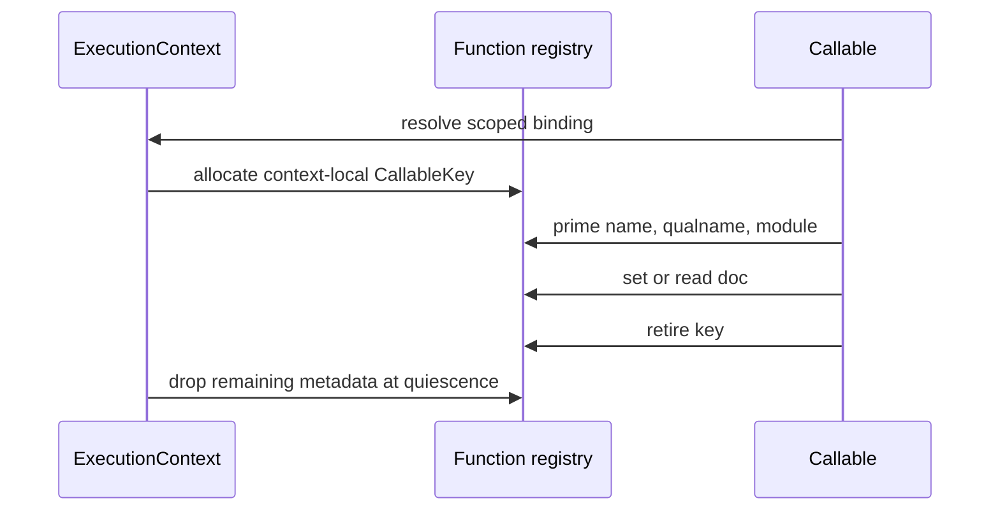

# Function identity metadata state topology

Issue: #2972
Parent inventory: #2968
Source revision: `f78c71f257c1909f931669452e91efcdfb5b5d86`

This Stage 1 DDD slice classifies the name, qualname, docstring, and defining
module maps in `runtime/closure.rs`. It extends the closure/cell topology
without authorizing source migration before #2839.

## Aggregate boundary

`ExecutionContext` remains the aggregate root. Function identity metadata is a
cohesive context-owned registry:

```text
ExecutionContext
└── RuntimeRegistrySet
    └── functions
        └── identity_metadata[CallableKey]
            ├── name
            ├── qualname
            ├── doc
            └── module
```

`CallableKey` is a value object wrapping the opaque bit pattern returned by
`MbValue::to_bits()`. The bit pattern may encode whichever callable form the
runtime passes. It is not inherently a heap pointer, stable process-global
identity, or ownership token.

## Frozen inventory

The admitted set contains exactly four newline-terminated, byte-sorted
identities. Its SHA-256 is
`a483558ff01e86c5f173ddcb7f4c75068ca363b8a64eb642374e33ccc7a94b6c`.

| Current symbol | Value | DDD owner | Destination |
|---|---|---|---|
| `FUNC_NAMES` | Rust `String` simple name | context-owned | `FunctionIdentityMetadata.name` |
| `FUNC_QUALNAMES` | Rust `String` qualified name | context-owned | `FunctionIdentityMetadata.qualname` |
| `FUNC_DOCS` | Rust `String` docstring | context-owned | `FunctionIdentityMetadata.doc` |
| `FUNC_MODULES` | Rust `String` module name | context-owned | `FunctionIdentityMetadata.module` |

All four maps currently use `u64` keys derived from `func.to_bits()`, overwrite
by `HashMap::insert`, have no individual removal API, and are cleared by
`cleanup_all_closures()`.

## Invariants

1. A `CallableKey` resolves only inside the owning `ExecutionContext`.
2. Reuse of the same opaque bits after callable retirement cannot expose stale
   metadata from an earlier callable.
3. Pointer-address reuse is only one conditional reuse mechanism when the
   callable is pointer-backed; the design must not assume every key is a
   pointer.
4. Priming name, qualname, and module metadata is one context-local
   transaction. Readers cannot observe a mixture from different callables or
   contexts.
5. Live `MbClosure` field fallback and registry lookup resolve within the same
   context and agree on callable identity.
6. Stored `String` values are Rust-owned. Dropping or overwriting them requires
   no Python `retain_if_ptr` or `release_if_ptr`.
7. Context retirement drops all four maps only after no child can publish or
   read function metadata.
8. Compatibility TLS carries only the scoped context/thread binding; the maps
   themselves never move into TLS payload or a process-global singleton.

## Current-state risks

- The raw bit key has no generation component. If the same bit pattern is
  reused while stale metadata remains, a different callable can observe the
  old identity fields.
- There is no per-callable removal path, so stale entries survive until the
  broad `cleanup_all_closures()` reset.
- TLS isolates OS threads rather than execution contexts. Two contexts on one
  thread can collide, while one context spanning worker threads sees split
  registries.
- Bulk cleanup safely drops the Rust strings, but it is not a valid
  context-local lifecycle boundary while the maps remain ambient TLS.

## Lifecycle



The future registry may add a context-local generation to `CallableKey` or
guarantee that callable bits are not reused before explicit removal. The
implementation ticket must choose and prove one rule; copying the current raw
map unchanged into the aggregate is insufficient.

## Dependency and source order

1. Finish the remaining #2968 Stage 1 inventory slices.
2. Implement #2839 Stage 2 aggregate shell and scoped restoring binding.
3. Establish directly observable Stage 3 output/exception isolation.
4. Migrate closure/cell and function metadata owners in separate Stage 4
   tickets.
5. Add per-callable retirement or generation-safe key reuse before claiming
   stale-entry freedom.

Forbidden changes include treating `func.to_bits()` as a process-global
pointer identity, sharing one metadata map across contexts, migrating all
`FUNC_*` registries in one ticket, or adding a broad lock around all callable
metadata.

## Verification surface

- Inventory count: 4.
- Inventory digest:
  `a483558ff01e86c5f173ddcb7f4c75068ca363b8a64eb642374e33ccc7a94b6c`.
- Exact source: `apps/mamba/src/runtime/closure.rs`.
- Snapshot rule: #2972 permits no repository changes from AGY and no
  `apps/mamba/src/**` changes from the controller.
