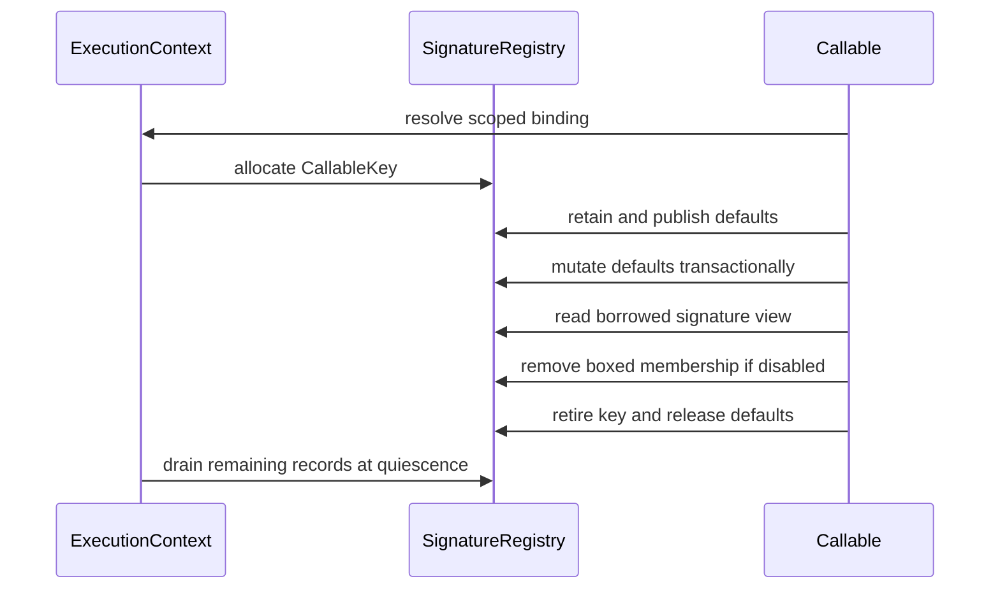

# Function signature metadata state topology

Issue: #2974
Parent inventory: #2968
Source revision: `d6e0c23e2c807ab627b99784a0cfba844814aad7`

This Stage 1 DDD slice classifies declared parameters, boxed-parameter state,
and return annotations in `runtime/closure.rs`. Unlike the other function
metadata slices, parameter records may own retained Python default values.

## Aggregate boundary

`ExecutionContext` remains the aggregate root:

```text
ExecutionContext
└── RuntimeRegistrySet
    └── functions
        └── signature_metadata[CallableKey]
            ├── params[]
            │   ├── name, kind, annotation
            │   ├── entry_abi, contract
            │   └── default: OwnedPyValue?
            ├── boxed_params
            └── return_annotation
```

`CallableKey` wraps the opaque `MbValue::to_bits()` identity and is valid only
inside the owning context and callable lifetime.

## Frozen inventory

The admitted set contains exactly three newline-terminated, byte-sorted
identities. Its SHA-256 is
`2bdfd494c16660497232ee6101c5c8902582eb26e52b296e55c76a0bf933a1ad`.

| Current symbol | Stored value | DDD destination |
|---|---|---|
| `FUNC_BOXED_PARAMS` | Rust `HashSet<u64>` membership flag | `SignatureMetadata.boxed_params` |
| `FUNC_PARAMS` | Rust `Vec<MbParamInfo>`, including retained `MbValue` defaults | `SignatureMetadata.params` |
| `FUNC_RET_ANNOS` | Rust `String` return annotation | `SignatureMetadata.return_annotation` |

## Parameter-default ownership

`MbParamInfo.default` is the only admitted payload with conditional Python heap
ownership:

1. `mb_func_set_params` extracts each default and calls `retain_if_ptr` before
   storing it.
2. Replacing an existing parameter vector calls `release_if_ptr` on every
   previous default.
3. `mb_func_set_pos_defaults` retains each incoming replacement before
   releasing the old stored default.
4. Clearing a positional default releases the old stored value and writes
   `MbValue::none()`.
5. `func_params` clones `MbParamInfo` records, but copying an `MbValue` does not
   create another owned retain. Readout is therefore a borrowed-value view
   whose validity is bounded by the owning signature record.
6. `cleanup_all_closures()` calls `FUNC_PARAMS.clear()` without walking
   records and calling `release_if_ptr`. Dropping the Rust containers does not
   release retained Python objects; the current broad cleanup intentionally
   leaks them until process exit.

The future aggregate must encode this distinction explicitly. A signature
record owns one retain for every pointer-backed default; transient readers do
not.

## Other value boundaries

- `FUNC_BOXED_PARAMS` contains only opaque callable keys. False mutation
  explicitly removes the key, unlike the maps that survive until broad
  cleanup.
- `FUNC_RET_ANNOS` stores Rust-owned text. Overwrite and cleanup drop strings
  normally and require no Python refcount operation.
- An annotation lookup may allocate Python values for presentation, but those
  values are not stored in the admitted return-annotation map.

## Invariants

1. Every signature lookup and mutation resolves through the current
   `ExecutionContext`.
2. A `CallableKey` cannot resolve a signature record from another context or a
   retired callable.
3. Reuse of an opaque bit identity cannot expose stale parameters, boxed state,
   annotations, or retained defaults. Pointer-address reuse is only one
   conditional mechanism for pointer-backed callables.
4. Publishing or replacing a parameter vector is one ownership transaction:
   new pointer defaults are retained before old pointer defaults are released.
5. Each stored pointer-backed default has exactly one aggregate-owned retain.
6. Borrowed/cloned parameter views cannot outlive the signature record unless
   they acquire their own retain explicitly.
7. Removing or retiring a signature record releases all owned defaults before
   the record becomes unreachable.
8. Context retirement drains signature ownership only after child quiescence;
   it cannot reuse the current leak-by-clear behavior.
9. Boxed-parameter membership and `entry_abi` remain distinct facts even when
   consumers use them together.
10. Compatibility TLS carries only the scoped context/thread binding; the
    signature registries do not remain TLS payload.

## Current-state risks

- `FUNC_PARAMS.clear()` leaks every retained pointer-backed default because
  `MbParamInfo` has no drop hook that invokes the runtime release operation.
- Raw bit keys have no generation component. Bit-identity reuse can attach a
  stale default, annotation, or boxing state to another callable.
- There is no per-callable removal for parameters or return annotations;
  boxed-parameter state is the only admitted registry with explicit removal.
- TLS scopes state by OS thread instead of execution context.
- `func_params().cloned()` produces borrowed-bit copies without an explicit
  lifetime type. Retirement concurrent with a reader would make ownership
  assumptions implicit and unsafe.

## Lifecycle



An implementation may wrap a stored default in an aggregate-owned RAII type,
or it may provide an explicit drain path. Either design must prove exactly-once
release and cannot inherit the current broad clear behavior.

## Dependency and source order

1. Finish the remaining #2968 Stage 1 inventory slices.
2. Implement #2839 Stage 2 aggregate shell and scoped restoring binding.
3. Establish directly observable Stage 3 output/exception isolation.
4. Migrate signature metadata as a bounded Stage 4 owner ticket.
5. Add explicit callable retirement and context-drain release tests before
   claiming leak freedom.

Forbidden changes include treating raw bits as process-global pointer identity,
dropping `FUNC_PARAMS` without releasing owned defaults, retaining on every
borrowed clone, conflating boxed membership with `entry_abi`, moving these maps
into thread state, or migrating all remaining `FUNC_*` registries together.

## Verification surface

- Inventory count: 3.
- Inventory digest:
  `2bdfd494c16660497232ee6101c5c8902582eb26e52b296e55c76a0bf933a1ad`.
- Exact source: `apps/mamba/src/runtime/closure.rs`.
- Complete static inventory: 24 candidates, 3 admitted and 21 discarded.
- Snapshot rule: #2974 permits no repository changes from AGY and no
  `apps/mamba/src/**` changes from the controller.
