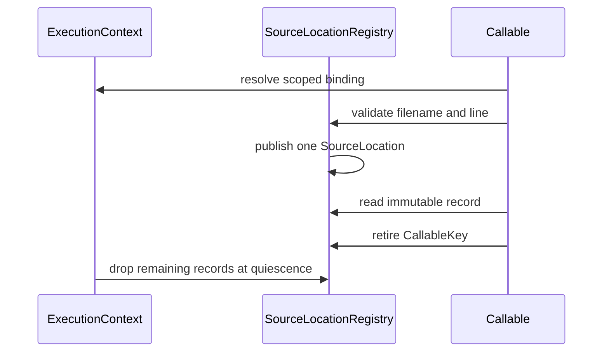

# Function source-location state topology

Issue: #2975
Parent inventory: #2968
Source revision: `e3287b2d61`

This Stage 1 DDD slice classifies function filenames and first-line numbers in
`runtime/closure.rs`. It freezes their current partial-publication behavior and
defines the future atomic record boundary.

## Aggregate boundary

```text
ExecutionContext
└── RuntimeRegistrySet
    └── functions
        └── source_location[CallableKey]
            ├── filename
            └── first_line
```

`CallableKey` is the context-local opaque `MbValue::to_bits()` identity
defined by the preceding function-metadata slices.

## Frozen inventory

The admitted set contains exactly two newline-terminated, byte-sorted
identities. Its SHA-256 is
`591bf8bcd00eb318f072e8f61344223cdff3e2b91e254bbc62c6dd71b8bc1dcc`.

| Current symbol | Stored value | DDD destination |
|---|---|---|
| `FUNC_FILES` | Rust-owned filename `String` | `SourceLocation.filename` |
| `FUNC_LINES` | primitive first-line `i64` | `SourceLocation.first_line` |

Both TLS maps use the same opaque callable key. `func_file` clones the Rust
string; `func_line` copies the integer. Neither map owns a Python heap value.

## Current publication semantics

`mb_func_set_srcinfo` is one API call but not one transaction:

1. It derives the callable key once.
2. It inserts the line only when the input is an integer greater than zero.
3. Independently, it inserts the filename only when `extract_str` succeeds and
   the result is non-empty.
4. An invalid field does not remove an old field and does not roll back a valid
   insertion for the other field.

The current representation can therefore contain filename-only, line-only, or
mixed-generation records. The future aggregate must not reproduce this
two-map partial-publication behavior.

## Invariants

1. A source location resolves only through the current `ExecutionContext`.
2. A `CallableKey` is valid only in its owning context and callable lifetime.
3. Reuse of an opaque bit identity cannot expose a retired callable's
   filename, line, or mixed record.
4. A valid source location publishes filename and first line atomically as one
   immutable value object.
5. Validation failure does not partially update a prior record. The chosen API
   must either reject the whole update or publish an explicitly modeled
   partial value; it cannot silently combine generations.
6. Overwrite replaces the whole source-location record.
7. Callable retirement removes its record; context retirement drops remaining
   records after child quiescence.
8. Rust string/integer cleanup requires no Python retain/release operation.
9. Compatibility TLS carries only the scoped binding, not the source-location
   maps.

## Current-state risks

- Independent validation and insertion can leave partial or stale mixed
  metadata after a malformed update.
- Neither map has per-callable removal, so stale entries survive broad cleanup.
- Raw bit identities have no generation component.
- TLS scopes metadata by OS thread rather than execution context.
- Separate maps permit readers to observe different publication moments even
  when both inputs are valid.

## Lifecycle



## Dependency and source order

1. Finish the remaining #2968 Stage 1 inventory slices.
2. Implement #2839 Stage 2 aggregate shell and scoped restoring binding.
3. Establish directly observable Stage 3 output/exception isolation.
4. Migrate source-location metadata as one bounded Stage 4 record ticket.
5. Verify invalid updates cannot create partial or mixed-generation records.

Forbidden changes include treating raw bits as process-global pointer identity,
retaining two independently mutable maps inside the aggregate, silently
combining old and new fields, moving source location into thread-state payload,
or migrating before #2839.

## Verification surface

- Inventory count: 2.
- Inventory digest:
  `591bf8bcd00eb318f072e8f61344223cdff3e2b91e254bbc62c6dd71b8bc1dcc`.
- Exact source: `apps/mamba/src/runtime/closure.rs`.
- Complete static inventory: 24 candidates, 2 admitted and 22 discarded.
- Snapshot rule: #2975 permits no repository changes from AGY and no
  `apps/mamba/src/**` changes from the controller.
