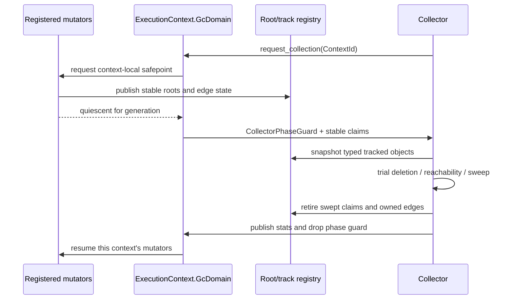

# Garbage collector domain state topology

Issue: #2997
Parent inventory: #2968
Source revision: `7c9f3a197d`

This Stage 1 slice classifies the cycle collector, root publication, collection
policy, and Python `gc` API bookkeeping declared by `runtime/gc.rs` and
`runtime/stdlib/gc_mod.rs`. It defines the ownership and coordination contract
for free-threaded execution without changing `src/**`.

## Bounded contexts

```text
ExecutionContext
├── GcDomain
│   ├── tracked_set
│   ├── root_set
│   ├── collector_phase
│   ├── collection_policy
│   ├── physical_stats
│   └── api_state
│       ├── count_baseline
│       ├── generation_collections
│       ├── generation_ticks
│       ├── freeze_count
│       └── debug_flags
└── ThreadDomain
    └── ThreadRecord
        └── MutatorRegistration

ExecutionThreadState
└── active_mutator
    └── published roots / safepoint state
```

`GcDomain` belongs to one `ExecutionContext`. It owns the context's physical
cycle-collector state and the synthetic counters exposed by that context's
Python `gc` module.

`ExecutionThreadState` is a registered mutator and root-publication dependency.
It does not own an independent collector. OS worker TLS may cache only a scoped
handle to the active context and child state.

## Aggregate and values

| Type | Kind | Identity / value |
|---|---|---|
| `GcDomain` | aggregate sub-root | `ContextId` |
| `TrackedObject` | entity claim | `ContextId + ObjectId + ObjectGeneration` |
| `RootLease` | owned entity/guard | `ContextId + RootLeaseId` |
| `MutatorRegistration` | child registration | `ContextId + ThreadRecordId + generation` |
| `CollectorPhaseGuard` | RAII phase guard | idle / requested / collecting / retiring |
| `CollectionPolicy` | value | enabled + threshold + coordination algorithm |
| `GcApiState` | value state | context-local CPython compatibility counters |
| `GcStats` | snapshot value | physical + API counters at one generation |

A tracked entry must pin or otherwise prove the lifetime of the object it
names. A raw address alone is neither identity nor ownership. A root lease
holds exactly one explicit ownership claim until it is retired.

## Frozen inventory

The six production identities have sorted newline SHA-256
`3f226ba6cc177cfabfba90bf7fe2e22d2c88bc550bc8632d0f3675c37cea3e3b`.
There are no test-only static declarations in this slice.

| Current symbol | Current storage | Current role | Target owner |
|---|---|---|---|
| `GC` | TLS `RefCell<GcState>` | physical tracking, roots, policy, phase, and stats | `ExecutionContext.GcDomain` |
| `COLLECTIONS` | TLS `Cell<[u64; 3]>` | emulated per-generation collection counts | `ExecutionContext.GcDomain.api_state` |
| `COUNT_BASELINE` | TLS `Cell<usize>` | emulated generation-zero count baseline | `ExecutionContext.GcDomain.api_state` |
| `DEBUG_FLAGS` | TLS `Cell<i64>` | Python `gc` debug flag word | `ExecutionContext.GcDomain.api_state` |
| `FREEZE_COUNT` | TLS `Cell<usize>` | emulated permanent-generation count | `ExecutionContext.GcDomain.api_state` |
| `GEN_TICKS` | TLS `Cell<[i64; 2]>` | emulated younger-generation ticks | `ExecutionContext.GcDomain.api_state` |

The accepted selector evidence contains 40 distinct physical path/line rows and
40 identity occurrences:

| Identity | Occurrences |
|---|---:|
| `GC` | 24 |
| `COLLECTIONS` | 3 |
| `COUNT_BASELINE` | 3 |
| `DEBUG_FLAGS` | 3 |
| `FREEZE_COUNT` | 4 |
| `GEN_TICKS` | 3 |
| **Total** | **40** |

## Current `GcState` ownership

| Field | Current producer / mutator | Current lifetime and teardown | Target role |
|---|---|---|---|
| `tracked` | `gc_track`, `gc_untrack`, `collect` | non-owning raw-address set; conditionally cleared by `gc_clear_all_state` | lifetime-safe `tracked_set` |
| `alloc_count` | `gc_track`, `collect` | scalar reset after collection or successful clear | `physical_stats.alloc_count` |
| `threshold` | constructor, `gc_set_threshold` | thread-local configuration; not reset by clear | `collection_policy.threshold` |
| `collections` | `collect` | scalar reset by successful clear | `physical_stats.collections` |
| `collecting` | `collect` | non-RAII reentrancy flag; successful clear forces false | `CollectorPhaseGuard` |
| `enabled` | constructor, enable/disable | thread-local policy; not reset by clear | `collection_policy.enabled` |
| `roots` | add/remove/clear root | borrowed `MbValue` bits; conditionally discarded | owned `RootLease` set |

## Current behavior and defects

### OS-worker ownership loses cross-worker object retirement

Allocation and tracking on worker A insert an address into worker A's TLS
`GC.tracked`. If worker B later drops the last reference, `gc_untrack` removes
the address from worker B's independent set. Worker A retains a stale address.

Collection on worker A then dereferences the stale pointer during refcount
sampling or child traversal. The tracked set neither pins the object lifetime
nor validates an object generation, so the same address can also be reused for
a different allocation before collection.

The target tracking operation resolves the active `ExecutionContext` and
updates its one `GcDomain`. Track, untrack, and object retirement use the same
typed identity and generation regardless of which worker executes them.

### Per-object locks are not a stable graph snapshot

`visit_contained` acquires per-object read locks for mutable List, Dict,
Instance, and Set payloads. Tuple and FrozenSet vectors are immutable and are
read without payload locks.

Those locks protect each payload while that payload is traversed. They do not:

- pin the raw parent pointer before its `ObjData` is read;
- keep all nodes and edges stable across trial-deletion phases;
- prevent another mutator from changing an edge after subtraction but before
  reachability marking or sweep;
- establish that every visited object belongs to the collecting context.

The target must provide one proven context-local coordination algorithm. A
context-local stop-the-world/safepoint protocol is valid. Epoch reclamation or
another concurrent collector is also valid if its lifetime and graph
consistency proof is explicit. The prohibition is a process-global GIL, not
coordination among mutators of one context.

### Current safepoint surface provides no coordination

`gc_register_thread`, `gc_unregister_thread`, and `gc_safepoint` are no-op
compatibility functions. Existing calls therefore do not prove mutator
registration, root publication, quiescence, or collection admission.

The target connects them to `ThreadDomain`:

```text
register -> publish roots -> execute/poll -> safepoint -> unpublish -> unregister
```

Registration is scoped to `ContextId`. Context retirement waits until all
registered mutators have quiesced or been joined. A worker executing another
context cannot satisfy this context's safepoint consensus.

### Roots are borrowed pointer bits

`gc_add_root` copies an `MbValue` into `roots` without retaining it.
`gc_remove_root`, `gc_clear_roots`, and `gc_clear_all_state` remove entries
without releasing them. The vector is therefore a borrowed pointer-bit list,
not an owning root set.

The target chooses one explicit model:

- an owned root slot retains or receives one strong reference and releases it
  exactly once; or
- a lexical `RootLease` proves that another owner outlives the lease.

Add, replace, remove, clear, and context retirement must share the same model.
Borrowed roots may not escape the lifetime guard that proves their validity.

### Collection phase is a flag, not a lock

`collecting` prevents re-entry only within the same TLS `RefCell`. It neither
coordinates workers nor makes graph traversal safe. It is manually set before
the trial-deletion pass and manually reset after sweep.

A caught Rust panic during the pass skips the reset and leaves the flag true,
silently disabling later manual and automatic collection on that worker.

The target uses `CollectorPhaseGuard`. Entering collection performs an atomic
context-local phase transition and establishes mutator coordination. Dropping
the guard restores or records a failed phase on normal return and unwind.
Process abort has no later observable runtime state and is not a recovery case.

### Runtime cleanup is conditional and thread-local

`gc_clear_all_state` calls `try_borrow_mut`. If the calling thread currently
borrows `GC`, the function silently performs no cleanup at all: `tracked`,
`roots`, counters, and `collecting` remain unchanged. A successful call still
reaches only the caller's TLS instance.

The clear deliberately does not collect. Current module dictionaries contain
borrowed, un-retained values, and running the collector during cleanup can
double-free those values. Discarding tracked addresses avoids that failure but
leaks the abandoned containers until process exit.

The target preserves the safety intent but removes the implicit outcome:

- context quiescence prevents a live collector borrow/phase conflict;
- teardown returns a typed success/failure result and is idempotent;
- any deliberate abandon-without-collect mode is named and measured;
- owned roots are retired according to their ownership ledger;
- retirement cannot silently succeed while leaving context state live.

### Python generation state is an emulation layer

Mamba's physical collector is single-generation. `COLLECTIONS`,
`COUNT_BASELINE`, `GEN_TICKS`, `FREEZE_COUNT`, and `DEBUG_FLAGS` emulate the
observable CPython three-generation `gc` API.

These values remain a cohesive `GcApiState` inside the context. They do not
change the physical collector into a generational collector and do not belong
to an OS thread. `gc.collect`, `get_count`, `get_stats`, freeze/unfreeze, and
debug operations read or update the active context's API state.

## Target coordination contract



Required invariants:

1. Collection coordinates every mutator of the target context and no unrelated
   context.
2. Every tracked entry remains lifetime-safe through the phase that reads it.
3. The collector observes a graph state sufficient for its chosen algorithm;
   per-object lock acquisition alone is not that proof.
4. Object and root identities include context authority and reject stale
   generations.
5. Collector locks/phase guards are not held while arbitrary Python code,
   finalizers, weakref callbacks, or cross-domain teardown can re-enter.
6. Normal return, runtime side-channel exception, and caught Rust unwind leave
   the domain in a resumable or explicitly failed phase.
7. No process-global GIL serializes independent execution contexts.

## Lifecycle and teardown

| Event | Current behavior | Target behavior |
|---|---|---|
| object allocation | address inserted into caller TLS, count incremented | typed claim inserted into active context and lifetime pinned |
| cross-worker final release | untracks only releaser TLS | retires the same context-owned claim and generation |
| automatic threshold | caller TLS may collect its local set | context policy requests coordinated context-local collection |
| manual `gc.collect(gen)` | physical local collection plus TLS API counters | coordinated physical collection plus atomic context API update |
| root add/remove | copy/discard borrowed bits | create/retire an explicit owned root or lexical lease |
| worker exit | TLS set disappears without joining other owners | unregister mutator after roots are unpublished and work joined |
| runtime reset | conditional caller-only clear, no collection | quiesce context, perform explicit idempotent teardown outcome |
| context retirement | no aggregate boundary | retire registrations, roots, tracked claims, API state, then domain |

## Migration seams

1. Stage 2 introduces `GcDomain`, typed context lookup, mutator registration,
   and a RAII collector phase without changing physical collection behavior.
2. Tracking and untracking move together; a mixed TLS/context tracking set is
   forbidden.
3. Root publication moves with an explicit retain/release or lease contract.
4. The no-op safepoint functions become context-aware only after every worker
   path installs the correct `ExecutionContext` and `ExecutionThreadState`.
5. Physical stats and all five `gc_mod` identities move in one API-state slice
   so one Python call cannot update a different worker's counters.
6. Legacy TLS storage and clear paths are removed only after two-context and
   cross-worker retirement gates pass.

## Verification gates

- Exact inventory gate: six declarations, the frozen digest above, and the
  40-row direct-access denominator remain reconciled until migration begins.
- Cross-worker retirement gate: allocate/track on worker A, transfer and
  release on worker B, then collect on A without stale access or leakage.
- Lifetime gate: forced address reuse cannot make an old tracked generation
  authorize a new object.
- Graph coordination gate: adversarial edge mutation at each trial-deletion
  phase produces neither false collection nor missed retirement.
- Root ledger gate: add/remove/clear/retire balances every retained or leased
  root exactly once, including unwind.
- Phase-guard gate: injected panic during each collector phase leaves the
  context resumable or explicitly failed, never silently stuck collecting.
- Two-context isolation gate: one context's collect, thresholds, debug flags,
  freeze count, and generation statistics cannot observe or mutate another.
- Teardown gate: active-borrow/active-phase cleanup cannot report success as a
  no-op; repeated retirement is safe and local.
- Parallelism gate: two independent contexts can collect concurrently when
  their own mutators are quiescent; no process-global GIL is observed.

## Dependency and retirement rules

- #2997 is a Stage 1 design slice under #2968; it changes no source.
- #2968 must close before Stage 2 work item #2839 can be dispatched.
- The context shell and scoped ABI binding precede `GcDomain` source migration.
- `ThreadDomain` registration and `ContextVarDomain`/`AsyncDomain` child
  propagation are dependencies for correct root publication, not alternate GC
  owners.
- A collector implementation is not accepted until its selected coordination
  algorithm and object-lifetime proof are executable gates rather than
  comments.
