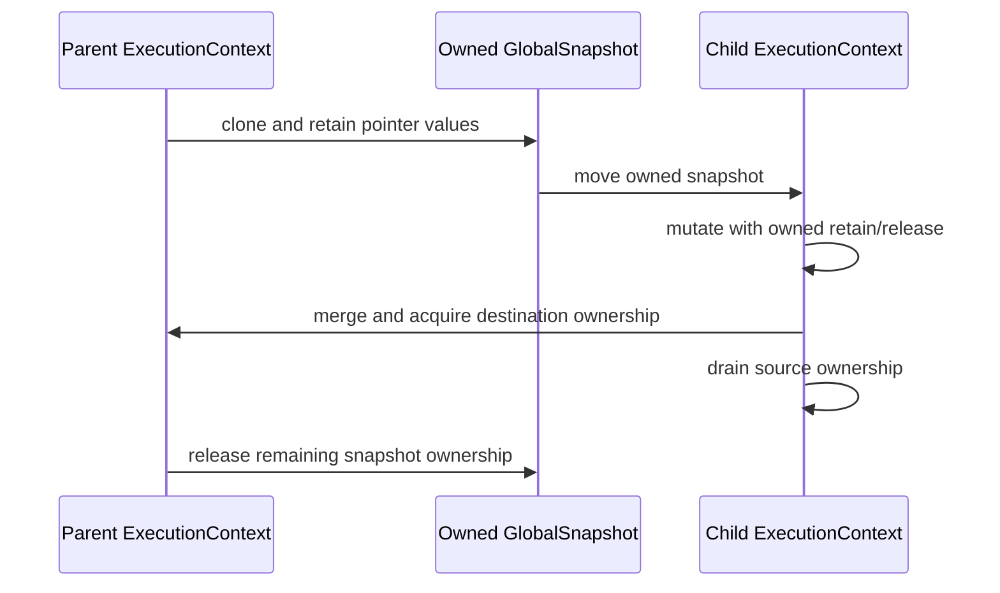

# Global value registry state topology

Issue: #2976
Parent inventory: #2968
Source revision: `f69402a25f`

This Stage 1 DDD slice classifies the string-keyed and scoped-SymbolId global
value registries. Both store conditionally retained Python values and currently
cross module, worker-thread, and async-task boundaries through manually managed
bit-copy snapshots.

## Aggregate boundary

```text
ExecutionContext
└── RuntimeRegistrySet
    └── global_values
        ├── by_name[String]
        └── by_symbol[ScopedSymbolKey]
```

`ScopedSymbolKey` contains a module name and the raw compilation-local
`SymbolId`. Raw symbol integers are not globally unique; the module component
is part of the identity.

## Frozen inventory

The admitted set contains exactly two newline-terminated, byte-sorted
identities. Its SHA-256 is
`2f8663bab47cb267362ac9750eb4fcdfbc8e20915e364ef5b8f90fe91e006efe`.

| Current symbol | Key | Stored value | DDD destination |
|---|---|---|---|
| `GLOBAL_ID_NAMESPACE` | `ScopedSymbolKey` | conditionally retained `MbValue` | `GlobalValues.by_symbol` |
| `GLOBAL_NAMESPACE` | Rust `String` | conditionally retained `MbValue` | `GlobalValues.by_name` |

## Stored-value ownership

Both registries own one retain for every pointer-backed stored value:

- setters call `retain_if_ptr` before insertion;
- overwrite releases the previous stored value;
- reads that return an owned Python value acquire a separate retain;
- `mb_global_del_id` releases the removed symbol-keyed value;
- broad `cleanup_all_closures()` clears both maps without releasing their
  stored pointer-backed values and therefore leaks registry retains.

The future owner must encode this in an owned-value wrapper or an explicit
drain path. Dropping a Rust `MbValue` bit pattern is not a Python release.

## Snapshot and transfer taxonomy

The current helper names hide materially different ownership operations:

| Operation | Current mechanism | Ownership meaning |
|---|---|---|
| current-module save | copy matching bits, then `retain`-remove source entries | logical move without refcount change |
| current-module restore | `retain`-remove current entries, then insert saved bits | saved ownership moves in; displaced current retains leak |
| full snapshot | `HashMap::clone` | borrowed bit aliases; no retain acquired |
| full replace | `std::mem::replace` | map move; no per-value retain/release |
| merge | retain each incoming value, release overwritten destination | new destination ownership acquired |
| broad clear/drop | Rust container clear/drop | no Python release |

A bit-copy snapshot is not an owned snapshot. It remains valid only while
another owner keeps every pointer-backed value alive and unchanged.

## Worker and async ownership graph

### Threading

1. The launching thread clones a borrowed-bit snapshot.
2. The worker installs that map with full replace.
3. The launcher may continue mutating its original registry while the worker
   holds aliases, so overwrite/delete can invalidate worker pointers.
4. Worker setters acquire retains for worker-created or rebound values.
5. Worker restore returns `worker_globals`.
6. Join merges those values into the launcher, acquiring destination retains.
7. `worker_globals` then drops as Rust bits without releasing worker-owned
   retains. Mutated pointer-backed entries can therefore retain one leaked
   worker ownership in addition to the merged launcher ownership.

### Async `to_thread`

1. Task capture clones a borrowed-bit snapshot.
2. The worker installs it using full replace.
3. After the task, the previous worker map is restored.
4. The returned task map is ignored. Pointer-backed values whose ownership was
   acquired during task mutation are dropped as bits without release.
5. Borrowed entries also remain vulnerable to concurrent invalidation by their
   original owner.

Weakref consumers likewise receive borrowed-bit snapshots; their validity must
be proven by the same owner-lifetime rule.

## Invariants

1. Every global lookup and mutation resolves through one current
   `ExecutionContext`.
2. Name-keyed and symbol-keyed registries share one lifecycle but preserve
   their distinct key domains.
3. Each stored pointer-backed value has exactly one registry-owned retain.
4. Overwrite, delete, module replacement, worker completion, task completion,
   and context retirement release every displaced registry ownership exactly
   once.
5. Cross-thread or cross-task transfer uses an explicitly owned snapshot that
   retains pointer-backed values, or a scoped borrow that statically cannot
   outlive/mutate its owner.
6. A map move transfers ownership without changing retain counts.
7. A map clone never implies ownership unless the clone operation explicitly
   retains every pointer-backed value.
8. Merging acquires destination ownership and drains/releases the source
   ownership after the merge.
9. Module restore releases the entries it displaces before publishing saved
   entries.
10. Context teardown drains all values after child quiescence; it cannot use
    leak-by-clear.
11. Worker panic/unwind follows the same restore and drain protocol as success.
12. No broad global lock substitutes for these ownership and lifetime rules.

## Current-state risks

- Snapshot bit copies can dangle when another thread overwrites or deletes the
  original value.
- Module restore removes current-module entries without releasing retained
  values.
- Thread join merges worker values but does not drain worker-owned retains.
- Async restoration ignores the returned task map and does not drain values
  acquired during task execution.
- Broad cleanup leaks both registries.
- Manual replace/restore is not guarded by one panic-safe context binding.
- TLS splits one logical context across workers and conflates multiple
  contexts reused on one OS thread.

## Lifecycle



## Dependency and source order

1. Finish the remaining #2968 Stage 1 inventory slices.
2. Implement #2839 Stage 2 aggregate shell and scoped restoring binding.
3. Establish Stage 3 output/exception isolation.
4. Migrate global-value ownership in a bounded Stage 4 ticket with owned
   snapshot/drain primitives.
5. Only then update threading and asyncio bridges to carry context ownership.

Forbidden changes include cloning raw `MbValue` bits as an owned snapshot,
clearing maps without draining retains, sharing the maps through a process
singleton, adding a broad lock, moving registries into child thread state, or
migrating before #2839.

## Verification surface

- Inventory count: 2.
- Inventory digest:
  `2f8663bab47cb267362ac9750eb4fcdfbc8e20915e364ef5b8f90fe91e006efe`.
- Exact declaration denominator: 24 static/TLS candidates in
  `runtime/closure.rs`, 2 admitted and 22 discarded.
- Cross-owner evidence:
  `runtime/stdlib/threading_mod.rs`,
  `runtime/stdlib/asyncio_mod.rs`, and
  `runtime/stdlib/weakref_mod.rs`.
- Snapshot rule: #2976 permits no repository changes from AGY and no
  `apps/mamba/src/**` changes from the controller.
