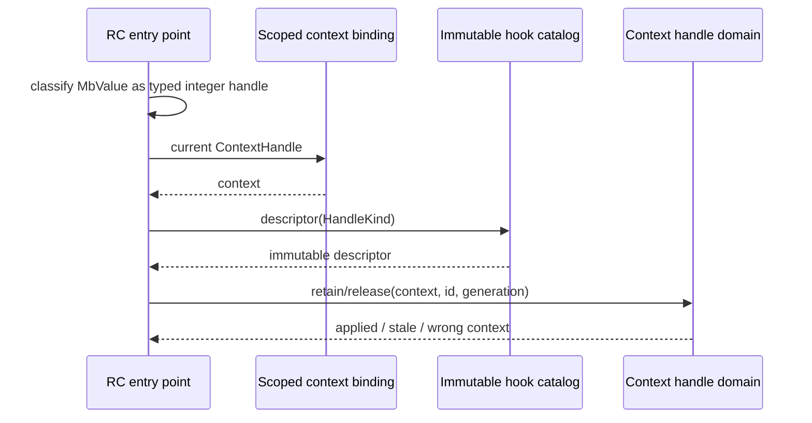

# Integer-handle hook catalog state topology

Issue: #3000
Parent inventory: #2968
Source revision: `ac2eb21e15`

This Stage 1 slice classifies the retain/release hook vector used for NaN-boxed
integer handles. It separates immutable dispatch metadata from the mutable
handle tables reached by that metadata without changing `src/**`.

## Bounded contexts

```text
Process
└── IntegerHandleHookCatalog
    └── HandleKindDescriptor[HandleKind]
        ├── owns(id, ContextHandle)
        ├── retain(id, ContextHandle)
        └── release(id, ContextHandle)

ExecutionContext
└── NativeHandleDomains
    ├── ArrayHandles
    ├── DecimalHandles
    ├── FractionHandles
    ├── GraphlibHandles
    ├── HashHandles
    ├── HmacHandles
    ├── IpAddressHandles
    ├── JsonHandles
    ├── QueueHandles
    ├── RandomHandles
    └── UuidHandles

ExecutionThreadState
└── scoped ContextHandle
```

The target catalog is process immutable after bootstrap. It owns only handle
kind metadata and static dispatch functions. Each backing handle table belongs
to the active `ExecutionContext`; neither the catalog nor a hook function owns
those entries.

## Aggregate and values

| Type | Kind | Identity / value |
|---|---|---|
| `IntegerHandleHookCatalog` | process-immutable catalog | one sealed process catalog |
| `HandleKindDescriptor` | immutable value | stable `HandleKind` |
| `HandleKind` | typed enum/value | array, decimal, fraction, graphlib, hash, hmac, ipaddress, json, queue, random, uuid |
| `IntegerHandle` | typed value | `ContextId + HandleKind + HandleId + Generation` |
| `ContextHandle` | scoped value | active execution context |
| `HandleOperation` | value | retain or release |

Raw `u64` is a compatibility representation. It is not sufficient handle
identity because several module tables can allocate the same integer.

## Frozen inventory

The one production identity has sorted newline-terminated SHA-256
`ce27a5e946c891927ea8163b1b0cfc05e77b7df550239ea8b97ef4edb189a31c`.
There are no test-only identities.

| Current symbol | Current storage | Current role | Target owner |
|---|---|---|---|
| `HOOKS` | TLS `RefCell<Vec<IntegerHandleHooks>>` | ordered retain/release function-pointer pairs | process-immutable `IntegerHandleHookCatalog` |

The accepted selector contains 19 physical rows:

| Family | Rows |
|---|---:|
| `HOOKS` | 4 |
| `register` | 11 |
| `retain` | 2 |
| `release` | 2 |
| **Total** | **19** |

## Producer catalog

`register_stdlib` reaches the 11 hook producers in this order:

| Order | Module | Hook pair |
|---:|---|---|
| 1 | `json_mod` | `retain_handle` / `release_handle` |
| 2 | `random_mod` | `retain_handle` / `release_handle` |
| 3 | `hashlib_mod` | `retain_handle` / `release_handle` |
| 4 | `decimal_mod` | `retain_handle` / `release_handle` |
| 5 | `fractions_mod` | `retain_handle` / `release_handle` |
| 6 | `array_mod` | `retain_handle` / `release_handle` |
| 7 | `uuid_mod` | `retain_handle` / `release_handle` |
| 8 | `hmac_mod` | `retain_handle` / `release_handle` |
| 9 | `queue_mod` | `retain_handle` / `release_handle` |
| 10 | `graphlib_mod` | `retain_handle` / `release_handle` |
| 11 | `ipaddress_mod` | `retain_handle` / `release_handle` |

Current `register` blindly pushes. Repeating `register_stdlib` on one worker
duplicates descriptors; calling it on another worker constructs a different
catalog. An unregistered worker has an empty catalog and silently treats every
eligible integer handle as unowned.

The target catalog is generated or constructed once from a deterministic
descriptor list. Duplicate `HandleKind` is a bootstrap error. Publication is
complete before any execution context can expose an integer handle.

## Consumer surface

Four RC entry points dispatch eligible positive integer values:

| Consumer | Operation | Preconditions before catalog dispatch |
|---|---|---|
| `release_if_ptr` | release | not typed-native wrapper; not pointer; not live closure handle; positive integer |
| `retain_if_ptr` | retain | not typed-native wrapper; not pointer; not live closure handle; positive integer |
| `mb_retain_value` | retain | same classification from JIT `u64` bits |
| `mb_release_value` | release | same classification from JIT `u64` bits |

`integer_handle_registry::{retain,release}` then rejects IDs below
`HANDLE_MIN_ID`.

`HANDLE_MIN_ID` reduces collisions with ordinary small Python integers. It
does not distinguish two handle kinds or two execution contexts.

## Current behavior and defects

### TLS catalog visibility differs by worker

Hook registration is coupled to the OS thread that runs module bootstrap.
Retain/release on another worker consults its own TLS vector. If that worker
did not repeat all module registrations in the same order, the operation can
be a silent no-op or choose a different hook.

The target process catalog is identical for every worker. The active context
handle selects mutable table state.

### First matching raw ID wins

Every hook returns `true` when its module-local table contains the raw ID.
Dispatch stops at the first `true`.

Multiple modules use high-range counters beginning at a shared or overlapping
base. If two tables contain the same integer, registration order—not value
type—chooses which table receives retain/release. The other handle is
mis-accounted.

The target `IntegerHandle` carries `HandleKind`, context, and generation.
Dispatch selects one descriptor directly; it never probes every table to infer
type from numeric coincidence.

### Hooks execute under the catalog borrow

Current retain/release holds an immutable `RefCell` borrow while invoking each
hook. None of the 11 current hook bodies registers another catalog entry, but
a future hook that calls `register` would request a mutable borrow and panic.

The target immutable slice needs no runtime borrow. A descriptor callback may
mutate only the selected context-owned handle table. It cannot mutate the
catalog after sealing.

### Catalog and table ownership are conflated by function signature

`fn(u64) -> bool` carries neither context nor handle kind. Hook bodies reach
module TLS tables ambiently, making an immutable-looking function pointer
dependent on the current OS worker.

Target descriptors receive or resolve an explicit scoped `ContextHandle`.
Their backing lookup is context-local even though the descriptor itself is
process immutable.

## Target dispatch contract



Required invariants:

1. Catalog membership and order are deterministic across the process.
2. The catalog is sealed before execution and never mutated afterward.
3. Duplicate handle kinds fail bootstrap rather than changing first-match
   order.
4. Dispatch carries `ContextId`, `HandleKind`, and generation.
5. A raw ordinary integer cannot be interpreted as a handle solely because it
   exceeds `HANDLE_MIN_ID`.
6. A handle operation touches exactly one context-owned table.
7. Catalog lookup is lock-free/read-only and never serializes independent
   contexts.
8. Table retirement cannot unregister or mutate process catalog metadata.

## Lifecycle

| Event | Current behavior | Target behavior |
|---|---|---|
| process bootstrap | no catalog until a worker registers modules | build, validate, and seal one catalog |
| repeated stdlib registration | append duplicate TLS hooks | catalog unchanged; module surface registration is separate |
| worker start | empty TLS hooks | sees immutable process catalog |
| context install | no catalog/table binding | scoped handle selects context tables |
| retain/release | linear first-match probe under TLS borrow | direct typed descriptor and context table operation |
| worker exit | drops that worker's catalog | no catalog lifecycle effect |
| context retirement | table cleanup unrelated to hooks | retire context tables; catalog remains |
| process exit | all TLS copies disappear | immutable catalog disappears with process |

## Migration seams

1. Introduce a deterministic descriptor registry with stable `HandleKind`.
2. Seal and publish it before runtime execution.
3. Extend the compatibility handle representation or side metadata so dispatch
   can identify kind, context, and generation.
4. Migrate backing tables by module domain; catalog metadata does not move with
   table entries.
5. Route all four RC consumers through the typed dispatcher.
6. Remove runtime `register` and TLS `HOOKS` only after exact producer/consumer
   scans prove no legacy path remains.

## Verification gates

- Exact-set gate: one identity and all 19 rows remain reconciled during
  migration.
- Producer gate: exactly 11 unique handle kinds; duplicate bootstrap fails.
- Worker gate: a worker that did not run stdlib registration still retains and
  releases handles correctly through the process catalog.
- Collision gate: simultaneous equal numeric IDs in two module domains route
  by explicit kind.
- Context gate: equal kind/id values in two contexts never cross-account.
- Generation gate: a released and reused ID rejects delayed operations.
- Reentrancy gate: descriptor callbacks cannot mutate the sealed catalog.
- RC parity gate: all four consumers apply identical eligibility and dispatch
  semantics.
- Parallelism gate: concurrent operations in different contexts overlap with
  no catalog lock.
- Retirement gate: retiring one context drains its tables without changing
  catalog availability for another.

## Dependency and retirement rules

- #3000 is a Stage 1 design slice under #2968; it changes no source.
- #2968 must close before Stage 2 #2839 can be dispatched.
- `IntegerHandleHookCatalog` is process immutable; module handle tables remain
  context-owned.
- `NativeCallableCatalog` and callable ABI design supply the same immutable
  metadata versus context state separation, but do not co-own this catalog.
- The first raw AGY output normalized as `EMPTY`; a compact same-conversation
  resume produced the accepted report. This is not a one-pass ramp sample.
