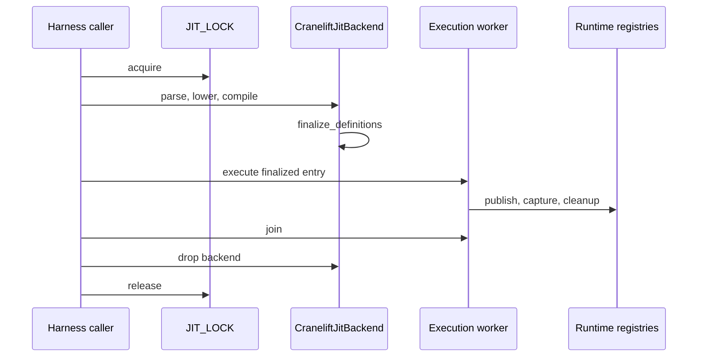
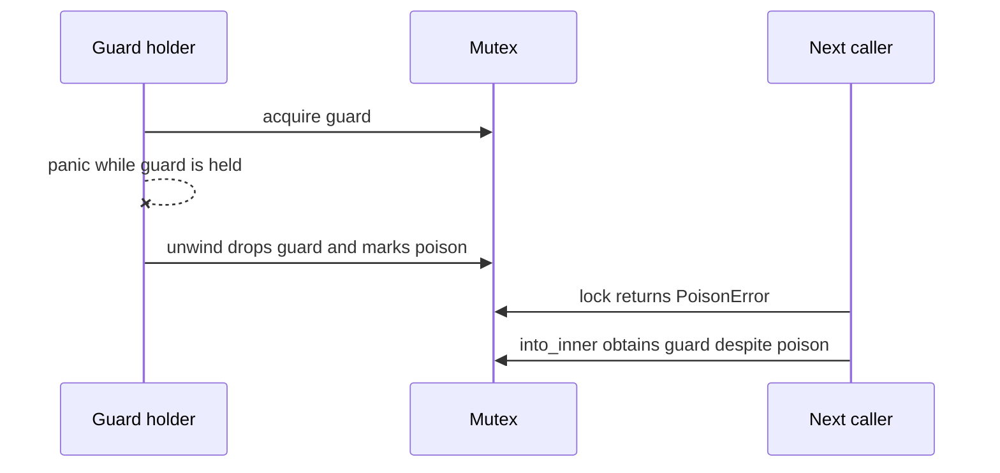
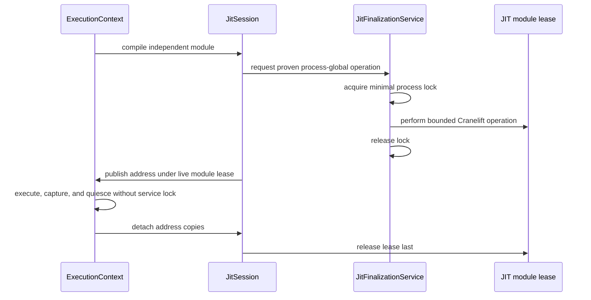

# JIT process boundary state topology

Issue: #2979
Parent inventory: #2968
Source revision: `a963f18d69`

This Stage 1 DDD slice separates the process-global Cranelift coordination
boundary from execution-context state. The current tree uses one global mutex
with inconsistent caller scopes; the target retains a process service only for
a proven Cranelift-global operation.

## Bounded-context boundary

```text
Process
├── JitFinalizationService
│   └── process-global Cranelift critical section
├── JitCache
│   ├── native ISA
│   └── runtime symbol seed
└── ExecutionContext
    └── JitSession
        ├── module lease
        ├── compiled callable addresses
        └── execution-local publication state
```

`JitFinalizationService` is a process service. It coordinates an operation
whose safety is shared across otherwise independent JIT modules; it does not
own a program, module, callable address, capture buffer, or cleanup lifecycle.

`JitSession` is context-owned. Its module lease owns executable-memory
lifetime. A lock guard never substitutes for that lease.

## Frozen inventory

The admitted set contains exactly one newline-terminated identity:

`apps/mamba/src/codegen/cranelift/jit.rs::JIT_LOCK`

Its SHA-256 is
`641ef73f9f1eda26edff1920c1a6868d776ef728e3d663d0a313b7c165405e79`.

The complete declaration denominator in `codegen/cranelift/jit.rs` is four:

| Current symbol | Current storage | Stage 1 decision |
|---|---|---|
| `JIT_LOCK` | `LazyLock<Mutex<()>>` | admitted process service |
| `CACHED_ISA` | `LazyLock<OwnedTargetIsa>` | discarded process immutable |
| `CACHED_RT_SYMBOLS` | `LazyLock<Vec<(&'static str, usize)>>` | discarded process immutable |
| function-local `TEST_LOCK` | `LazyLock<Mutex<()>>` | discarded test-only state |

`CACHED_ISA` is constructed once, then forced or cheaply cloned.
`CACHED_RT_SYMBOLS` is constructed once, then forced, sized, and iterated to
seed backend-owned maps. Neither has a post-publication mutation path.
`TEST_LOCK` exists only inside the poison-recovery unit test and is not
production ambient state.

## Current critical-section topology

The declaration is one mutex, but its effective boundary is defined by each
caller:

| Caller family | Current lock scope |
|---|---|
| `conformance::run_and_capture` | parse, typecheck, lower, backend creation, codegen/finalization, worker execution, output capture, runtime cleanup, join, backend drop, and process-cwd restoration |
| conformance stress/generator helpers | parse through JIT execution, capture, cleanup, join, and scope-end backend drop |
| CPython-ported harness | parse through worker compile/execute, process-cwd sandboxing, capture, cleanup, join, and scope-end teardown |
| CPython directive pipeline | parse, typecheck, lower, codegen/finalization, entry execution, assertions, and scope-end backend drop; it does not capture output, change cwd, or call global cleanup |
| driver/runtime/JIT tests | generally a whole test or helper scope; exact cleanup behavior varies by test |
| wide-call shim | only its `JITModule::finalize_definitions()` call |
| `CraneliftJitBackend::codegen` | calls `finalize_definitions()` without acquiring the mutex; safety currently depends on external caller discipline |

The broad scopes are current compatibility behavior, not the target aggregate
boundary. In particular, process cwd and environment variables are separate
process services; their present serialization does not justify placing them
under JIT finalization ownership.

## Current normal sequence



This sequence serializes independent execution contexts even though the only
known Cranelift-specific failure report concerns concurrent finalization.

## Current failure and poison sequence



Dropping the guard releases mutual exclusion. `into_inner()` does not clear the
poison flag. Current callers continue because the protected payload is `()`,
but a panic during executable-memory finalization may still indicate
process-level integrity risk. The target service must make continuation policy
explicit rather than equating an empty mutex payload with safe recovery.

## Target aggregate and service contract

The target interaction is:



The service API must own lock acquisition. Callers must not acquire the old
outer lock and then call a service that acquires the same non-reentrant mutex;
outer-lock removal and service adoption are one coherent migration slice.

## Executable-address lifetime

Finalization makes code addresses callable; it does not transfer executable
memory ownership to those addresses.

- `TAG_FUNC` values are copied address bits and are not Python-refcounted
  executable-memory leases.
- Introspection maps, module attrs, or other address copies may outlive the
  call that published them.
- The owning JIT backend/module lease must outlive every reachable address and
  every active invocation.
- Context retirement detaches metadata, attrs, GC roots, and other address
  copies before releasing the module lease.
- Releasing the process lock says nothing about address lifetime.

## Invariants

1. JIT coordination remains a named process service outside
   `ExecutionContext`.
2. Process-immutable ISA and runtime-symbol caches are shared, never copied
   into each context as mutable fields.
3. The future process lock protects only an operation proven to require
   cross-module serialization.
4. Compile preparation, entry execution, output capture, runtime cleanup,
   child join, context teardown, and module-lease retirement occur outside the
   future JIT critical section.
5. A service guard is never held across a callable invocation.
6. A callable address is usable only while its matching module lease is live.
7. Address detachment precedes module-lease release on normal, error, timeout,
   and panic paths.
8. The service mutex is acquired exactly once per protected operation; no
   caller/service nested acquisition is permitted.
9. Poison recovery is an explicit integrity decision. `into_inner()` is not
   treated as proof that finalization state is safe.
10. Two contexts can compile and execute with observed overlap; absence of a
    crash in serial tests is not concurrency evidence.

## Current risks

- The main backend relies on undocumented external locking discipline, while
  the wide-call shim locks locally.
- Callers that forget the outer lock can race finalization; callers that keep
  it serialize execution and teardown unnecessarily.
- Moving lock acquisition into `codegen` without first removing outer guards
  deadlocks because `std::sync::Mutex` is non-reentrant.
- Broad test locks also mask cross-context registry, cwd, capture, and cleanup
  races that Stage 2 and later stages must expose rather than inherit.
- Continuing after a poisoned finalization lock may hide an unsafe
  partially-finalized process state.
- Code-address publication is not type-coupled to its module lease.

## Unresolved proof obligations

Before contracting the lock, Stage 5 must establish from Cranelift behavior and
targeted stress evidence:

1. which operation or operations are process-global across independent
   `JITModule` instances;
2. whether definition, finalization, page-permission changes, function-address
   lookup, or another internal step forms the minimal indivisible boundary;
3. whether that boundary differs by architecture or operating system;
4. whether a panic/error inside it permits retry, requires abandoning the
   module, or poisons the process service;
5. that code-address publication after guard release is safe while the module
   lease remains live.

Comments linking aarch64 failures to concurrent finalization and `mprotect`
motivate the investigation; they do not discharge these proof obligations.

## Dependency and source order

1. Finish the remaining #2968 Stage 1 inventory.
2. Dispatch #2839 only after #2968 closes; Stage 2 introduces the context shell
   without contracting `JIT_LOCK`.
3. Migrate output/exception and runtime registries to context ownership, adding
   two-context isolation evidence per owner.
4. Introduce an explicit JIT module lease coupled to callable publication and
   teardown.
5. In Stage 5, prove the minimal Cranelift boundary and atomically replace
   caller-held outer locks with `JitFinalizationService`.
6. In Stage 6, remove obsolete harness serialization and run the selected
   integration denominator with more than one test thread.

Forbidden changes include moving `JIT_LOCK` or either immutable cache into
`ExecutionContext`, wrapping compile-through-cleanup in a renamed global lock,
adding service acquisition beneath an already-held outer mutex, treating
`TAG_FUNC` as an executable-memory lease, or claiming concurrency from serial
green tests.

## Verification surface

- Inventory count: 1 admitted plus 3 discarded.
- Inventory digest:
  `641ef73f9f1eda26edff1920c1a6868d776ef728e3d663d0a313b7c165405e79`.
- Structural evidence:
  `codegen/cranelift/jit.rs`, `runtime/builtins/wide_call.rs`, and every current
  `JIT_LOCK` caller under `src/**` and `tests/**`.
- Lock-scope gate: no future service guard is live at entry invocation,
  capture, cleanup, child join, or module-lease retirement.
- Concurrency gate: two independently attributed compile-plus-execute paths
  overlap in wall time and repeatedly return distinct correct results.
- Lifetime gate: stale-address negative controls fail closed after explicit
  detachment and lease release.
- Poison gate: injected finalization failure follows the reviewed recovery or
  fail-closed policy.
- Snapshot rule: #2979 permits no repository changes from AGY and no
  `apps/mamba/src/**` changes from the controller.
