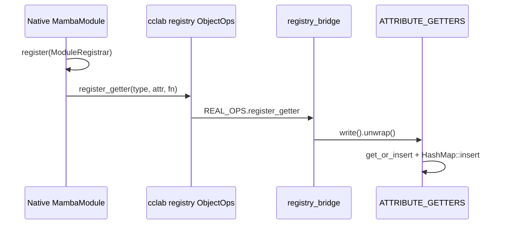
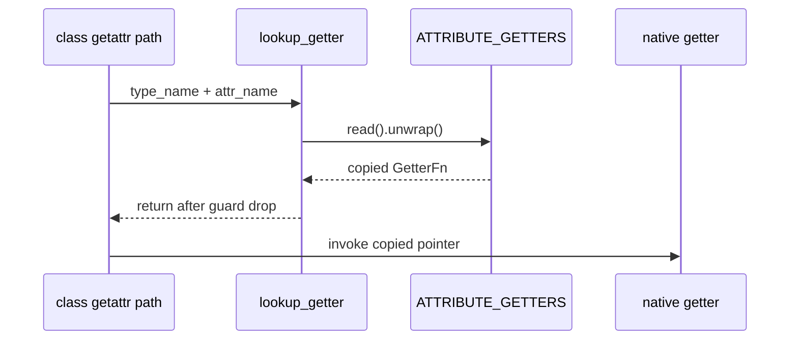
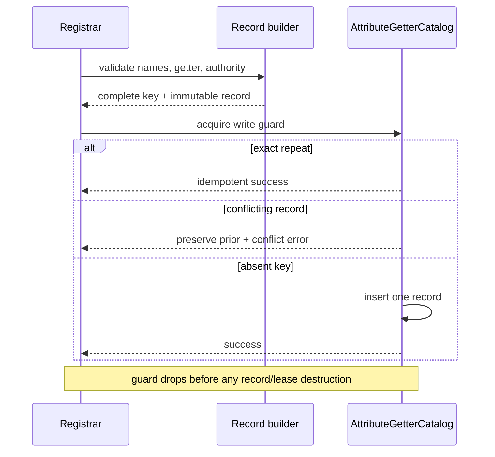

# Native attribute getter catalog topology

Issue: #3011
Parent inventory: #2968
Source revision: `f8fe8ab3bbd839c9fa5a4dc0ed0f24328279afc6`

This Stage 1 DDD slice classifies the bridge registry that maps a native type
and attribute name to an FFI getter. The current mutable map is process-global,
survives every runtime cleanup, silently replaces conflicts, and can poison all
later lookup after one panic under its `std::sync::RwLock`. The target keeps the
catalog process-owned because its callable records describe code in the
process image or a leased native module, not Python values in one execution
context. No `src/**` change occurs in this slice.

## Bounded context

```text
NativeBridgeService
├── ObjectOpsInstallation
│   └── immutable REAL_OPS callback table
└── AttributeGetterCatalog
    └── NativeGetterKey -> NativeGetterRecord
        ├── GetterFn
        └── CodeLifetimeAuthority

ExecutionContext[*]
└── borrows NativeBridgeService; never owns or clears it
```

`NativeBridgeService` is a process service. All execution contexts in one
process observe the same native code catalog. Context retirement cannot clear
or replace native records because another live context may still resolve them.

## Aggregate and values

| Type | Kind | Identity / value |
|---|---|---|
| `AttributeGetterCatalog` | process aggregate | one catalog per process image |
| `NativeTypeName` | validated value | native wrapper type identity |
| `AttributeName` | validated value | Python-visible attribute name |
| `NativeGetterKey` | compound value | `NativeTypeName + AttributeName` |
| `GetterFn` | callable address | copied `unsafe extern "C"` function pointer |
| `NativeGetterRecord` | immutable record | getter plus mandatory code authority |
| `CodeLifetimeAuthority::ProcessImage` | process authority | statically linked code remains mapped |
| `CodeLifetimeAuthority::ModuleLease` | owned service lease | dynamically unloadable code stays mapped |

Map keys own Rust strings. Getter pointers and code-lifetime authorities are
Rust/process-service values. No catalog key or record owns a Python
`MbValue` reference-count claim.

A raw function pointer is not code-lifetime authority. It remains callable
only while the code containing that address remains mapped.

## Frozen inventory

The one admitted production identity is:

`apps/mamba/src/runtime/registry_bridge.rs::ATTRIBUTE_GETTERS`

The one discarded process-immutable candidate is:

`apps/mamba/src/runtime/registry_bridge.rs::REAL_OPS`

There are zero test-only identities. The admitted identity's sorted
newline-terminated SHA-256 is
`a2bc9b6e7c28c9eebfaeedabc3e518c28173a022d679e53b26ac14f79c7bd9a9`.

The frozen selector emits 10 physical rows and 10 symbol occurrences:

| Family | Occurrences |
|---|---:|
| `ATTRIBUTE_GETTERS` | 3 |
| `REAL_OPS` | 2 |
| `register_getter` | 2 |
| `lookup_getter` | 3 |

The 10 rows are:

1. `runtime/registry_bridge.rs:159` — `ATTRIBUTE_GETTERS` declaration;
2. `runtime/registry_bridge.rs:162` — `register_getter` definition;
3. `runtime/registry_bridge.rs:163` — `ATTRIBUTE_GETTERS` write;
4. `runtime/registry_bridge.rs:180` — `lookup_getter` definition;
5. `runtime/registry_bridge.rs:181` — `ATTRIBUTE_GETTERS` read;
6. `runtime/registry_bridge.rs:190` — `REAL_OPS` declaration;
7. `runtime/registry_bridge.rs:202` — callback-table `register_getter` field;
8. `runtime/registry_bridge.rs:209` — install `REAL_OPS`;
9. `runtime/class/mod.rs:6955` — first `lookup_getter` consumer;
10. `runtime/class/mod.rs:17513` — second `lookup_getter` consumer.

## Candidate decisions

| Candidate | Current storage | Decision | Reason |
|---|---|---|---|
| `ATTRIBUTE_GETTERS` | process `RwLock<Option<HashMap<(String,String),GetterFn>>>` | admitted process service | mutable registration, lookup, conflict, poison, and code-lifetime policy |
| `REAL_OPS` | immutable `ObjectOps` static | discarded from mutable inventory | compile-time callback table; external `OnceLock` installs its address first-wins |

Installing an immutable value through a `OnceLock` does not make the value
mutable. It also does not by itself prove lock freedom or a particular access
cost.

## Current registration lineage



Native bindings such as schema and httpkit register getters from their
`MambaModule::register` paths after the Mamba runtime has installed
`REAL_OPS`. The external `OBJECT_OPS` is a first-install-wins
`OnceLock<&'static ObjectOps>`; later installation calls are ignored.

`register_getter` allocates owned key strings, acquires the process write
guard, lazily creates the map, and calls `HashMap::insert`.

Current duplicate semantics are:

- an exact repeat silently replaces the same pointer;
- a conflicting pointer for the same key also silently replaces the prior
  record;
- the replaced function pointer has no Rust destructor or Python release
  edge;
- no code/module authority accompanies either pointer.

Last-writer replacement makes link/registration order a hidden semantic input.
It cannot be retained in the free-threaded target.

## Current lookup and call



`lookup_getter` constructs two temporary Rust lookup strings while the read
guard is live, copies the function pointer, and returns it. Both class call
sites invoke the copied pointer only after `lookup_getter` returns. No current
catalog guard is held across the native getter call.

That guard boundary is narrower than getter execution, but it is not called
lock-free. The current lookup still takes a process `std::sync::RwLock` read
guard and performs key allocation while holding it.

## Current failure and lifecycle

| Boundary | Current result |
|---|---|
| first registration | lazily allocates map and inserts record |
| exact repeat | silently replaces |
| conflicting duplicate | silently replaces |
| panic while write guard live | poisons process registry |
| later registration after poison | `write().unwrap()` panics |
| later lookup after poison | `read().unwrap()` panics |
| lookup miss | returns `None` |
| getter invocation | occurs after read guard drop |
| runtime/context cleanup | leaves catalog and `REAL_OPS` installation unchanged |
| next driver execution | observes prior registrations |
| context retirement | has no catalog effect |
| dynamic module unload | no lease evidence; raw pointer could become invalid |
| process exit | address-space reclamation ends map/string state; no Python drain |

There is no current recovery policy for lock poison. Address-space reclamation
is not normal catalog retirement, but the catalog owns no Python values that
would need an RC drain.

## Target record and authority

```rust
enum CodeLifetimeAuthority {
    ProcessImage,
    ModuleLease(NativeModuleLease),
}

struct NativeGetterRecord {
    getter: GetterFn,
    authority: CodeLifetimeAuthority,
}
```

Every published record carries one authority:

- `ProcessImage` is valid only for code proven to be statically linked for the
  full process lifetime;
- `ModuleLease` keeps dynamically unloadable code mapped until the last
  callable record and active invocation release it.

There is no `None` variant. Registration without a valid authority fails
before publication.

Authority equality is typed. Exact-repeat comparison uses the same getter
address and the same stable authority identity, not debug text or an
unscoped raw module address.

## Target registration transaction

The catalog uses a narrow, non-poisoning
`parking_lot::RwLock<HashMap<NativeGetterKey, NativeGetterRecord>>`.
This is not a lock-free design.



Before the guard:

- allocate and validate both names;
- validate the function pointer;
- acquire and validate `CodeLifetimeAuthority`;
- build the complete immutable record.

Under the guard:

- compare a present record;
- accept an exact repeat without mutation;
- reject a conflict without replacing the prior record;
- insert one distinct, fully formed record.

No allocation, callback, native getter execution, module teardown, or
code-lease release occurs with the catalog guard live. A record that would be
dropped after comparison is moved out of the guard scope first.

The commit point is the absent-key insertion. The design is transactional at
the catalog boundary, not one atomic operation spanning record construction
and insertion.

## Target lookup and invocation

Lookup constructs the typed key before acquiring the read guard. It clones or
copies the immutable record under the guard, then releases the guard.

For `ProcessImage`, the copied record carries the process authority marker.
For `ModuleLease`, cloning the record acquires an invocation-safe lease.
Native invocation occurs after guard release. Dropping the returned record or
module lease also occurs after guard release.

This separates:

- catalog visibility — whether a key resolves;
- code lifetime — whether the copied getter remains callable;
- invocation lifetime — whether an active call holds its code lease.

## Target invariants

1. The attribute getter catalog is process-owned.
2. Execution contexts and TLS contain no catalog payload.
3. Context retirement cannot clear or mutate the catalog.
4. Key identity is typed `NativeTypeName + AttributeName`.
5. Every record is immutable after publication.
6. Every record has a mandatory code-lifetime authority.
7. A raw getter pointer alone is never valid publication authority.
8. `ProcessImage` is used only for proven process-lifetime code.
9. Unloadable code remains mapped through a `ModuleLease`.
10. Key and record construction finish before the write guard.
11. Exact repeats are idempotent and do not replace the record.
12. Conflicting duplicates fail closed and preserve the prior record.
13. Distinct-key insertion is the publication commit point.
14. No partially built record is visible.
15. The target lock does not propagate standard-library poison.
16. This non-poisoning lock is not described as lock-free.
17. Lookup builds its key before the read guard.
18. Lookup returns a copied or leased immutable record.
19. The catalog guard drops before native getter invocation.
20. No callback or native code runs under a catalog guard.
21. No allocation or fallible record construction runs under the write guard.
22. No code/module teardown or lease release runs under a catalog guard.
23. No catalog operation owns, retains, or releases Python `MbValue`s.
24. Repeated runtime initialization preserves compatible process records.
25. A registration conflict is observable and cannot depend on last-writer
    scheduling.
26. An active invocation keeps unloadable code mapped independently of catalog
    guard lifetime.

## Source implementation slice

Prerequisites:

1. finish and close Stage 1 parent #2968;
2. land the Stage 2 context shell #2839 so process/context boundaries are
   explicit;
3. migrate this catalog as one process-service slice before concurrent native
   module publication is enabled.

Exact planned paths:

- `apps/mamba/src/runtime/registry_bridge.rs`
  - replace `ATTRIBUTE_GETTERS` with the typed process catalog, implement
    conflict-aware registration, and return immutable records outside guards.
- `crates/cclab-mamba-registry/src/ops.rs`
  - expose typed registration failure and lifetime authority through
    `ObjectOps`.
- `crates/cclab-mamba-registry/src/lib.rs`
  - only when required to define or transport the proved module lease.

Forbidden changes:

- moving the catalog into `ExecutionContext` or TLS;
- clearing native getter records during context/runtime cleanup;
- retaining silent last-writer conflict replacement;
- publishing a record without code-lifetime authority;
- treating a raw function pointer as an unload lease;
- using an optional/nullable authority;
- allocating key strings or building a record under the write guard;
- invoking a getter, callback, destructor, or module teardown under a catalog
  guard;
- releasing a module lease under a catalog guard;
- calling `OnceLock`, `parking_lot`, or guard-free invocation wholly
  lock-free;
- calling multi-step construction plus insertion one atomic operation;
- treating copied function pointers as Python retains or owned Python
  snapshots;
- adding a context cleanup path for immutable `REAL_OPS`.

## Verification gates

- Exact-set gate: one admitted identity, one discarded immutable candidate,
  zero test-only identities, 10 rows, and `3/2/2/3` subtotals reconcile.
- First-publication gate: one record registers and resolves with its typed
  authority.
- Repeat gate: an exact record repeat succeeds without replacing the stored
  record or lease.
- Conflict gate: a different getter or authority for the same key fails and
  preserves the first record.
- Concurrency gate: concurrent lookup while a distinct key publishes returns
  only complete records.
- Guard-scope gate: getter reentry and instrumentation prove no catalog guard
  is live during invocation.
- Failure gate: name/record/authority construction failure occurs before the
  guard and leaves the catalog unchanged.
- Non-poison gate: a pre-guard panic cannot poison or corrupt later catalog
  access.
- Cleanup gate: retiring one or many execution contexts leaves the process
  catalog unchanged.
- Static-code gate: `ProcessImage` records remain callable for process life.
- Module-lease gate: unloadable code cannot unmap while a catalog record or
  active invocation owns its lease.
- Python-RC gate: catalog registration, lookup, replacement rejection, and
  process lifetime produce no Python RC deltas.
- AGY's measure-only run executed none of these planned gates.

## Dependency and dispatcher result

- #3011 is a Stage 1 classification slice under #2968.
- It produces a later process-service migration after #2839.
- AGY's first report reconciled the inventory and current behavior but inferred
  lock freedom from immutable `OnceLock` access, made code authority optional,
  and left the target publication primitive unresolved.
- Its revision selected a non-poisoning narrow catalog, made code authority
  mandatory, and kept construction, invocation, and lease destruction outside
  the guards.
- The accepted run made no repository change; Codex independently verified the
  snapshot, protected artifacts, selector, source lineage, and negative
  control.
- The run required one revision, so the dispatcher ramp remains one ticket.
