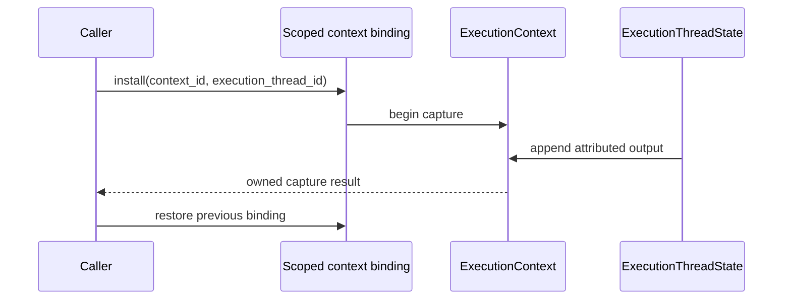
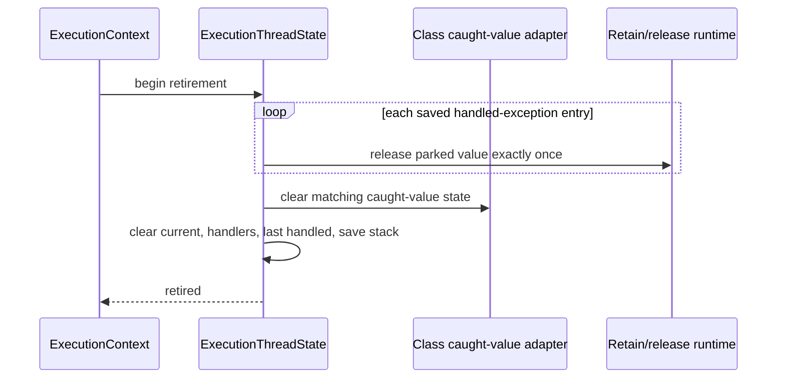

# Output and exception state topology

Issue: #2969
Parent inventory: #2968
Source revision: `8da2c550096ec65ed40380af4a15ca1de593b462`

This DDD slice classifies the ambient output and exception state in
`runtime/output.rs` and `runtime/exception.rs`. It is Stage 1 inventory
evidence for the `ExecutionContext` migration; it does not authorize Stage 3
source changes before the Stage 2 context shell in #2839.

## Bounded context

The execution-lifecycle bounded context owns state that must differ between
two compiled-and-executed Mamba programs in one process. An OS thread is a
carrier, not an aggregate boundary: sequential or nested contexts may use the
same thread, while one context may create several execution children.

The aggregate root is `ExecutionContext`.

```text
ExecutionContext
├── OutputCapture                 context-owned entity
└── ExecutionThreadState[*]       child-owned entity
    ├── output redirect stacks
    └── exception frame state
```

`ExecutionThreadState` has identity `(context_id, execution_thread_id)`.
Compatibility TLS may bind the current OS thread to that identity, but the TLS
binding owns no output or exception payload.

## Frozen inventory

The admitted set contains exactly eight newline-terminated, byte-sorted
identities. Its SHA-256 is
`abef68ba1041eb75fe4eac9b7a1a47034a1fe67c6b8f9396506bbe80ca17daa0`.

| Current symbol | Current storage | DDD owner | Destination |
|---|---|---|---|
| `output.rs::CAPTURE_BUF` | TLS `RefCell<Option<Vec<u8>>>` | context-owned | `ExecutionContext.output_capture.buffer` |
| `output.rs::STDOUT_REDIRECT` | TLS `RefCell<Vec<u64>>` | child-owned | `ExecutionThreadState.output_redirects.stdout` |
| `output.rs::STDERR_REDIRECT` | TLS `RefCell<Vec<u64>>` | child-owned | `ExecutionThreadState.output_redirects.stderr` |
| `exception.rs::CURRENT_EXCEPTION` | TLS `RefCell<Option<MbException>>` | child-owned | `ExecutionThreadState.exceptions.current` |
| `exception.rs::EXCEPTION_HANDLERS` | TLS `RefCell<Vec<ExceptionHandler>>` | child-owned | `ExecutionThreadState.exceptions.handlers` |
| `exception.rs::LAST_HANDLED_EXCEPTION` | TLS `RefCell<Option<MbException>>` | child-owned | `ExecutionThreadState.exceptions.last_handled` |
| `exception.rs::HANDLED_EXC_SAVE_STACK` | TLS `RefCell<Vec<(Option<MbException>, u64)>>` | child-owned | `ExecutionThreadState.exceptions.save_stack` |
| `exception.rs::cleanup_all_exceptions` | module cleanup operation | aggregate lifecycle operation | `ExecutionThreadState::retire_exception_state` called by `ExecutionContext::quiesce` |

The `thread_local!` invocation lines are containers rather than additional
state identities. `begin_capture`, `end_capture`, `mb_save_handled_exc`, and
`mb_restore_handled_exc` are behavior over the admitted state, not additional
state. Calls to traceback reset functions remain dependencies owned by the
traceback slice.

## Aggregate invariants

1. A context owns one capture result even when generator or worker children
   write from different OS threads.
2. Redirect stacks are scoped to one execution child and restore through RAII
   on success, error, and panic.
3. Exception current/handler/handled/save-stack state is never addressed by OS
   thread identity alone; it resolves through `(context_id,
   execution_thread_id)`.
4. Retiring exception state releases every parked retain in
   `HANDLED_EXC_SAVE_STACK` exactly once before dropping the stack.
5. `LAST_HANDLED_EXCEPTION` and the class runtime's caught-value state are
   restored or retired in one transaction.
6. Traceback notification state is reset for the same execution child as the
   exception it describes.
7. Quiescing one context cannot clear another context's capture, redirect, or
   exception state.
8. Missing compatibility binding is explicit in debug and test builds; it does
   not fall back to a process-global context.

## Current-state defects

- `cleanup_all_exceptions()` clears `CURRENT_EXCEPTION` and
  `EXCEPTION_HANDLERS` only. It leaves `LAST_HANDLED_EXCEPTION` populated.
- It also leaves `HANDLED_EXC_SAVE_STACK` populated. Clearing that vector
  mechanically would leak or mis-release the parked `MbValue` retains; teardown
  must run the same release discipline as `mb_restore_handled_exc`.
- `CAPTURE_BUF` is thread-local while generator output uses a separate shared
  buffer. Attribution is therefore split across two ownership mechanisms.
- Redirect stacks have balanced push/pop APIs but no context-retirement
  cleanup, so abnormal exit can leave ambient TLS state on a reused thread.

These are migration inputs, not authorization for a pre-Stage-2 patch.

## Transaction boundaries

### Capture



### Exception retirement



## Dependency and ticket order

1. Complete the remaining #2968 inventory slices and exact-set roll-up.
2. Implement #2839 Stage 2: aggregate shell, opaque handle, scoped restoring
   compatibility binding, and idempotent context-local teardown.
3. Split Stage 3 into source tickets that preserve the transaction boundaries:
   output capture/redirect ownership, exception thread state, class
   caught-value coupling, and traceback notification coupling.
4. Only after those slices land may the two-context output/exception product
   proof run.

Forbidden shortcuts remain: payload-bearing raw TLS setters, a process-global
`ExecutionContext` singleton, a broad lock around capture/exception execution,
or clearing the save stack without releasing parked retains.

## Verification surface

- Inventory count: 8.
- Inventory digest:
  `abef68ba1041eb75fe4eac9b7a1a47034a1fe67c6b8f9396506bbe80ca17daa0`.
- Source witnesses:
  - `runtime/output.rs`: three TLS declarations, generator shared-buffer
    fallback, nested begin/end capture.
  - `runtime/exception.rs`: four TLS declarations and the incomplete
    `cleanup_all_exceptions`.
- Snapshot rule: no `apps/mamba/src/**` change is permitted for #2969.
