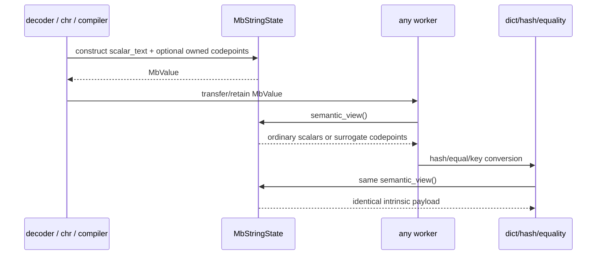

# Surrogate-string object state topology

Issue: #3004
Parent inventory: #2968
Source revision: `b85b64be74`

This Stage 1 slice classifies the TLS raw-pointer sidecar used to preserve lone
Unicode surrogate codepoints. It moves that metadata into the string object
owned by the context's object domain without changing `src/**`.

## Bounded context

```text
ExecutionContext
└── ObjectDomain
    └── MbStringState[StringObjectIdentity]
        ├── scalar_text: String
        └── surrogate_codepoints: Option<Box<[u32]>>

ExecutionChild / OS worker
└── borrowed or retained MbValue
    └── resolves the same intrinsic MbStringState
```

`ObjectDomain` is the target ownership class. One string object owns its scalar
storage and optional surrogate-preserving codepoints for exactly the object's
lifetime. OS worker TLS is neither owner nor compatibility storage.

## Aggregate and values

| Type | Kind | Identity / value |
|---|---|---|
| `MbStringState` | object entity state | one typed string object identity + generation |
| `ScalarText` | owned value | valid Rust UTF-8 `String` |
| `SurrogateCodepoints` | owned optional value | boxed exact `u32` sequence |
| `StringSemanticView` | borrowed value | ordinary scalar sequence or surrogate sequence |
| `RetainedStringHandle` | owned RAII value | one balanced `MbValue` retain/release |

The exact destination is:

```rust
pub struct MbStringState {
    scalar_text: String,
    surrogate_codepoints: Option<Box<[u32]>>,
}
```

`ObjData::Str` owns `MbStringState`. Ordinary strings have
`surrogate_codepoints=None`. Surrogate-preserving strings have
`Some(codepoints)`; `scalar_text` is compatibility storage only and cannot
serve as semantic identity when metadata is present.

All equality, ordering, hashing, length, encoding, formatting, and dict-key
conversion use `StringSemanticView`, not a sentinel scalar.

## Frozen inventory

The one production identity has sorted newline-terminated SHA-256
`a193a9d70ff857845db517c864ca4eb48c9e58c9fe94d11d018f02d44729f836`.
There are zero test-only state identities.

| Current symbol | Current storage | Current role | Target disposition |
|---|---|---|---|
| `SURROGATE_STRINGS` | TLS `RefCell<HashMap<usize,Vec<u32>>>` | raw string address to exact codepoints | remove; metadata moves into `MbStringState` |

The accepted selector contains 48 physical rows:

| Family | Rows |
|---|---:|
| `SURROGATE_STRINGS` | 4 |
| `SURROGATE_SENTINEL` | 4 |
| `new_surrogate_codepoints_str` | 5 |
| `new_surrogate_codepoints_str_immortal` | 3 |
| `new_lone_surrogate_str` | 4 |
| `surrogate_codepoints` | 26 |
| `surrogate_single_codepoint` | 2 |
| **Total** | **48** |

Two rows are test calls:

- `string_ops.rs:6138` belongs to
  `test_lone_surrogate_predicates_false`;
- `string_ops.rs:8015` belongs to
  `test_mb_str_repr_non_bmp_and_surrogates`.

The other 46 rows are production declarations, helpers, producers, and
consumers. A production row is not necessarily a consumer; definitions and
sidecar storage rows remain distinct.

## Current producers

| Producer | Object lifetime | Current metadata publication |
|---|---|---|
| `new_surrogate_codepoints_str` | normal atomic RC/GC object | allocate sentinel `ObjData::Str`, insert raw address into current worker TLS |
| `new_surrogate_codepoints_str_immortal` | `IMMORTAL_REFCOUNT`, process/object-code lifetime | allocate immortal sentinel string, insert raw address into current worker TLS |
| `new_lone_surrogate_str` | normal wrapper | validate lone-surrogate range and delegate to normal producer |
| Cranelift AOT/JIT constant paths | immortal wrapper consumers | call immortal producer from compilation paths |

The sentinel is the valid Unicode private-use scalar U+E000. It is not a lone
surrogate and cannot distinguish an ordinary U+E000 string from a sidecar-
backed string without raw-address metadata.

## Consumer families

| Family | Current use |
|---|---|
| `dict_ops.rs` | convert surrogate strings to/from `DictKey::StrCodepoints`; exclude them from plain-string fast lookup |
| `bytes_ops.rs` | create surrogate-preserving decoded strings |
| `builtins/ascii.rs` | render exact codepoints |
| `builtins/str_conversion.rs` | clone and represent surrogate strings |
| `builtins/char_radix.rs` | `chr` producer and `ord` single-codepoint consumer |
| `builtins/mod.rs` | value display/conversion and generic string equality |
| `string_ops.rs` | length, predicates, encoding, formatting, hashing, helper equality |
| Cranelift AOT/JIT | create immortal surrogate constants |

`mb_str_hash` explicitly reads `surrogate_codepoints` and hashes the exact
sequence. Dictionary conversion also reads the sidecar.

Direct `mb_str_eq`, however, does **not** read the sidecar: it compares the
underlying scalar `String`. Because every surrogate-backed value currently
stores the same U+E000 sentinel, direct `mb_str_eq` can report two different
surrogate sequences equal. Generic builtin equality separately calls
`string_values_equal_if_surrogate` before scalar fallback. These paths are not
equivalent and must converge on the target semantic view.

## Complete current lifecycle

| Event | Current result |
|---|---|
| normal construction | current worker gains raw-address entry |
| immortal construction | current worker gains raw-address entry; object cannot be RC-freed |
| read on creating worker | sentinel check + TLS lookup can recover codepoints |
| read on another worker | TLS miss; value degrades to ordinary U+E000 scalar |
| normal object retirement | object drops; no per-entry sidecar removal |
| central runtime cleanup | `mod.rs:64` calls `cleanup_all_surrogate_strings` |
| cleanup effect | callee intentionally clears nothing to preserve compiled literals across nested reset |
| long-lived worker | retired-object keys and boxed vectors accumulate |
| OS-thread exit | Rust TLS destructor drops that worker's whole map |
| immortal object after creator exit | object survives but its only metadata copy is dropped |
| process exit | remaining TLS maps and process objects retire |

The memory is therefore not unconditionally process-permanent. It leaks
relative to object lifetime on a long-lived worker, then retires wholesale at
thread exit. For immortal objects, that same TLS destruction causes metadata
loss rather than correct retirement.

## Current defects

### Worker affinity changes value semantics

A value created on worker A is only surrogate-backed on A. Worker B sees the
same `MbValue` and sentinel object but cannot recover its codepoints.

This changes:

- length and character predicates;
- encoding error behavior;
- `repr`/`ascii`/formatting;
- `chr`/`ord`;
- hash and equality;
- dictionary key classification and lookup.

The target state is intrinsic to the object and visible wherever a valid
object handle is visible.

### Object retirement and sidecar retirement are unrelated

Normal string drop cannot remove its raw-address entry. A later allocation at
the same address can inherit stale codepoints if it contains the U+E000
sentinel and runs on that worker.

An ordinary user string whose actual content is U+E000 is therefore a valid
collision subject. The sentinel precheck reduces false hits for other strings
but does not supply generation or ownership authority.

### Immortal object and TLS lifetimes contradict

An immortal compiled literal is intended to outlive normal RC claims and move
across execution. Its metadata belongs only to the compiler/worker TLS map.
When that worker exits, the object remains but its semantic payload disappears.

Target immortal construction embeds the same owned codepoints as normal
construction. Immortality changes object retirement only; it never changes
representation or visibility.

### Direct equality is already inconsistent

Some generic equality paths call the surrogate helper; direct `mb_str_eq`
compares the sentinel scalars. Hashing uses codepoints. That can violate the
required `equal => equal hash` relationship depending on which equality entry
point is used.

Target string operations share one semantic comparison/hash API over
`MbStringState`.

## Target object contract



Required invariants:

1. A string's semantic payload is independent of current OS worker.
2. Normal and immortal constructors create the same representation.
3. Normal object drop releases optional codepoints exactly once.
4. Immortal object metadata remains available until process/object-code
   retirement.
5. No raw address, TLS, global map, sentinel match, or cleanup sweep grants
   surrogate authority.
6. Ordinary U+E000 remains an ordinary one-character string.
7. Clone/copy paths preserve the complete semantic payload.
8. Equality and ordering compare semantic codepoint sequences.
9. Equal values always hash equally on the process `StringHashState`.
10. Dict-key conversion and reconstruction preserve ordinary versus surrogate
    representation.

## Migration blast radius and sequencing

There are currently hundreds of direct `ObjData::Str` destructures across the
runtime. A one-shot payload flip without normalization would create a broad,
error-prone compile repair. The target remains `MbStringState`; delivery is
atomized without substituting a second representation.

### Slice A — semantic string access API

Exact primary path:

- `apps/mamba/src/runtime/rc.rs`

Add `MbStringState`, ordinary/surrogate constructors, borrowed scalar access,
semantic codepoint view, owned scalar extraction, and cloning helpers while
`ObjData::Str` still temporarily stores `String`.

Forbidden in this slice: TLS deletion or behavior change.

### Slice B — direct-access normalization

Inventory command:

```text
rg -l 'ObjData::Str\(' apps/mamba/src/runtime apps/mamba/src/codegen
```

Migrate direct payload consumers in bounded owner families to the semantic
string access API. Each ticket names its exact files and verifies ordinary
string behavior. High-risk families are:

- core `builtins`, `class`, `dict_ops`, `string_ops`, bytes/file/module paths;
- codegen/runtime bridges;
- stdlib adapters that clone `String` or call string-specific methods.

A caller that needs a Rust `String` must explicitly choose ordinary scalar
text or a surrogate-preserving conversion policy; `state.clone()` cannot
silently stand in for `String::clone()`.

### Slice C — representation flip and sidecar retirement

Exact primary paths:

- `apps/mamba/src/runtime/rc.rs`
- `apps/mamba/src/runtime/string_ops.rs`
- `apps/mamba/src/runtime/mod.rs`

Change `ObjData::Str` to `MbStringState`; route normal and immortal surrogate
constructors to intrinsic metadata; unify hash/equality/length/encoding;
delete `SURROGATE_STRINGS`, `SURROGATE_SENTINEL`, the no-op cleanup function,
and its central call.

Codegen call sites continue to use the constructor boundary unless compilation
proves an ABI adjustment is required.

## Forbidden changes

- a replacement TLS/process side table;
- pointer or sentinel authority;
- a new `ObjData::SurrogateStr` shortcut that avoids the agreed normalized
  `MbStringState`;
- dropping codepoints during clone, serialization, dict conversion, or
  immortal construction;
- treating U+E000 as reserved user content;
- changing public string ABI or exception text without a separate contract;
- claiming all 739 direct `ObjData::Str` occurrences can be repaired as one
  unreviewed mechanical patch.

## Verification gates

- Exact-set gate: one identity and all 48 frozen rows reconcile until
  retirement.
- Normal constructor gate: exact codepoints survive creation, retain/release,
  clone, and final drop.
- Cross-worker gate: worker B observes the payload created on worker A.
- Worker-exit gate: an immortal value remains semantically intact after its
  creator worker exits.
- Runtime-reset gate: nested cleanup neither loses live metadata nor requires a
  sidecar no-op.
- Address-reuse gate: reused allocation addresses cannot inherit metadata.
- Sentinel gate: ordinary U+E000 is length one, hashes/compares as U+E000, and
  never becomes surrogate-backed.
- Equality gate: direct and generic equality agree for equal/different
  surrogate sequences and ordinary codepoint-equivalent values.
- Hash gate: every equal pair has equal hash across workers.
- Dict gate: insert/lookup/delete/reconstruction preserve
  `DictKey::StrCodepoints` semantics across workers.
- Encoding gate: UTF-8/16/32 surrogatepass/surrogateescape/error paths retain
  current exact outcomes.
- Lifetime gate: normal metadata drops with the object; immortal metadata
  survives normal RC and creator-thread exit.
- Plain-string regression gate: ordinary construction, clone, comparison,
  hashing, formatting, and stdlib extraction remain unchanged.
- Ownership gate: exact scans find no TLS/global/raw-pointer surrogate state.

## Dependency and dispatcher result

- #3004 is a Stage 1 design slice under #2968; it changes no source.
- #2968 must close before Stage 2 #2839 can be dispatched.
- AGY required two semantic corrections and one denied non-allowlisted read
  before producing the accepted report. It is not a one-pass ramp sample.
- Controller normalization: `mb_str_hash` reads sidecar metadata, but direct
  `mb_str_eq` does not; it compares sentinel scalar strings. The target must
  close this pre-existing equality/hash split.
