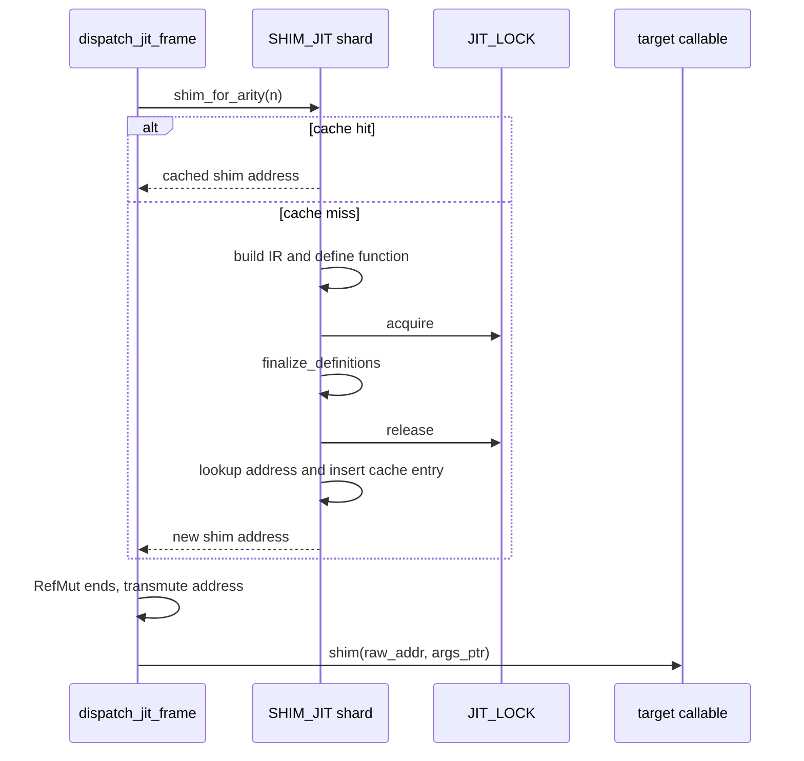

# Wide-call shim service topology

Issue: #3008
Parent inventory: #2968
Related design: #2979
Origin behavior: #1950
Source revision: `c0fe3d2e8e`

This Stage 1 slice classifies the production thread-local Cranelift module used
to dispatch dynamic calls beyond the fixed Rust function-pointer arity table.
Its storage is thread-local, but its semantic owner is a process code service,
not an execution context or execution child. The current storage already
implements the required thread-affine shard boundary, so this slice changes no
source.

## Bounded context

```text
Process
├── WideCallShimService
│   └── ShimJitShard[OS thread]
│       ├── JITModule
│       └── compiled[arity] -> shim address
├── JitFinalizationService                         future #2979
└── ExecutionContext
    └── JitSession
        └── target program module lease
```

`WideCallShimService` owns reusable loader code. A `ShimJit` value is one
thread-affine service shard whose module and address cache live until that OS
thread exits.

The service owns no user object, frame, exception, callback, target program
module, or target callable address. `raw_addr` is an immediate borrowed call
argument whose separate `JitSession` module lease must remain live through the
invocation.

## Aggregate and values

| Type | Kind | Identity / value |
|---|---|---|
| `WideCallShimService` | process service | policy and set of thread-affine code shards |
| `ShimJit` | OS-thread-affine service shard | one module plus arity cache |
| `JITModule` | executable-memory owner | owns compiled shim code and its lifetime |
| `compiled` | shard-owned cache | arity to address within that module |
| `WideShimFn` | immediate function-pointer view | `(target_addr, args_ptr) -> result bits` |
| `raw_addr` | borrowed target address | valid only under the caller's program-module lease |

The exact current state identity is:

`apps/mamba/src/runtime/builtins/wide_call.rs::SHIM_JIT`

There is one production state identity and zero test-only state identities. Its
sorted newline-terminated SHA-256 is
`e82de6266639a3ca8ff19e66e42e6446caa93b65861909acd9a1f465917f0802`.

## Frozen inventory

The selector contains 12 distinct physical rows and 14 symbol occurrences:

| Family | Occurrences |
|---|---:|
| `JIT_LOCK` | 2 |
| `WideShimFn` | 2 |
| `ShimJit` | 3 |
| `shim_for_arity` | 2 |
| `SHIM_JIT` | 2 |
| `dispatch_wide` | 3 |
| **Physical rows** | **12** |

The two `dispatch_wide` rows in `builtins/mod.rs` document and invoke the only
consumer. Dynamic call frames with more than sixteen entries take this path;
the 0–16 arms use statically typed Rust function pointers.

## Current cache and lock behavior



| Step | `JIT_LOCK` | Shard borrow |
|---|---|---|
| cache lookup/hit | not held | mutable `RefCell` borrow |
| signature/IR construction | not held | held |
| `define_function` | not held | held |
| `finalize_definitions` | held | held |
| finalized-address lookup | released | held |
| cache insertion | released | held |
| transmute and indirect call | released | released |

A cache hit performs no IR construction and never acquires `JIT_LOCK`.
`SHIM_JIT.with(...)` returns the address at the end of one statement, so the
`RefMut` is gone before user code can reenter the wide-call path.

The source comments attribute the lock to a suspected cross-module
finalization/page-protection hazard. That is motivation, not proof that
`mprotect`, `finalize_definitions`, or the current scope is the minimal required
process-global critical section. #2979 retains that proof obligation.

## Address and lifecycle matrix

| Boundary | Current result |
|---|---|
| first `(thread, arity)` use | lazily create the thread shard if needed and compile one shim |
| repeated same-thread arity | reuse the cached address |
| same arity on another OS thread | independently compile into that thread's module |
| runtime cleanup/reset | shard, module, and cache remain unchanged |
| `RefCell` statement end | mutable borrow retires before indirect execution |
| shim call return | no shim address is retained by the caller |
| OS-thread exit | TLS drops the shard, module, executable memory, and cached addresses |
| process exit | remaining thread shards retire |

The shim address is valid only while its owning thread-local `JITModule` lives.
The target `raw_addr` is governed by a distinct program-module lease. A copied
address is not a lease for either executable-memory owner.

The wide path intentionally permits duplicate cross-thread compilation and is
not performance-gated. This design makes no process-global cache, zero-cost
first-hit, or unique-code-identity claim.

## Failure matrix

All failures occur before `compiled.insert(n, addr)`, but a clean cache is not
proof that the retained module is reusable.

| Failure point | Lock result | Shard/module result |
|---|---|---|
| `declare_function(...).expect(...)` | no lock acquired | cache unchanged; shard stays allocated; mutation atomicity is unproven |
| `define_function(...).expect(...)` | no lock acquired | cache unchanged; module can be partially advanced |
| `finalize_definitions().expect(...)` | panic unwinds while guard is live and poisons `JIT_LOCK` | cache unchanged; defined/unfinalized module remains |

`RefCell` has no poison state. A later `JIT_LOCK` acquisition may observe
`PoisonError` and the current code continues with `into_inner()`; that is not
recovery of the already failed finalization. Current code defines no reviewed
retry, shard-abandonment, shard-poison, or fail-closed policy for a partially
advanced `JITModule`.

## Target invariants

1. `WideCallShimService` is process-owned and outside `ExecutionContext`.
2. Every `ShimJit` shard is confined to one OS thread.
3. Each shard owns its module before every address cached from that module.
4. Cache hit performs neither compilation nor process-lock acquisition.
5. The current lock is held only around `finalize_definitions`.
6. Address lookup, cache insertion, borrow release, transmute, and invocation
   occur after the lock is released.
7. The `RefCell` mutable borrow ends before any indirect target execution or
   same-thread reentrancy.
8. A shim address never escapes the immediate dispatch path.
9. A target callable address remains valid only under its caller-owned
   program-module lease.
10. Neither raw address acts as its executable-memory lease.
11. Cross-thread duplicate shim compilation is permitted.
12. Runtime cleanup does not retire process code-service shards.
13. OS-thread exit retires only that worker's shard and cached addresses.
14. The service owns no user value, runtime frame, exception, callback, target
    program module, or execution-child state.
15. Source comments do not discharge #2979's minimal-lock proof.
16. A clean cache after failure does not prove the retained module is safe to
    reuse.
17. Poison continuation and partial-module recovery remain explicit future
    integrity decisions.
18. No performance improvement is claimed by this ownership classification.

## Source boundary

Stage 1 source implementation paths: none.

The existing `thread_local!` declaration is retained as the accepted
thread-affine shard implementation. #2979 owns any later adoption of
`JitFinalizationService`, proof and contraction of the critical section,
poison/failure policy, and typed executable-address/module-lease coupling.

Forbidden changes:

- moving the shard into `ExecutionContext` or `ExecutionThreadState`;
- replacing it with one process-global `JITModule` without a proven thread
  safety and lifetime design;
- expanding `JIT_LOCK` across definition, address lookup, cache insertion, or
  indirect execution;
- holding the `RefCell` borrow across target invocation;
- publishing a shim address outside its owning module lifetime;
- treating `raw_addr` as an owned target-module lease;
- claiming comments prove a specific syscall or minimal lock boundary;
- treating `into_inner()` as recovery of the failed attempt;
- assuming `declare_function` either installed or rolled back state on error;
- retrying a partially advanced shard without reviewed integrity policy.

## Verification gates

- Exact-set gate: one identity, zero test-only identities, 12 rows, and the
  `2/2/3/2/2/3` occurrence subtotals reconcile.
- Cache gate: first use compiles; same-thread reuse does not acquire
  `JIT_LOCK`.
- Reentrancy gate: a wide target recursively performs another wide call
  without a live `RefMut`.
- Cross-thread gate: two workers may compile the same arity into independent
  shards without transferring either address.
- Lifetime gate: each shim address is usable only under its owning module, and
  `raw_addr` remains covered by the separate program lease.
- Retirement gate: runtime cleanup preserves the shard; OS-thread exit drops
  it; no address escapes for later use.
- Failure gate: injected definition/finalization failure proves cache
  non-publication and follows the reviewed future abandon/poison/fail-closed
  policy rather than assuming retry safety.
- Lock gate: the future proof measures the real minimal cross-module boundary
  instead of treating comments as evidence.
- AGY's measure-only run executed none of these planned gates.

## Dependency and dispatcher result

- #3008 is a Stage 1 classification slice under #2968.
- It generates no `src/**` implementation ticket.
- #2968 must close before Stage 2 #2839 can start.
- AGY's initial report upgraded a source-comment hazard into a proved
  `mprotect` rationale and omitted failure/lifecycle/invariant surfaces.
- The first revision conflated same-attempt poisoning with later
  `into_inner()` handling and asserted unproved declaration mutation.
- The final report corrected both boundaries. Snapshot and protected-artifact
  verification passed throughout.
- This required two revisions, so it is not a one-pass ramp sample.
