## Logic

```mermaid
---
id: mamba-to-thread-gather-result-preservation-contract
entry: worker_completes
nodes:
  worker_completes: { kind: start, label: "to_thread background worker thread finishes" }
  store_result: { kind: process, label: "store_future_result writes _exception/_result/_state=FINISHED, one field at a time (asyncio_mod.rs:883-892)" }
  driver_polls: { kind: decision, label: "mb_gather's own local EventLoop.tick() polls the coroutine's Future (async_task.rs mb_gather 1150-1206, tick() 520-645)" }
  first_poll_pending: { kind: decision, label: "Future still PENDING on first poll: suspend recorded via mb_coroutine_suspend_current (async_rt.rs:768-794)" }
  pre_fix_recheck: { kind: process, label: "PRE-6e6524aa6: to_thread_future_body re-polled the Future's LIVE state again instead of trusting the suspend flag" }
  wrong_resume_path: { kind: process, label: "Desync: next drive takes mb_coroutine_step's fresh-start branch instead of mb_coroutine_send's resume-value branch" }
  none_symptom: { kind: terminal, label: "BUG: mb_coroutine_take_resume_value finds nothing set, defaults to None -> gather slot silently loses the worker's value (#1841 / AC1)" }
  post_fix_check: { kind: process, label: "FIXED: mb_coroutine_is_suspended reads coro.suspend_requested directly, no live re-poll (async_rt.rs:714-732)" }
  correct_resume_path: { kind: process, label: "Next tick(): has_pending_await=true -> mb_coroutine_send -> mb_coroutine_resume_pending_await_state -> resume_await_iterator re-polls the Future directly (async_task.rs:320-330,410-434)" }
  complete_guard: { kind: process, label: "mb_coroutine_complete no-ops if coro.suspend_requested is still true, defense in depth added by 6e6524aa6 (async_rt.rs:511-538)" }
  correct_result: { kind: terminal, label: "Every gathered coroutine's COROUTINES entry holds the real result; mb_gather reads c.result per coroutine id in task_ids (input) order (async_task.rs:1190-1201) -> every result reaches its gather slot exactly once, in order" }
  leak_finding: { kind: terminal, label: "Secondary finding (R2/AC2 leak-free scope, not the R1 drop symptom): mb_gather never tombstones the per-coroutine COROUTINES/TASKS entries it creates via mb_create_task" }
edges:
  - { from: worker_completes, to: store_result }
  - { from: store_result, to: driver_polls }
  - { from: driver_polls, to: first_poll_pending }
  - { from: first_poll_pending, to: pre_fix_recheck, label: "pre-fix code path (historical)" }
  - { from: pre_fix_recheck, to: wrong_resume_path, label: "worker resolves the future in the re-check's desync window" }
  - { from: wrong_resume_path, to: none_symptom }
  - { from: first_poll_pending, to: post_fix_check, label: "current code path" }
  - { from: post_fix_check, to: correct_resume_path }
  - { from: correct_resume_path, to: complete_guard }
  - { from: complete_guard, to: correct_result }
  - { from: correct_result, to: leak_finding, label: "independent hardening item" }
---
flowchart TD
    A["to_thread background worker thread finishes\n(spawn_to_thread_worker, asyncio_mod.rs:895-936)"] --> B["store_future_result writes _exception, _result,\nthen _state=FINISHED LAST, each field individually\nRwLock-protected (asyncio_mod.rs:883-892, set_field 531-543)"]
    B --> C{"mb_gather's own local EventLoop.tick() polls\nthe to_thread coroutine's Future\n(mb_gather async_task.rs:1150-1206; tick() 520-645)"}
    C -- "Future still PENDING on first poll" --> D["to_thread_future_body's first invocation calls\nrt_await(future) == mb_await(future) -> await_asyncio_future\n-> poll_asyncio_future sees Pending -> mb_coroutine_suspend_current(future)\nsets coro.suspend_requested=true, coro.pending_await=Some(future)\n(asyncio_mod.rs:939-969; async_task.rs:1023-1044; async_rt.rs:768-794)"]

    D --> E{"PRE-6e6524aa6 bug shape: to_thread_future_body then\nRE-CHECKED the Future's LIVE state again to decide\nwhether to call mb_coroutine_complete, instead of trusting\nthe suspend flag it had just set"}
    E -- "worker resolves the future inside the narrow window\nbetween rt_await's internal poll and this outer re-check" --> F["Desync: the outer re-check observes 'ready' but the coroutine\nwas never routed onto the resume-value path. The NEXT drive\ntakes tick()'s mb_coroutine_step fresh-start branch instead of\nmb_coroutine_send's resume branch (tick() async_task.rs:562-573)"]
    F --> G["to_thread_future_body's second invocation calls\nmb_coroutine_take_resume_value(coro); never set on this path,\nso it defaults to MbValue::none() -> mb_coroutine_complete(coro, None)\n(asyncio_mod.rs:939-969; async_rt.rs:1151-1159)"]
    G --> H["BUG SYMPTOM: this coroutine's gather slot is None instead\nof the worker's real value -- issue #1841, violates AC1"]

    E -- "FIXED: mb_coroutine_is_suspended(coro) reads\ncoro.suspend_requested directly instead of re-polling\nthe live Future (async_rt.rs:714-732, doc-commented for #1841)" --> I["to_thread_future_body sets coroutine state=2 (pending) and\nreturns; the flag was recorded unconditionally at suspend time\nso this check cannot desync from it"]
    I --> J["Next tick(): has_pending_await=true (coro.pending_await is Some)\n-> calls mb_coroutine_send instead of mb_coroutine_step\n(tick() async_task.rs:562-573)"]
    J --> K["mb_coroutine_send_for_await_state -> mb_coroutine_resume_pending_await_state\n-> resume_await_iterator re-polls poll_asyncio_future(future) directly\n(no coroutine-id target, so pending_await_coro_id is None) and returns\nAwaitResume::Complete(real_result) (async_task.rs:320-330, 410-434)"]
    K --> L["mb_coroutine_store_resume_value stores the REAL result;\nthe second to_thread_future_body invocation takes it and calls\nmb_coroutine_complete(coro, real_result) (async_rt.rs:889-958, 1136-1159)"]
    L --> M["mb_coroutine_complete additionally no-ops if coro.suspend_requested\nis still true, as defense in depth (async_rt.rs:511-538, added by 6e6524aa6)"]
    M --> N["FIXED: every gathered coroutine's COROUTINES entry holds the\ncorrect result; mb_gather's final results Vec reads c.result per\ncoroutine id in task_ids (input) order (async_task.rs:1190-1201)\n-> every result reaches its gather slot exactly once, in order"]

    N -.->|"secondary finding, in scope per R2/AC2's leak-free\nrequirement, NOT the R1 drop symptom"| S["mb_gather never tombstones the per-coroutine\nCOROUTINES/TASKS entries it creates via mb_create_task;\neach gathered coroutine's retained .result reference and its\nregistry rows persist for the process lifetime\n(async_task.rs:1150-1206, mb_create_task 25-37; async_rt.rs\ntombstone_completed_coroutine 629-652 is never invoked on them)"]

    T["Verification performed this session, on current HEAD\n(post-6e6524aa6, post-#1845 close c47464b37)"] --> U["MAMBA-T1-FT-GATHER-RESULTS: 5/5 rounds pass,\nbyte-identical to a real CPython 3.12 control run (AC1)"]
    T --> V["MAMBA-T1-FT-GATHER-STABILITY: 100 rounds x 8 concurrent\nworkers, zero None/duplicate/stale/wrong/crash/panic/\ntimeout/deadlock observations (AC2)"]
    T --> W["MAMBA-T1-FT-GATHER-EFFICIENCY: speedup=3.756x,\nprocess cpu/wall=3.688, both well above the required 1.50x\ngate on this 10-logical-CPU host, inside its peak-RSS bound (AC4)"]
    T --> X["test_to_thread_parallelizes_direct_function_pointer_calls\n(asyncio_mod.rs:2041-2094 -- the exact two-worker gather scenario\nthe bug title's asyncio_mod.rs:2070 line cites) run 230x total\n(80x debug + 150x release) directly against the compiled test\nbinary: 230/230 pass, PARALLEL_PEAK>=2 confirming genuine overlap\nevery time; zero reproductions of the drop symptom found"]
```

<!-- type: logic lang: mermaid -->


## Changes
<!-- type: changes lang: yaml -->

```yaml
changes:
  - path: apps/mamba/src/runtime/async_rt.rs
    action: modify
    section: logic
    impl_mode: hand-written
    anchor: tombstone_completed_coroutine
  - path: apps/mamba/src/runtime/async_task.rs
    action: modify
    section: logic
    impl_mode: hand-written
    anchor: mb_gather
  - path: apps/mamba/tests/external_contracts/mamba_core_semantics_ec.rs
    action: modify
    section: unit-test
    impl_mode: hand-written
    anchor: to_thread_gather_results
  - path: apps/mamba/src/runtime/stdlib/asyncio_mod.rs
    action: modify
    section: unit-test
    impl_mode: hand-written
    anchor: test_to_thread_parallelizes_direct_function_pointer_calls
```
## Unit Test
<!-- type: unit-test lang: mermaid -->

```mermaid
---
id: 1841-verification
requirements:
  AC1:
    id: AC1
    text: ">=2 concurrent to_thread calls return every distinct expected value exactly once in gather input order across >=5 focused repetitions."
    kind: functional
    risk: high
    verify: to_thread_gather_results (5/5 rounds observed this session, byte-identical to a real CPython 3.12 control run)
  AC2:
    id: AC2
    text: "100-round, 8-worker stress varies completion order with zero missing/None/duplicate/stale/wrong result, crash, panic, timeout, or deadlock; thread count returns to bounded post-quiescence baseline."
    kind: regression
    risk: high
    verify: to_thread_gather_stability (100/100 rounds observed this session, zero anomalies)
  AC3:
    id: AC3
    text: "The two-window soak RSS rule in MAMBA-T1-FT-GATHER-STABILITY passes and exposes retained-state growth."
    kind: regression
    risk: medium
    verify: to_thread_gather_stability (RSS two-window soak assertion within the same stability test)
  AC4:
    id: AC4
    text: "On a host with >=4 logical CPUs, the efficiency gate proves >=1.50x wall-clock speedup and process CPU/wall >=1.50 while staying inside peak-RSS bound; unsupported hosts are explicit blockers, not silent passes."
    kind: performance
    risk: medium
    verify: to_thread_gather_efficiency (observed speedup=3.756x, cpu/wall=3.688 on a 10-logical-CPU host this session)
  AC5:
    id: AC5
    text: "Focused ECs, owning async/runtime regression tests, full regression, and aw td code-check pass from clean committed state."
    kind: regression
    risk: high
    verify: test_to_thread_parallelizes_direct_function_pointer_calls plus full cargo test -p mamba suite and aw td code-check
  R1:
    id: R1
    text: "Every concurrently completed to_thread result reaches the matching asyncio.gather slot exactly once and in gather input order."
    kind: functional
    risk: high
    verify: to_thread_gather_results (MAMBA-T1-FT-GATHER-RESULTS, cargo test -p mamba --test mamba_core_semantics_ec -- to_thread_gather_results --exact)
  R2:
    id: R2
    text: "The fix is race-, deadlock-, and leak-free under repeated completion-order variation."
    kind: regression
    risk: high
    verify: to_thread_gather_stability (MAMBA-T1-FT-GATHER-STABILITY, cargo test -p mamba --test mamba_core_semantics_ec -- to_thread_gather_stability --exact)
  R2_LEAK:
    id: R2-LEAK
    text: "mb_gather tombstones the per-coroutine COROUTINES/TASKS bookkeeping it allocates via mb_create_task after reading gathered results, so repeated gather calls do not grow the process-global registries (R2 leak-free scope, secondary hardening item, not the R1 drop symptom)."
    kind: regression
    risk: low
    verify: test_to_thread_parallelizes_direct_function_pointer_calls (new COROUTINES/TASKS pre/post-gather size assertion)
  R3:
    id: R3
    text: "Result correctness preserves the existing required multicore CPU and RSS envelope; serial fallback is not an acceptable repair."
    kind: performance
    risk: medium
    verify: to_thread_gather_efficiency (MAMBA-T1-FT-GATHER-EFFICIENCY, cargo test -p mamba --release --test mamba_core_semantics_ec -- to_thread_gather_efficiency --exact)
---
flowchart TD
    ac1[AC1 AC1] --> to_thread_gather_results_5_5_rounds_observed_this_session_byte_identical_to_a_real_cpython_3_12_control_run[to_thread_gather_results (5/5 rounds observed this session, byte-identical to a real CPython 3.12 control run)]
    r1[R1 R1] --> to_thread_gather_results_mamba_t1_ft_gather_results_cargo_test_p_mamba_test_mamba_core_semantics_ec_to_thread_gather_results_exact[to_thread_gather_results (MAMBA-T1-FT-GATHER-RESULTS, cargo test -p mamba --test mamba_core_semantics_ec -- to_thread_gather_results --exact)]
    ac2[AC2 AC2] --> to_thread_gather_stability_100_100_rounds_observed_this_session_zero_anomalies[to_thread_gather_stability (100/100 rounds observed this session, zero anomalies)]
    r2[R2 R2] --> to_thread_gather_stability_mamba_t1_ft_gather_stability_cargo_test_p_mamba_test_mamba_core_semantics_ec_to_thread_gather_stability_exact[to_thread_gather_stability (MAMBA-T1-FT-GATHER-STABILITY, cargo test -p mamba --test mamba_core_semantics_ec -- to_thread_gather_stability --exact)]
    ac3[AC3 AC3] --> to_thread_gather_stability_rss_two_window_soak_assertion_within_the_same_stability_test[to_thread_gather_stability (RSS two-window soak assertion within the same stability test)]
    r3[R3 R3] --> to_thread_gather_efficiency_mamba_t1_ft_gather_efficiency_cargo_test_p_mamba_release_test_mamba_core_semantics_ec_to_thread_gather_efficiency_exact[to_thread_gather_efficiency (MAMBA-T1-FT-GATHER-EFFICIENCY, cargo test -p mamba --release --test mamba_core_semantics_ec -- to_thread_gather_efficiency --exact)]
    ac4[AC4 AC4] --> to_thread_gather_efficiency_observed_speedup_3_756x_cpu_wall_3_688_on_a_10_logical_cpu_host_this_session[to_thread_gather_efficiency (observed speedup=3.756x, cpu/wall=3.688 on a 10-logical-CPU host this session)]
    ac5[AC5 AC5] --> test_to_thread_parallelizes_direct_function_pointer_calls_plus_full_cargo_test_p_mamba_suite_and_aw_td_code_check[test_to_thread_parallelizes_direct_function_pointer_calls plus full cargo test -p mamba suite and aw td code-check]
    r2_leak[R2-LEAK R2 LEAK] --> test_to_thread_parallelizes_direct_function_pointer_calls_new_coroutines_tasks_pre_post_gather_size_assertion[test_to_thread_parallelizes_direct_function_pointer_calls (new COROUTINES/TASKS pre/post-gather size assertion)]
```
