## Logic

```mermaid
---
id: mesh-cli-shell-contract
entry: start
nodes:
  start:       { kind: start,    label: "mesh <subcommand>" }
  parse:       { kind: process,  label: "clap parses top-level command surface from apps/mesh/src/main.rs" }
  llm:         { kind: terminal, label: "llm [--topic outline|boundaries] [--format md|json] -> cli_std::llm::render(mesh topics)" }
  upgrade:     { kind: terminal, label: "upgrade [--version TAG] [--check] -> cli_std::upgrade with ToolInfo{name=mesh, release_prefix=mesh@}" }
  issue:       { kind: terminal, label: "issue <search|view|create> -> cli_std::issue scoped to app:mesh" }
  serve:       { kind: terminal, label: "serve placeholder exits (code 3) with tracked 'not implemented yet: HTTP service shell' diagnostic" }
  collections: { kind: terminal, label: "collections placeholder exits (code 3) with tracked 'not implemented yet: collection lifecycle' diagnostic" }
  nodes:       { kind: terminal, label: "nodes placeholder exits (code 3) with tracked 'not implemented yet: node write/read' diagnostic" }
  edges:       { kind: terminal, label: "edges placeholder exits (code 3) with tracked 'not implemented yet: edge write/read' diagnostic" }
  query:       { kind: terminal, label: "query placeholder exits (code 3) with tracked 'not implemented yet: traversal/path query' diagnostic" }
  dockerfile:  { kind: terminal, label: "dockerfile placeholder exits (code 3) with tracked 'not implemented yet: dockerfile render' diagnostic" }
  k8s:         { kind: terminal, label: "k8s placeholder exits (code 3) with tracked 'not implemented yet: k8s render/operator' diagnostic" }
  boundary:    { kind: process,  label: "llm topics state: Mesh owns typed node/edge property-graph storage, traversal/path query, and a log-driven derived index (never system of record); it does NOT own vector ANN (Beam), lexical/semantic/perceptual search (Lumen), or OLAP aggregation (Cube)" }
  noheavydeps: { kind: process,  label: "crate dependencies stay CLI-shell-only in this slice; no GPU/raft/http-server runtime deps" }
edges:
  - { from: start, to: parse }
  - { from: parse, to: llm,         label: "llm" }
  - { from: parse, to: upgrade,     label: "upgrade" }
  - { from: parse, to: issue,       label: "issue" }
  - { from: parse, to: serve,       label: "serve" }
  - { from: parse, to: collections, label: "collections" }
  - { from: parse, to: nodes,       label: "nodes" }
  - { from: parse, to: edges,       label: "edges" }
  - { from: parse, to: query,       label: "query" }
  - { from: parse, to: dockerfile,  label: "dockerfile" }
  - { from: parse, to: k8s,         label: "k8s" }
  - { from: llm,   to: boundary }
  - { from: parse, to: noheavydeps }
---
flowchart TD
    start([mesh CLI]) --> parse[Parse top-level subcommand]
    parse -->|llm| llm[Render offline agent topics via cli_std::llm]
    parse -->|upgrade| upgrade[Delegate self-update/check to cli_std::upgrade]
    parse -->|issue| issue[Delegate issue search/view/create to cli_std::issue app:mesh]
    parse -->|serve| serve[Placeholder: HTTP service shell not implemented, exit 3]
    parse -->|collections| collections[Placeholder: collection lifecycle not implemented, exit 3]
    parse -->|nodes| nodes[Placeholder: node write/read not implemented, exit 3]
    parse -->|edges| edges[Placeholder: edge write/read not implemented, exit 3]
    parse -->|query| query[Placeholder: traversal/path query not implemented, exit 3]
    parse -->|dockerfile| dockerfile[Placeholder: dockerfile render not implemented, exit 3]
    parse -->|k8s| k8s[Placeholder: k8s render/operator not implemented, exit 3]
    llm --> boundary[Topics name Mesh/Beam/Lumen/Cube boundary explicitly]
    parse --> noheavydeps[No GPU/raft/http-server runtime dependency in this slice]
```

<!-- type: logic lang: mermaid -->



## Changes
<!-- type: changes lang: yaml -->

```yaml
changes:
  - path: "Cargo.toml"
    action: modify
    section: logic
    impl_mode: hand-written
  - path: "apps/mesh/Cargo.toml"
    action: create
    section: logic
    impl_mode: hand-written
  - path: "apps/mesh/build.rs"
    action: create
    section: logic
    impl_mode: hand-written
  - path: "apps/mesh/src/lib.rs"
    action: create
    section: logic
    impl_mode: hand-written
  - path: "apps/mesh/src/main.rs"
    action: create
    section: logic
    impl_mode: hand-written
  - path: "apps/mesh/tests/cli_contract.rs"
    action: create
    section: unit-test
    impl_mode: hand-written
```

## Unit Test
<!-- type: unit-test lang: mermaid -->

```mermaid
---
id: mesh-cli-shell-verification
requirements:
  issue_scope:
    id: R4
    text: "`mesh issue --help` delegates to cli_std issue handling scoped to `app:mesh`, so tracker search/view/create carry that scope."
    kind: functional
    risk: medium
    verify: cli_contract::issue_help_scoped_to_app_mesh
  llm_boundary:
    id: R3
    text: "`mesh llm --topic outline` states the mesh/lumen/beam/cube boundary: Mesh owns typed node/edge property-graph storage, traversal/path query, and a log-driven derived index (never system of record); it does not own vector ANN (Beam), lexical/semantic/perceptual search (Lumen), or OLAP aggregation (Cube)."
    kind: functional
    risk: high
    verify: cli_contract::llm_outline_states_boundary
  no_heavy_deps:
    id: R6
    text: "The shell crate builds and tests without GPU, raft, or HTTP-server runtime dependencies (no stray heavy deps in this slice)."
    kind: functional
    risk: high
    verify: cargo tree -p mesh (no GPU/raft/http-server crates)
  placeholder_verbs_exit:
    id: R5
    text: "Each domain placeholder verb (`serve`, `collections`, `nodes`, `edges`, `query`, `dockerfile`, `k8s`) exits with code 3 and prints a tracked \"not implemented yet: <thing>\" diagnostic instead of panicking."
    kind: functional
    risk: high
    verify: cli_contract::placeholder_verbs_exit_code_3_not_implemented
  standard_cli_help:
    id: R2
    text: "`mesh --help` lists `llm`, `upgrade`, `issue`, and the domain placeholder verbs (`serve`, `collections`, `nodes`, `edges`, `query`, `dockerfile`, `k8s`)."
    kind: functional
    risk: high
    verify: cli_contract::help_lists_all_verbs
  workspace_member:
    id: R1
    text: "`apps/mesh` is a Cargo workspace member (lib + bin) with build.rs wiring cli_std's stamp(\"MESH\")."
    kind: functional
    risk: high
    verify: cargo build -p mesh
---
flowchart TD
    r1[R1 workspace member] --> cargo_build_p_mesh[cargo build -p mesh]
    r2[R2 standard cli help] --> cli_contract_help_lists_all_verbs[cli_contract::help_lists_all_verbs]
    r3[R3 llm boundary] --> cli_contract_llm_outline_states_boundary[cli_contract::llm_outline_states_boundary]
    r4[R4 issue scope] --> cli_contract_issue_help_scoped_to_app_mesh[cli_contract::issue_help_scoped_to_app_mesh]
    r5[R5 placeholder verbs exit] --> cli_contract_placeholder_verbs_exit_code_3_not_implemented[cli_contract::placeholder_verbs_exit_code_3_not_implemented]
    r6[R6 no heavy deps] --> cargo_tree_p_mesh_no_gpu_raft_http_server_crates[cargo tree -p mesh (no GPU/raft/http-server crates)]
```
