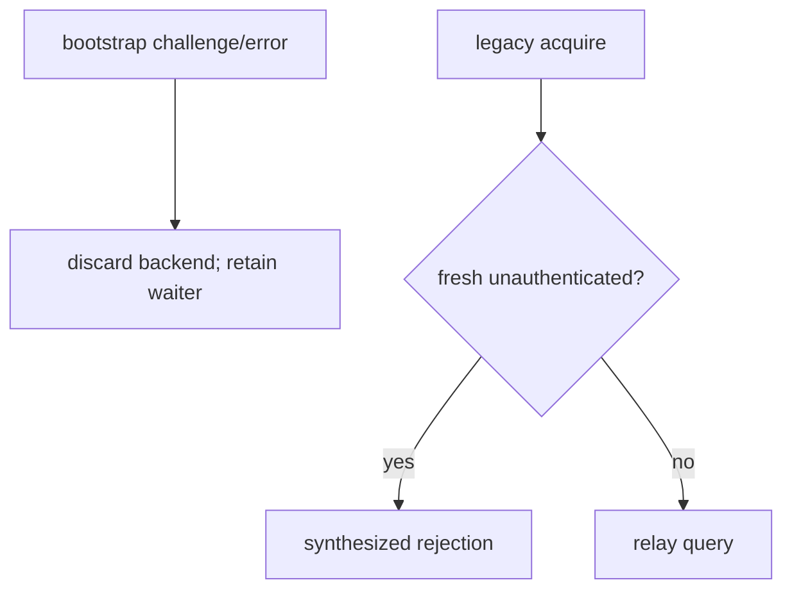
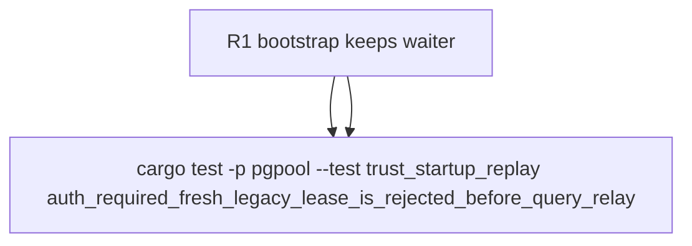

## Logic
<!-- type: logic lang: mermaid -->


## Changes
<!-- type: changes lang: yaml -->

```yaml
changes:
  - path: apps/pgpool/src/pool/reactor/runtime.rs
    action: modify
    section: logic
    impl_mode: hand-written
    anchor: close_backend
  - path: apps/pgpool/src/pool/transaction.rs
    action: modify
    section: logic
    impl_mode: hand-written
    anchor: run_transaction_client
  - path: apps/pgpool/tests/trust_startup_replay.rs
    action: modify
    section: unit-test
    impl_mode: hand-written
    anchor: startup_mismatch_and_auth_challenges_never_replay
```
## Unit Test
<!-- type: unit-test lang: mermaid -->


