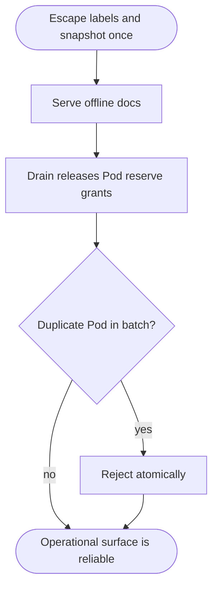

## Logic
<!-- type: logic lang: mermaid -->



Control-plane Prometheus labels use the shared metrics renderer's escaping rule; admin metrics capture each pool's stats exactly once per render. `/docs` is a self-contained offline HTML index to the same `/openapi.json` contract. Completed drain reaps every grant whose key belongs to the drained Pod only after static allocation releases. Static batch admission rejects a duplicate Pod before calculating or inserting allocation state.

## Changes
<!-- type: changes lang: yaml -->

```yaml
coverage_kind: semantic
changes:
  - path: libs/metrics-prometheus/src/lib.rs
    action: modify
    section: logic
    impl_mode: hand-written
    anchor: render_labeled
    reason: Expose the shared Prometheus label-value escaping primitive for custom metric families.
  - path: apps/pgpool/src/k8s/control.rs
    action: modify
    section: logic
    impl_mode: hand-written
    anchor: prometheus
    reason: Escape endpoint and Pod labels and reap Pod-owned reserve grants on completed drain.
  - path: apps/pgpool/src/k8s/reserve.rs
    action: modify
    section: logic
    impl_mode: hand-written
    anchor: release_after_close
    reason: Add endpoint-ledger per-Pod reserve grant reaping after physical drain completion.
  - path: apps/pgpool/src/k8s/budget.rs
    action: modify
    section: logic
    impl_mode: hand-written
    anchor: reserve_many
    reason: Reject duplicate Pod identities within one static admission batch before state mutation.
  - path: apps/pgpool/src/admin/metrics.rs
    action: modify
    section: logic
    impl_mode: hand-written
    anchor: render
    reason: Capture one BackendPool stats snapshot per pool per Prometheus render.
  - path: apps/pgpool/src/admin/handlers.rs
    action: modify
    section: logic
    impl_mode: hand-written
    anchor: docs
    reason: Replace remote Swagger CDN assets with a self-contained offline documentation page.
  - path: apps/pgpool/src/admin/router.rs
    action: modify
    section: unit-test
    impl_mode: hand-written
    anchor: docs_serves_swagger_ui_html_referencing_openapi_json
    reason: Verify docs HTML has no external network dependency.
```

## Unit Test

```mermaid
---
id: pgpool-operational-hygiene-verification
requirements:
  docs_are_offline:
    id: R3
    text: "Docs HTML references only local admin paths and no remote CDN asset."
    kind: functional
    risk: medium
    verify: docs_serves_offline_openapi_index
  drain_reaps_reserves:
    id: R4
    text: "Completed drain removes every reserve grant owned by that endpoint Pod."
    kind: regression
    risk: high
    verify: drain_completion_reaps_pod_reserve_grants
  duplicate_batch_is_rejected:
    id: R5
    text: "Static allocation rejects duplicate Pod names within one batch without mutation."
    kind: regression
    risk: high
    verify: duplicate_pod_batch_is_rejected_atomically
  metrics_use_one_stats_snapshot:
    id: R2
    text: "Each admin metrics render captures one BackendPool stats snapshot per pool."
    kind: regression
    risk: medium
    verify: metrics_render_uses_one_snapshot_per_pool
  prometheus_labels_are_escaped:
    id: R1
    text: "Control-plane Prometheus output escapes hostile endpoint and Pod label values through the shared renderer primitive."
    kind: regression
    risk: medium
    verify: control_plane_prometheus_escapes_hostile_labels
---
flowchart TD
    r1[R1 prometheus labels are escaped] --> control_plane_prometheus_escapes_hostile_labels[control_plane_prometheus_escapes_hostile_labels]
    r2[R2 metrics use one stats snapshot] --> metrics_render_uses_one_snapshot_per_pool[metrics_render_uses_one_snapshot_per_pool]
    r3[R3 docs are offline] --> docs_serves_offline_openapi_index[docs_serves_offline_openapi_index]
    r4[R4 drain reaps reserves] --> drain_completion_reaps_pod_reserve_grants[drain_completion_reaps_pod_reserve_grants]
    r5[R5 duplicate batch is rejected] --> duplicate_pod_batch_is_rejected_atomically[duplicate_pod_batch_is_rejected_atomically]
```

<!-- type: unit-test lang: mermaid -->


