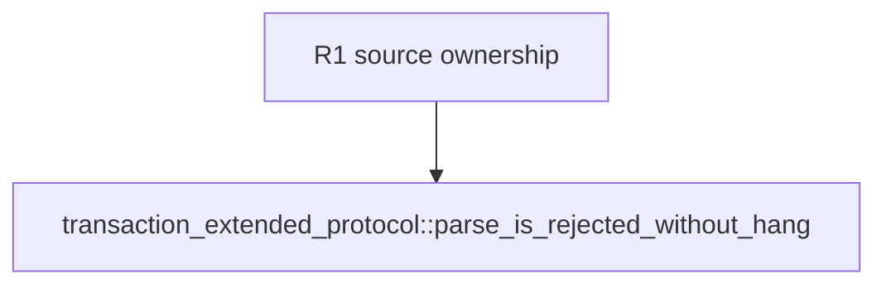

## Logic

```mermaid
---
id: pgpool-transaction-regression-source-ownership
entry: test_source
nodes:
  test_source: { kind: start, label: "Existing extended-protocol integration regression test" }
  managed: { kind: process, label: "Attach SPEC-MANAGED source mirror" }
  ownership: { kind: process, label: "Wrap test implementation in HANDWRITE ownership" }
  verify: { kind: terminal, label: "Test passes and AW ownership audit is clean" }
edges:
  - { from: test_source, to: managed }
  - { from: managed, to: ownership }
  - { from: ownership, to: verify }
---
flowchart LR
    test_source([Extended-protocol regression]) --> managed[SPEC-MANAGED mirror]
    managed --> ownership[HANDWRITE ownership]
    ownership --> verify([Targeted test and code-check pass])
```

<!-- type: logic lang: mermaid -->



The follow-up changes ownership metadata only. The existing regression continues proving error-then-close for both transaction engines; its new source mirror and HANDWRITE block let AW audit that proof without changing wire behavior.

## Changes
<!-- type: changes lang: yaml -->

```yaml
coverage_kind: semantic
changes:
  - path: apps/pgpool/tests/transaction_extended_protocol.rs
    action: modify
    section: logic
    impl_mode: hand-written
    anchor: parse_is_rejected_without_hang
    reason: Add auditable ownership metadata around the existing two-engine extended-protocol regression proof.
```

## Unit Test
<!-- type: unit-test lang: mermaid -->


