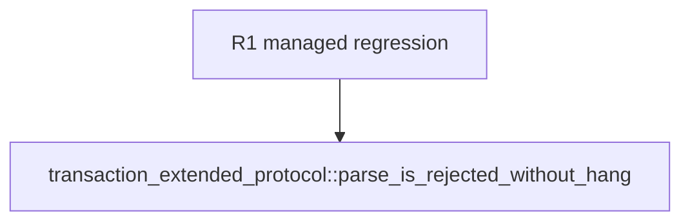

## Logic

```mermaid
---
id: pgpool-transaction-regression-source-ownership-contract
entry: source_file
nodes:
  source_file: { kind: start, label: "Transaction extended-protocol regression source" }
  spec: { kind: process, label: "Point to this TD logic section with SPEC-MANAGED" }
  handwrite: { kind: process, label: "Declare the existing test setup and assertions HANDWRITE" }
  test: { kind: process, label: "Run real-Postgres test when available; skip otherwise" }
  audit: { kind: terminal, label: "Code-check recognizes the test as managed" }
edges:
  - { from: source_file, to: spec }
  - { from: spec, to: handwrite }
  - { from: handwrite, to: test }
  - { from: test, to: audit }
---
flowchart LR
    source_file([Existing regression source]) --> spec[SPEC-MANAGED this TD]
    spec --> handwrite[HANDWRITE test code]
    handwrite --> test[Run two-engine integration test]
    test --> audit([Managed code-check])
```

<!-- type: logic lang: mermaid -->



The marker envelope covers the full integration test because its local-Postgres readiness probe, proxy startup, and legacy/reactor loop form one cohesive regression concern. No behavior, timing, assertion, or skip policy changes in this work item.
## Changes
<!-- type: changes lang: yaml -->

```yaml
coverage_kind: semantic
changes:
  - path: apps/pgpool/tests/transaction_extended_protocol.rs
    action: modify
    section: logic
    impl_mode: hand-written
    anchor: parse_is_rejected_without_hang
    reason: Give the existing transaction extended-protocol integration proof explicit, auditable ownership without changing behavior.
```
## Unit Test
<!-- type: unit-test lang: mermaid -->


