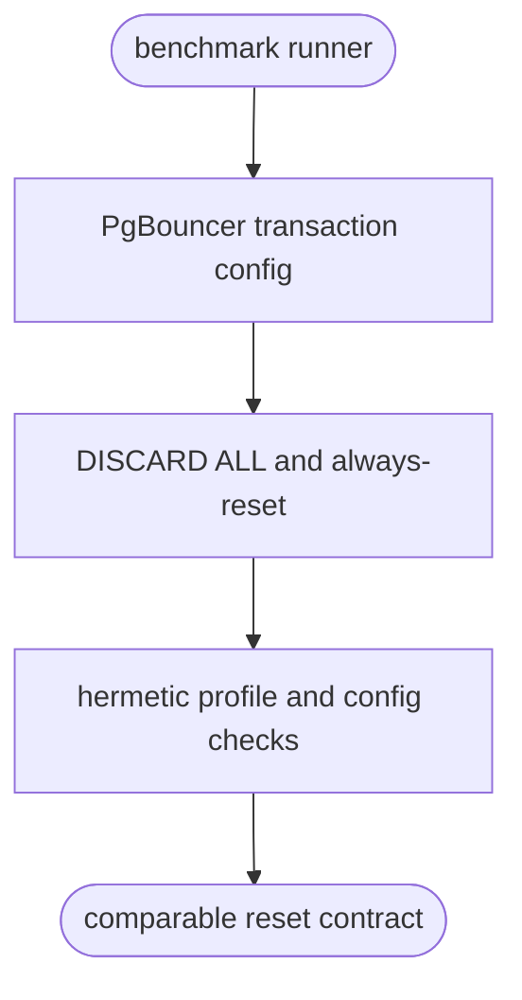
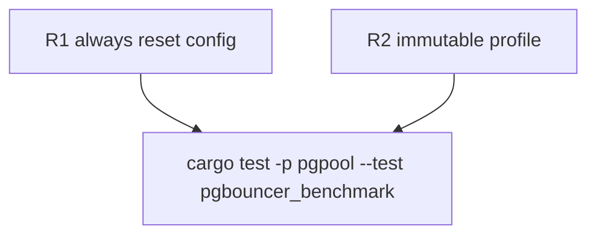

## Logic
<!-- type: logic lang: mermaid -->


## Changes
<!-- type: changes lang: yaml -->

```yaml
changes:
  - path: apps/pgpool/benchmarks/pgbouncer-transaction-pooling/run.sh
    action: modify
    section: pgbouncer-always-reset-benchmark-contract
    impl_mode: hand-written
  - path: apps/pgpool/benchmarks/pgbouncer-transaction-pooling/README.md
    action: modify
    section: pgbouncer-always-reset-benchmark-contract
    impl_mode: hand-written
  - path: apps/pgpool/tests/pgbouncer_benchmark.rs
    action: modify
    section: pgbouncer-always-reset-benchmark-contract
    impl_mode: hand-written
```

## Unit Test
<!-- type: unit-test lang: mermaid -->


