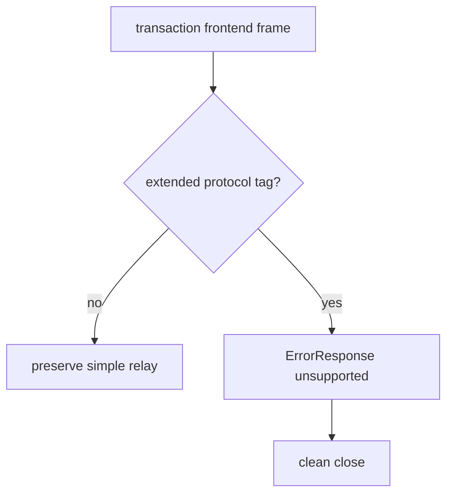
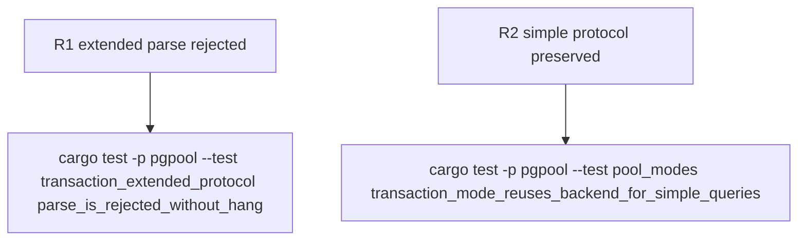

## Logic
<!-- type: logic lang: mermaid -->



## Changes
<!-- type: changes lang: yaml -->

```yaml
changes:
  - path: apps/pgpool/src/wire/reader.rs
    action: modify
    section: logic
    impl_mode: hand-written
    anchor: validate_frontend_relay
  - path: apps/pgpool/src/pool/transaction.rs
    action: modify
    section: logic
    impl_mode: hand-written
    anchor: run_transaction_client
  - path: apps/pgpool/src/pool/reactor/runtime.rs
    action: modify
    section: logic
    impl_mode: hand-written
    anchor: handle_client_relay_frame
  - path: apps/pgpool/tests/transaction_extended_protocol.rs
    action: create
    section: unit-test
    impl_mode: hand-written
```

## Unit Test
<!-- type: unit-test lang: mermaid -->


