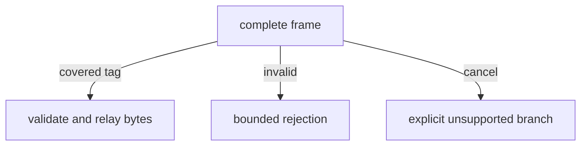

## Logic
<!-- type: logic lang: mermaid -->


## Changes
<!-- type: changes lang: yaml -->

```yaml
changes:
  - path: apps/pgpool/Cargo.toml
    action: modify
    section: unit-test
    impl_mode: hand-written
  - path: Cargo.lock
    action: modify
    section: unit-test
    impl_mode: hand-written
  - path: apps/pgpool/src/wire/backend.rs
    action: modify
    section: logic
    impl_mode: hand-written
    anchor: decode
  - path: apps/pgpool/src/wire/frontend.rs
    action: modify
    section: logic
    impl_mode: hand-written
    anchor: decode
  - path: apps/pgpool/src/wire/mod.rs
    action: modify
    section: logic
    impl_mode: hand-written
  - path: apps/pgpool/src/wire/reader.rs
    action: modify
    section: logic
    impl_mode: hand-written
    anchor: validate_backend_relay
  - path: apps/pgpool/tests/wire_codec.rs
    action: modify
    section: unit-test
    impl_mode: hand-written
    anchor: frontend_extended_query_round_trip
  - path: apps/pgpool/tests/session_proxy.rs
    action: modify
    section: unit-test
    impl_mode: hand-written
    anchor: real_postgres_session_connects_queries_and_disconnects_cleanly
```
## Unit Test

```mermaid
---
id: lossless-wire-relay-contract-verification
requirements:
  invalid_rejected:
    id: R3
    text: "Malformed and oversized versions of newly covered tags remain rejected before relay."
    kind: negative
    risk: high
    verify: cargo test -p pgpool --test wire_codec relay_rejects_malformed_covered_frames
  opaque_tags_relay:
    id: R1
    text: "Well-formed extended, COPY, notification, and empty-query frames remain valid opaque relay frames without an UnknownTag failure."
    kind: regression
    risk: high
    verify: cargo test -p pgpool --test wire_codec relay_accepts_extended_copy_notify_and_empty_frames
  session_end_to_end:
    id: R2
    text: "A real session-mode client completes covered PostgreSQL exchanges without a proxy-initiated unknown-tag disconnect."
    kind: functional
    risk: high
    verify: cargo test -p pgpool --test session_proxy session_mode_relays_extended_copy_notify_and_empty_query
---
flowchart TD
    r1[R1 opaque tags relay] --> cargo_test_p_pgpool_test_wire_codec_relay_accepts_extended_copy_notify_and_empty_frames[cargo test -p pgpool --test wire_codec relay_accepts_extended_copy_notify_and_empty_frames]
    r2[R2 session end to end] --> cargo_test_p_pgpool_test_session_proxy_session_mode_relays_extended_copy_notify_and_empty_query[cargo test -p pgpool --test session_proxy session_mode_relays_extended_copy_notify_and_empty_query]
    r3[R3 invalid rejected] --> cargo_test_p_pgpool_test_wire_codec_relay_rejects_malformed_covered_frames[cargo test -p pgpool --test wire_codec relay_rejects_malformed_covered_frames]
```

<!-- type: unit-test lang: mermaid -->



## Changes
<!-- type: changes lang: yaml -->

```yaml
changes:
  - path: apps/pgpool/src/wire/backend.rs
    action: modify
    section: logic
    impl_mode: hand-written
    anchor: BackendMessage::decode
  - path: apps/pgpool/src/wire/frontend.rs
    action: modify
    section: logic
    impl_mode: hand-written
    anchor: FrontendMessage::decode
  - path: apps/pgpool/src/wire/reader.rs
    action: modify
    section: logic
    impl_mode: hand-written
    anchor: validate_backend_relay
  - path: apps/pgpool/tests/wire_codec.rs
    action: modify
    section: unit-test
    impl_mode: hand-written
    anchor: frontend_extended_query_round_trip
  - path: apps/pgpool/tests/session_proxy.rs
    action: modify
    section: unit-test
    impl_mode: hand-written
    anchor: real_postgres_session_connects_queries_and_disconnects_cleanly
```
