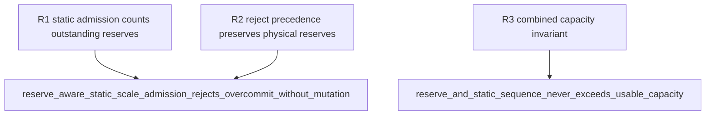

## Logic
<!-- type: logic lang: mermaid -->


Static Pod admission has precedence only over new Pods: outstanding reserve grants remain held until their normal close/release transition. The control plane rejects a scale-up that would exceed `usable`; it does not implicitly reclaim idle, draining, or expired reserves, because each may still represent a physical backend connection. The preflight is mutation-free, then `reserve_many` remains the atomic static-allocation operation.
## Changes
<!-- type: changes lang: yaml -->

```yaml
coverage_kind: semantic
changes:
  - path: apps/pgpool/src/k8s/budget.rs
    action: modify
    section: logic
    impl_mode: hand-written
    anchor: EndpointAllocator::reserve_many
    reason: Admit static Pod quota against the allocator quota plus externally-held reserve capacity, preserving the allocator's atomic error and blocked-scale status behavior.
  - path: apps/pgpool/src/k8s/control.rs
    action: modify
    section: logic
    impl_mode: hand-written
    anchor: PgpoolControlPlane::admit_scale
    reason: Pass outstanding reserve-grant units into static scale admission, reject instead of implicitly reclaiming grants, and cover admit/grant/release sequences.
```
## Unit Test
<!-- type: unit-test lang: mermaid -->


